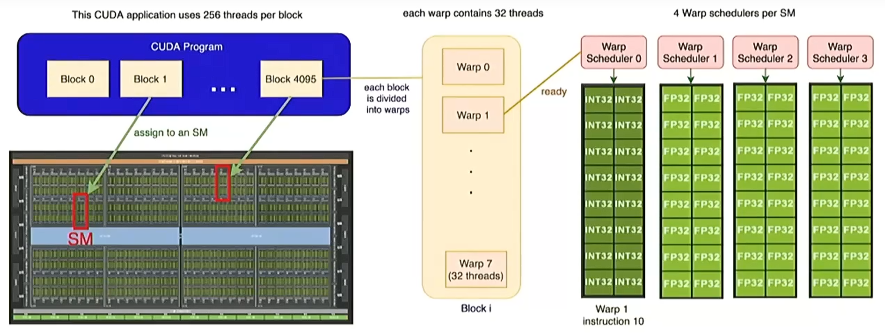

# GPU
## GPU和TPU的基本架构

### N卡的一般架构

这张图生动地展示了 NVIDIA GPU（采用 CUDA 架构）如何从逻辑软件层面映射到物理硬件层面。我们可以从宏观到微观，把 GPU 的构造分为四个核心层级：

#### 1. 宏观层级：GPU 芯片与SM(Streaming Multiprocessor，流式多处理器)
SM 是 GPU 的核心大脑：所有的计算任务最终都会分发到各个 SM 上执行。

分配机制：图中显示 CUDA 程序中的“Block（线程块）”被分配到不同的 SM 中。一个 SM 可以同时处理多个 Block，但一个 Block 一旦分配给某个 SM，就会在该 SM 上运行直到结束。

#### 2.任务组织层级：线程块 (Block) 与线程束 (Warp)

Block (线程块)：开发者定义的逻辑单元。图中例子是一个 Block 包含 256 个线程。
Warp (线程束)：这是 GPU 执行的基本调度单位。关键概念：1 个 Warp 永远包含 32 个线程。
计算方式：如果一个 Block 有 256 个线程，它会被自动切分为 $256 / 32 = 8$ 个 Warp（即图中看到的 Warp 0 到 Warp 7）。
SIMT 架构：Warp 内的 32 个线程在同一时刻执行相同的指令，只是处理的数据不同（单指令多线程）。

#### 3. 调度层级：Warp Scheduler (线程束调度器)
图片右侧展示了 SM 内部的运作逻辑。一个 SM 通常包含多个 Warp Scheduler（图中为 4 个）。

并发执行：每个调度器负责挑选一个“就绪”的 Warp 指令并将其发送到计算单元。

掩盖延迟：当某个 Warp 因为读取内存而停顿时，调度器会立刻切换到另一个准备好的 Warp，从而让硬件始终保持满载。

#### 微观执行层级：运算核心 (Cores)
最右侧的绿色网格代表了真正的计算单元：

INT32 Cores：负责整数运算（如地址计算、逻辑判断）——这种运算单元也被称为通用运算单元。

FP32 Cores：负责单精度浮点运算（这是 AI 和图形计算中最常用的部分）。

Register File (寄存器堆)：虽然图中未直接标注，但每个线程都有自己的寄存器，用于极速存储临时变量。