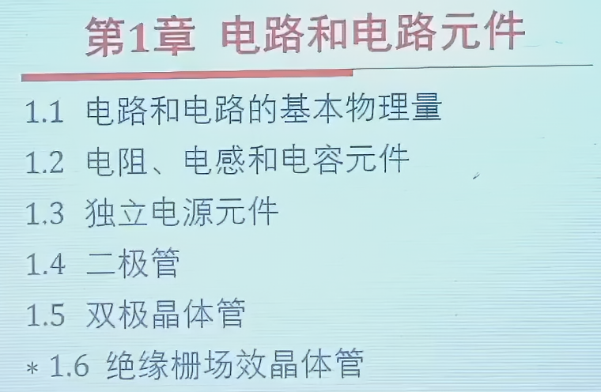

这一章的总体大纲

## 1.1 电路和电路的基本物理量

在糕中的时候我们就学过我们的电路有着电流电压电感电阻，在大一的时候我们又学习了微积分，现在我们终于能够拓展我们之前所学习的知识了

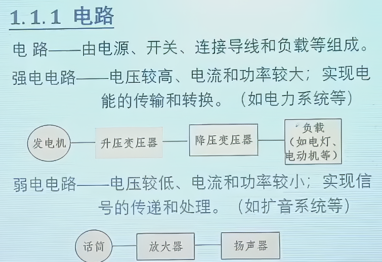

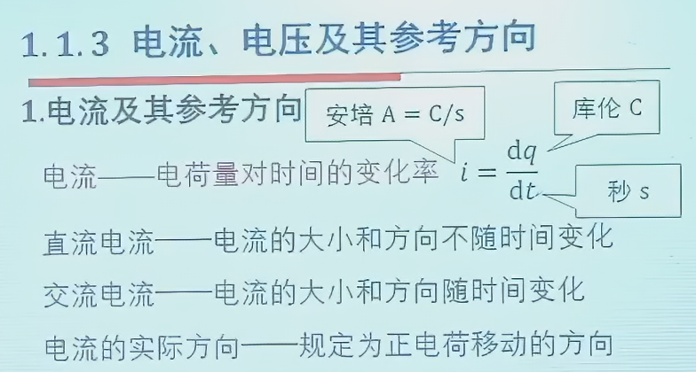

大学和高中最大的区别就是电流和电压都加上了矢量

首先，我们电流要加上一个人为确定的方向

同样，电压也要加上方向

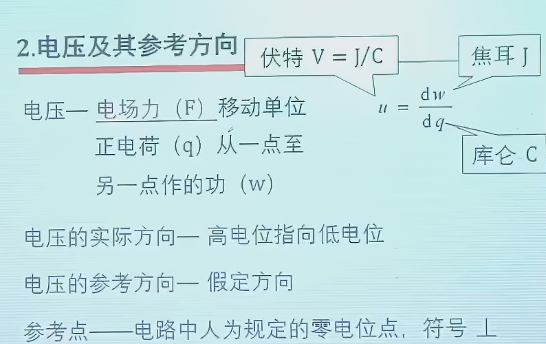

方向一致的叫做关联方向，方向不一致的叫做不关联方向，同时，我们的电位差决定了我们电压的实际方向

电源往往采用非关联方向，我们的负载往往采用关联方向

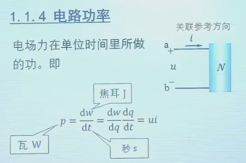

于是我们来到了电阻

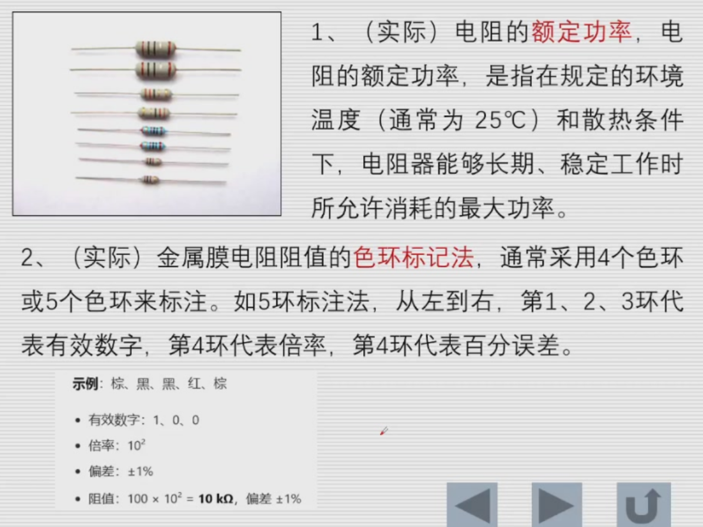

由于电阻基本都是正的，所以如果一个原件在关联方向下，他一般都吸收功率

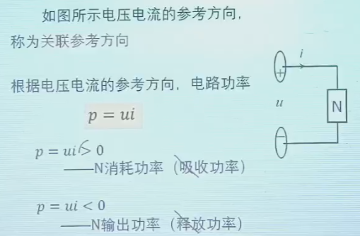

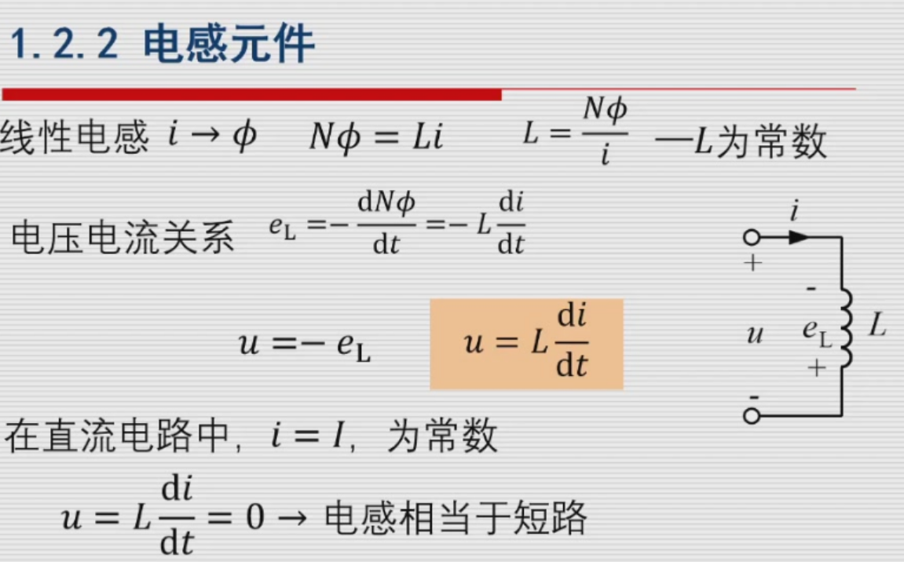

功率就是大小和方向

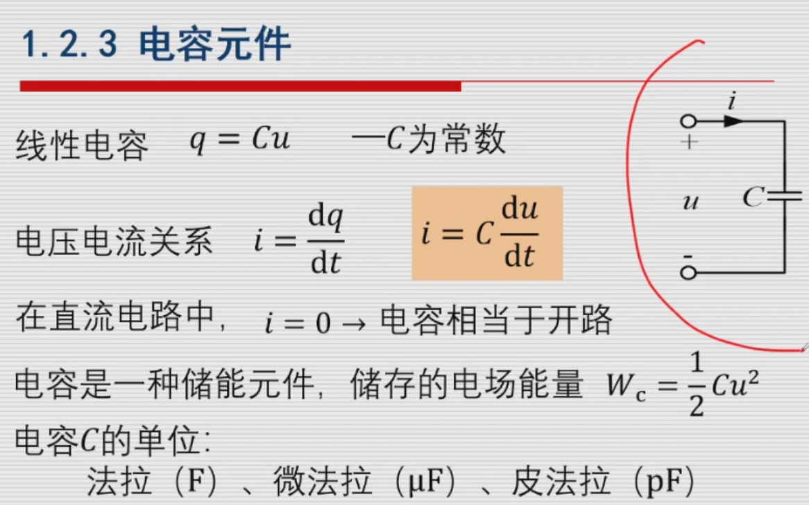

### 题目 1.1.1

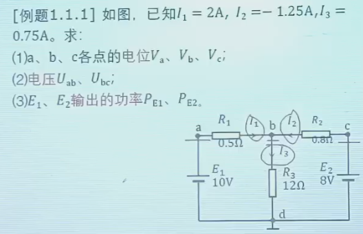

这种一般有几个地方需要注意下：

1. 我们电源两端直接设成0和对应的电压值就行了，这一点很简单
2. 我们要注意最后的吸收和输出的功率，虽然只是频率变化，但是这是有实际的意义的

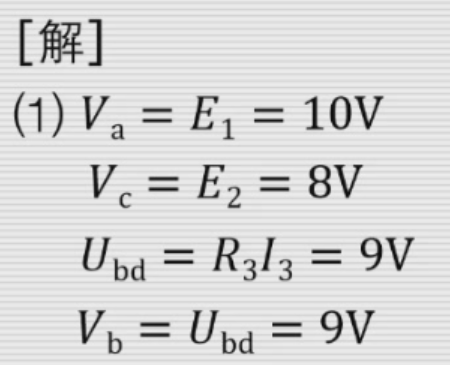