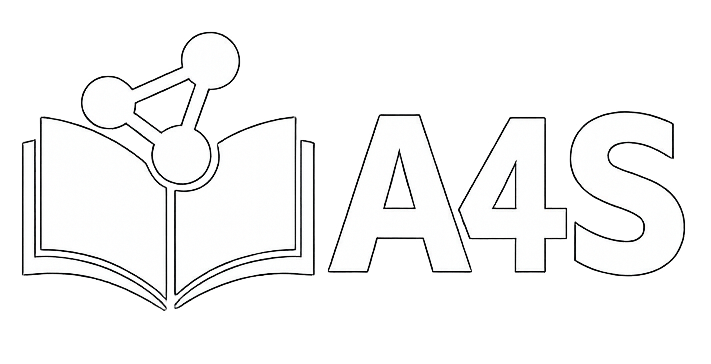

# 前言

## Hi Here is YanZhu

    你怎么到这里来啦！

我一直觉得，现当代的学习和传统的学习方式有了翻天覆地的变化，人类的历史从教育诞生开始经历了工业化，信息化，和人工智能的迅猛发展，但是我们的教育架构仍然停留在工业化的教育流水线，仅在一些形式上体现出信息化的感觉——小测变成了线上，讲义变成了回放，板书变成了PPT；但是最本质的一套从来没有发生任何的变化——绩点，分数，以及围绕着加分的各种比赛和活动

与此同时，人类寻求安逸的本性又让AI的使用成为了一种普遍的情况，水课上学生用AI生成的课件讲述AI的危害，老师用AI批改来节省效率，这一切形成了一种可笑而又可悲的闭环

学习的本质真的如此吗？考试的本质是什么？当面对着试题复习的人拿到了远超每天去上课的人的分数，当AI能几分钟内总结出教授都不会给出的讲义和复习方案，当半学期的内容能在三天内被突击完，我们是否需要用另一种视角去审视我们的教育？

很多时候我们的教育被分数解构，把学习的结果当成了学习的本质，这本质上也是一种被分数的异化

高中的时候曾经有幸读过一篇文章《轨道和旷野》，我们有没有可能跳出这种评价体系，从更宏大的角度审视我们的生活

《Outlier》给了我答案

大学当然可以为了自己而活——当我们不在乎优绩主义下的评价体系后

不是指整日整夜在宿舍打游戏，而是当你不在乎这套评价体系后，你有更多时间，空隙去想更多事情，有更多精力，热忱去做更多事情，真正有机会去体验，遇见，感受……

而不是在焦虑迷茫中踱来踱去却发现原地踏步，不是在题海中苦行僧一般告诫自己“打好基础”，不是忙来忙去发现只是按部就班地浪费时间

在图书馆，我想读遍自己感兴趣的书，在宿舍，我想玩遍自己期待的游戏，在校园之外，我想尝试自己好奇的事物

这时候，我相信你会体会到校歌中的两句箴言：“大不自多，海纳江河”

我一直信奉着效率至上，这些笔记大多都是在复习的过程中为了加深记忆而留下的思想痕迹——当然杂谈文章不是——希望也能帮到你的学习

---

## 📖 更新日志
此处只记录功能上的重大更新，笔记内容每天都在更新，已成为驻波的笔记本

- 2026-02-07: 创建学习笔记仓库，完成初始框架搭建
- 2026-02-08: 页面美化
- 2026-02-10：修复了side_bar不显示的问题，修改路径为绝对路径
- 2026-02-11: 新增了python第七小节
- 2026-02-14: 增加了六级内容，完善了python部分，增加了随笔集部分（没错情人节就这样coding）
- 2026-02-27：AI板块源起，记录LLM的学习过程
- 2026-03-01：解决了版面样式显示的问题和代码渲染不成功的问题，但是右侧sidebar显示貌似还有问题
- 2026-03-28：修改成vue3架构
- 2026-04-13：修改成mkdoc架构
- 2026-04-16：大改页面逻辑
- 2026-04-22：增加README规范agent开发
---

> 💡 路漫漫其修远，吾上下而求索

