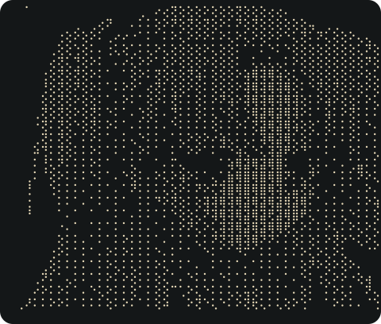
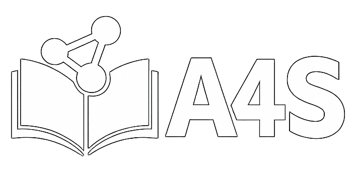
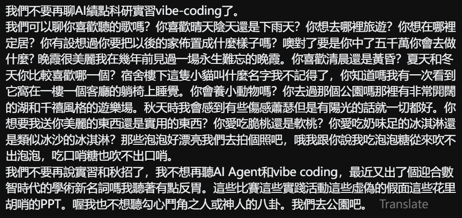

# 前言

## Hi Here is Bamb0ochen

  

    
前天看到了小兔 おとといは兎を見たの

    
昨天是小鹿 昨日は鹿

    
今天是……你 今日は…あなた

    
欢迎失足落进我的空间

  

  

## 为什么叫移动的大图书馆

帕秋莉是居住于红魔馆的魔法使。

居住在幻想乡中藏书最多的大图书馆——红魔馆地下图书馆中。

她平常总待在大图书馆里，患有哮喘、贫血，体质虚弱，因此在肉搏战中非常劣势。

身体能力比人类还弱，不过她压倒性的魔法攻击可以弥补这一点。但患有哮喘的她常常无法咏唱完魔法咒语。

她无论什么时候都拿着书，并将书视为自己的一部分，离开书便无法生活。

帕秋莉被称作不动的大图书馆，在红魔馆地下图书馆中形成了自己独特的世界观和方法论，但是我想在这个时代我们毕竟终将是要和人创造连结的。读万卷书是一方面，行万里路和识万般人又是另一方面，这是所谓“移动的大图书馆的发心”，希望我有一天能够做到吧，共勉

## 大图书馆的前言

我一直觉得，现当代的学习和传统的学习方式有了翻天覆地的变化，人类的历史从教育诞生开始经历了工业化，信息化，和人工智能的迅猛发展，但是我们的教育架构仍然停留在工业化的教育流水线，仅在一些形式上体现出信息化的感觉——小测变成了线上，讲义变成了回放，板书变成了PPT；但是最本质的一套从来没有发生任何的变化——绩点，分数，以及围绕着加分的各种比赛和活动

与此同时，人类寻求安逸的本性又让AI的使用成为了一种普遍的情况，水课上学生用AI生成的课件讲述AI的危害，老师用AI批改来节省效率，这一切形成了一种可笑而又可悲的闭环

学习的本质真的如此吗？考试的本质是什么？当面对着试题复习的人拿到了远超每天去上课的人的分数，当AI能几分钟内总结出教授都不会给出的讲义和复习方案，当半学期的内容能在三天内被突击完，我们是否需要用另一种视角去审视我们的教育？

很多时候我们的教育被分数解构，把学习的结果当成了学习的本质，这本质上也是一种被分数的异化

高中的时候曾经有幸读过一篇文章《轨道和旷野》，我们有没有可能跳出这种评价体系，从更宏大的角度审视我们的生活

《Outlier》给了我答案

大学当然可以为了自己而活，当然，在当前的社会环境下，我们不可能不在乎优绩主义下的评价体系

但是我希望我们能流出更多给自己的时间，就像一篇文章中说的“我们不要再聊保研实习AIvibe coding了”或在这个世界上，我们首先得成为自己

当然，这种“为自己而活”不是指整日整夜在宿舍打游戏的享乐主义或者小红书上的消费主义，而是让你有更多时间，空隙去想更多事情，有更多精力，热忱去做更多事情，真正有机会去体验，遇见，感受……

这里我引用回上面那篇文章

life is experience ，有这种心态的人是无坚不摧的，而不是在焦虑迷茫中踱来踱去却发现原地踏步，不是在题海中苦行僧一般告诫自己“打好基础”，不是忙来忙去发现只是按部就班地浪费时间，当我们换一种角度去审视我们的学习，我们的发心时，我们会对学习产生新的认识和新的热情

当然，这种独行侠式的攀登和隐士般的自由并不意味着我们要放弃我们的所爱，只是我希望，我们能够终有一天把消遣变成我们的一种选择，而非一种自暴自弃的发泄

这时候，我相信你会体会到校歌中的两句箴言：“大不自多，海纳江河”

## 大图书馆的馆藏

我是个对所有学科都能产生热情的人（大红砖和水课除外），希望我的笔记能够帮到不仅是cs方向的同学们，还能够在其他方面产生不一样的化学反应

我一直信奉着效率至上，这些笔记大多都是在复习的过程中为了加深记忆而留下的思想痕迹——当然杂谈文章不是——希望也能帮到你的学习

<a class="md-button md-button--primary" href="https://github.com/Bamb0oChen/notes" target="_blank" rel="noopener noreferrer">如果感觉对你有帮助的话，不妨顺手点个star👉</a>

## 和馆主交流？

欢迎看我的个人主页，这里面你或许能看到我的更多展示面，欢迎添加友链，也欢迎通过联系方式真实（bushi）结识我

---

## 📖 更新日志
此处只记录功能上的重大更新，笔记内容每天都在更新，已成为驻波的笔记本

- 2026-02-07: 创建学习笔记仓库，完成初始框架搭建
- 2026-02-08: 页面美化
- 2026-02-10：修复了side_bar不显示的问题，修改路径为绝对路径
- 2026-02-11: 新增了python第七小节
- 2026-02-14: 增加了六级内容，完善了python部分，增加了随笔集部分（没错情人节就这样coding）
- 2026-02-27：AI板块源起，记录LLM的学习过程
- 2026-03-01：解决了版面样式显示的问题和代码渲染不成功的问题，但是右侧sidebar显示貌似还有问题
- 2026-03-28：修改成vue3架构
- 2026-04-13：修改成mkdoc架构
- 2026-04-16：大改页面逻辑
- 2026-04-22：增加README规范agent开发
- 2026-05-10：感谢黑客松，我们的网站有了第一个商标
- 2026-05-20：迁移了obsidian上的内容，现在可以看到大一的拙劣笔记了（笑
- 2026-07-21：不记得具体是什么时候了，暑假的时候对我们网站的font选型和可读性都做了很多的优化
- 2026-09-22：优化了一下展示，放上了朝武芳乃嘿嘿，页面改成透明遮罩
- 2026-09-23：优化了我们的白天/黑夜模式
- 2026-09-28：优化了一下我们的文件排布，分成社会科学和自然科学了
- 2026-09-30：加上了开往，更新了一下前言，解释了一下我们的大图书馆
---

> 💡 路漫漫其修远，吾上下而求索
