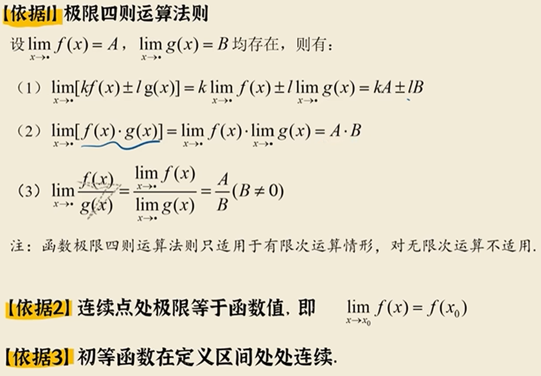
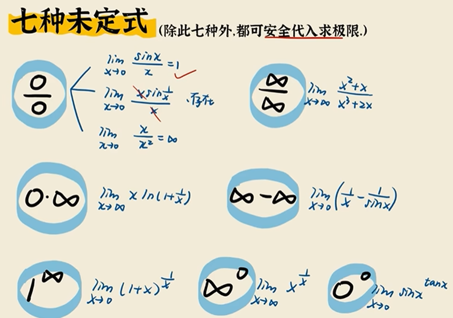
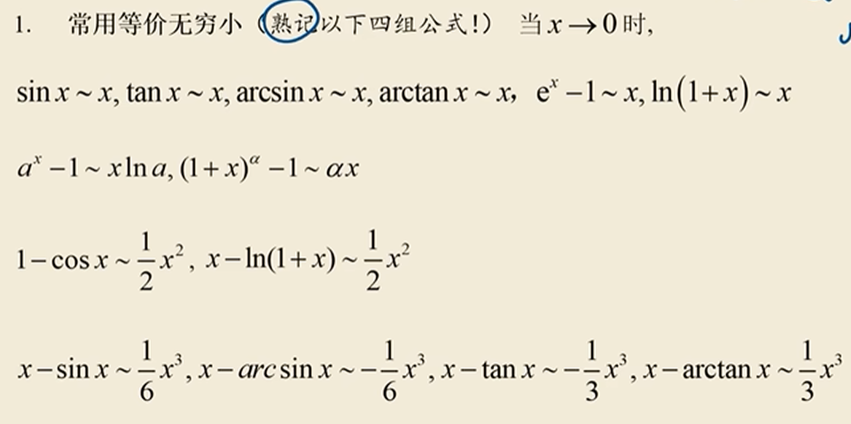
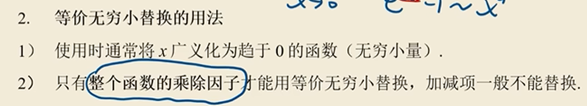
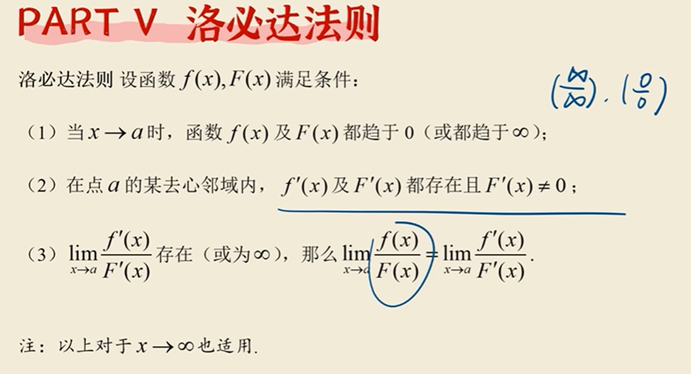
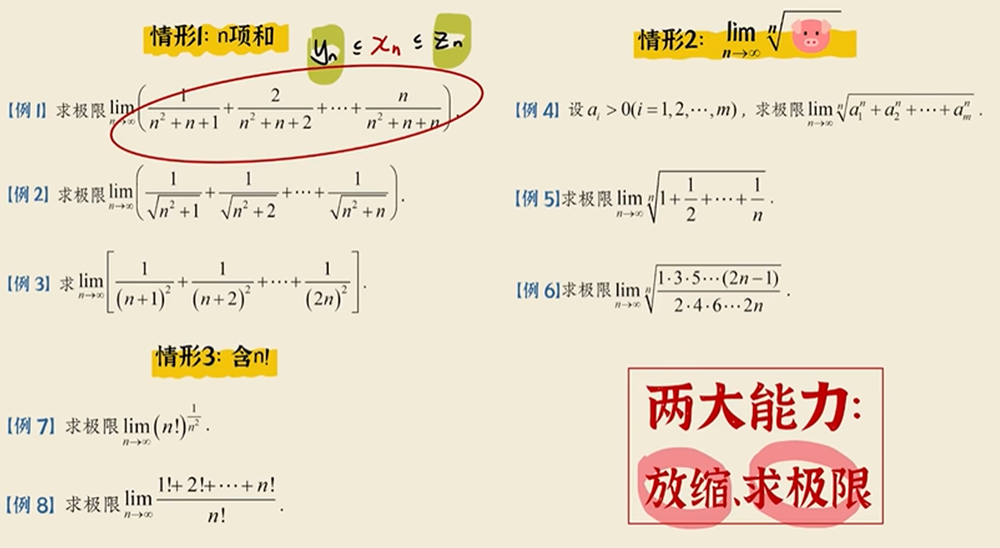

## 1.可以代入吗？

简述：点和极限的值相等+代入式分别存在极限（不属于未定式）  就能代

有种要求有极限值的题目，很多时候就是基于未定式的情况比如 $0/0$ 或者 $∞/∞$

## 2.等价无穷小代换

关于乘除因子：就是只有乘上整个的才能换 

## 3.拆极限

拆极限的理论依据——拆完以后要都存在（都有极限）
方法论：看到极限就拆出

## 4.提前求

和上文一样，依旧只有乘除因子才能用来直接提前求
## 5.洛必达法则

1.满足条件

## 6.我来补充一点： #夹逼定理
夹逼定理貌似只出现在有高次项时可以使用，因为此时对小项进行改变对整个式子的影响比较小

不妨来复习一下夹逼定理：
1. 极限存在准则之一：
夹逼定理
单调有界定理
2. 要求：夹逼的两项必须都要有极限值

## 方法论
原则一
1. 连加式优先考虑全员放缩
2. 连乘式优先考虑全员放缩
原则二：放缩/略去局部
