[2.1 极限与连续，导数与微分](2.1%20极限与连续，导数与微分.md)
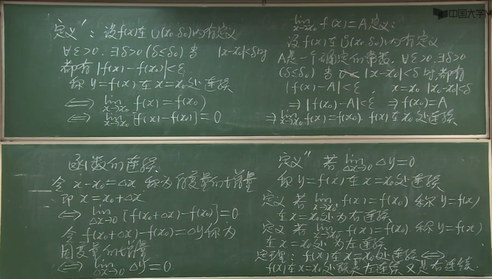
连续的定义
连续的简便表达：
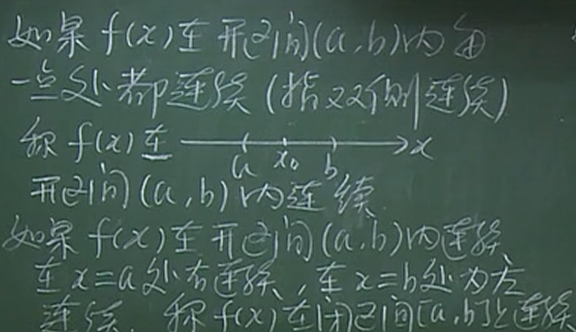
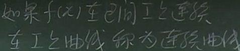
间断点的定义
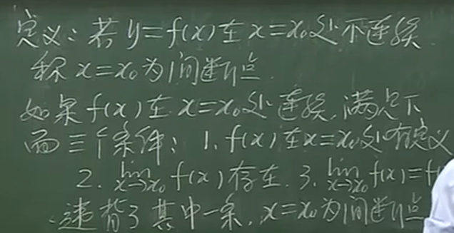

间断点的分类 
1.可去间断点——研究函数上特定点对函数连续性质有无影响
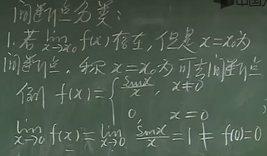
可去间断点的应用：
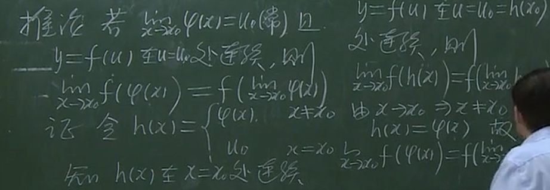
（几个小点的值不影响整段函数的性质）

2.跳跃间断点——左右极限不一

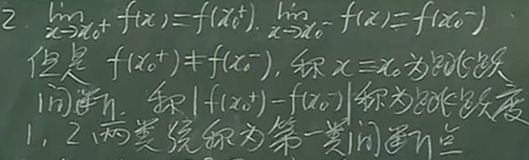
新概念：跳跃度

3.第二类间断点——有一端不存在（包括无穷间断点）
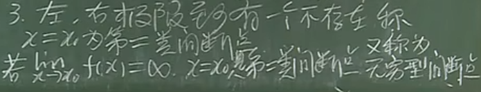

**连续的性质**
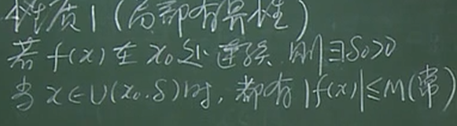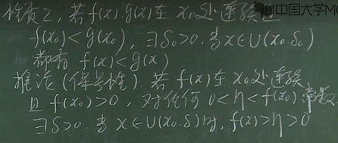
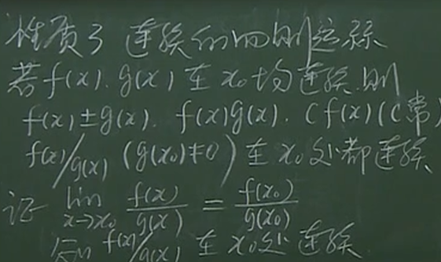

**研究初等函数的连续性**
函数的连续性是可以继承的（函数的组合，反函数，四则运算）
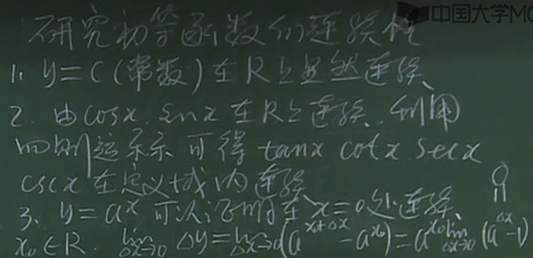
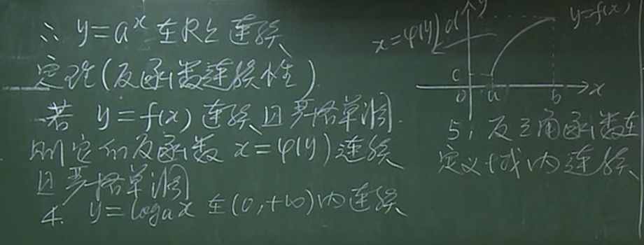
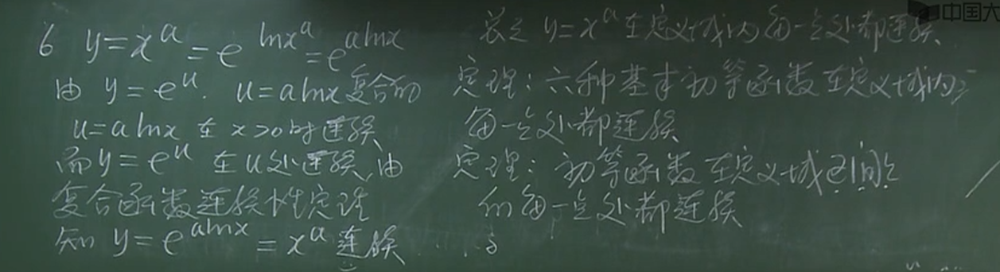
要注意定义域
例：
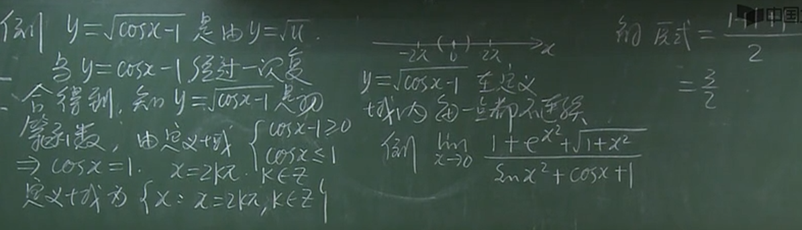

拓：等价量替换法（分式中的分子分母才能等价量替换）（错误：进行加减替换）
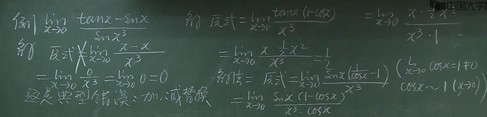
错误：分次求极限
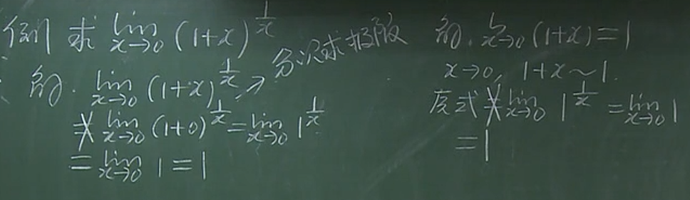

