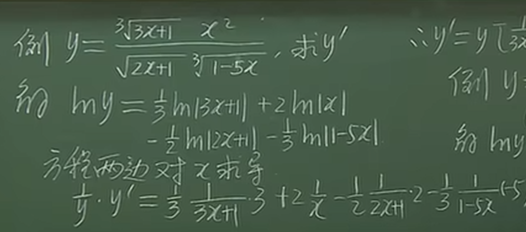
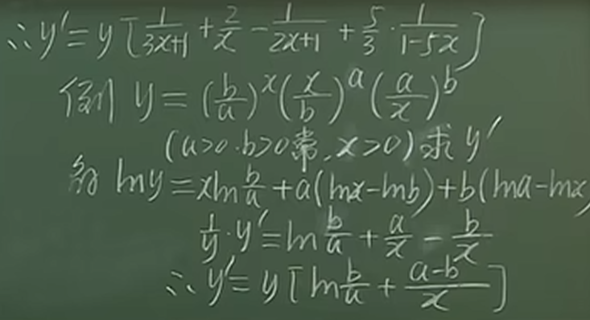
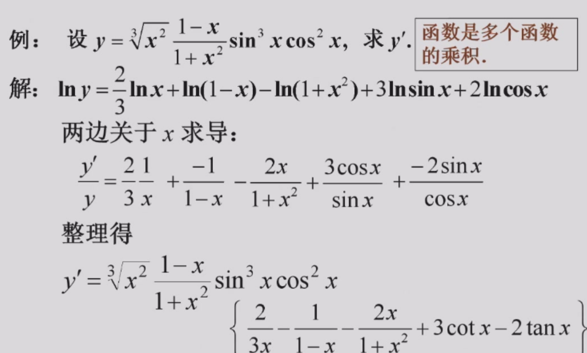

 ## 知乎前言

一般来说，对一元函数微分是比较容易的（可导与可微等价，dy=f'(x)dx），特别是与它的分析对应物（积分）相比。在一些情况下，我们希望事情简单一些。例如，考虑以下函数：

  

这只不过是一个简单的实数多项式。然而，当涉及到微分时，它就不再那么简单了。乍一看，有（至少）两种微分（求导）方法。

- 将括号里的内容展开，然后对每一项微分
- 使用乘积的微分法则。

显然，第一种方法不是一个很好的选择（太繁琐）。就使用乘积的微分法则而言，情况要好一些，但仍然不够简便：

在上述情况下，f的所有因子都是多项式，但如果我们有一个像下面这样的函数，会怎么样呢：

  

## 对数微分（Log-Differentiation）

那么，对于像g(x)这样复杂的情况该怎么办，因为使用通常的[乘积微分法则](https://zhida.zhihu.com/search?content_id=180865869&content_type=Article&match_order=1&q=%E4%B9%98%E7%A7%AF%E5%BE%AE%E5%88%86%E6%B3%95%E5%88%99&zhida_source=entity)会花费大量的时间。

我们可能还记得老师以前讲过，对数使运算更容易，因为**指数变成了乘法，乘法变成了加法等等**。我们可以通过取对数使这类函数的微分变得更加容易。

例如，考虑一个像下面这样的函数f：

  

  

假设上述乘积中出现的所有因子都是可微的，也是正的。那么f是正的，所以g是有意义的，其中g是以下函数：

  

  

现在，请牢记：

  

  

很容易得到下面的函数：

  

  

另一方面，观察一下：

  

  

可以得到：

  

  

因此，我们得到了一个很好的f的求导公式。虽然在计算中大量使用了对数，但得到的公式却没有对数，这主要是由于对数的导数本身并不包括任何对数，除了f中可能出现的对数。

## 对数微分法练习

又一例：

对数求导法的危机：过程中可能会改变定义域
