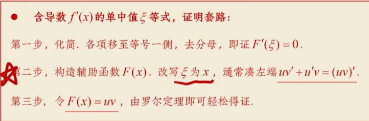
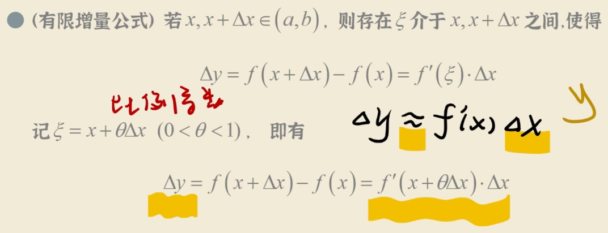
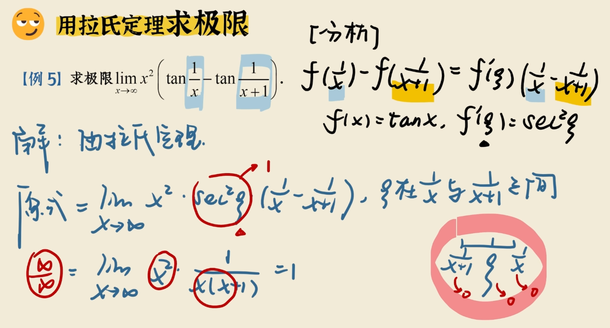
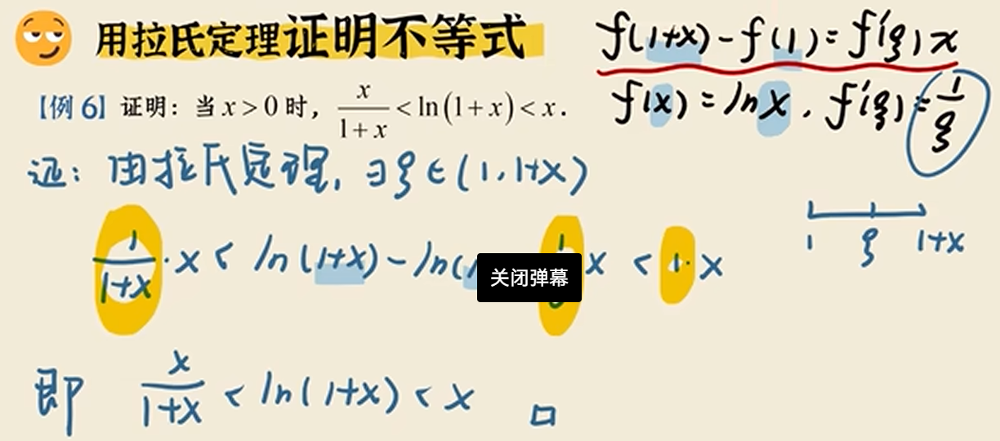
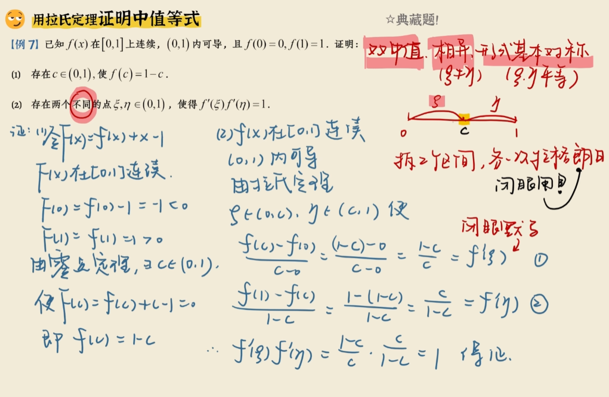
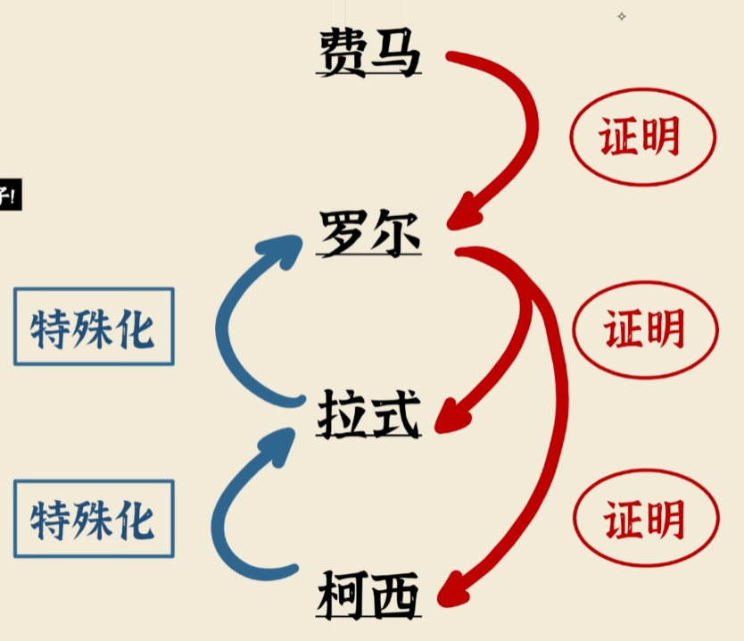
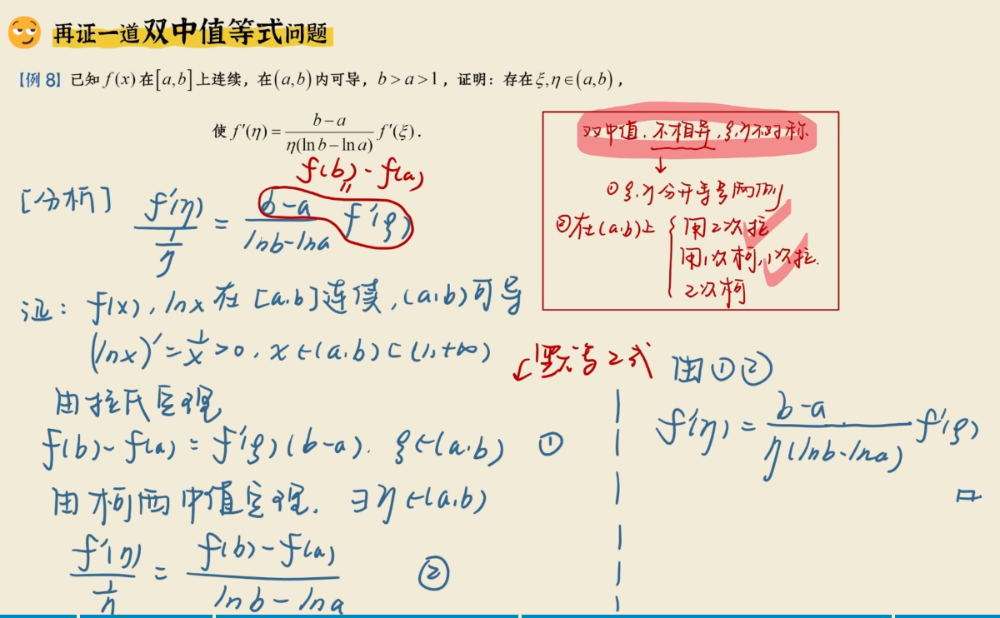

## 0.费马引理
连续可导的区间
必定有最小最大值
极值处导数为0

## 1.罗尔定理

记住定义：
开区间可导
闭区间连续
两端点相等
人话：两端相等连续可导，必有极点导数为零

## 2.拉格朗日定理
记住定义
同上12
人话：曲线连续可导，必有一导等于斜率

推论：有限增量

拉格朗日还能求极限和求不等式
看到两函数相减多可以往这方面考虑

### 双中值拉格朗日
拆两个区间，用两次拉格朗日

## 柯西中值定理
定义：上面12+分子不为0

拉格朗日的构造要注意区间的两个端点，是某在区间上有定义的函数带入两端点得到的
