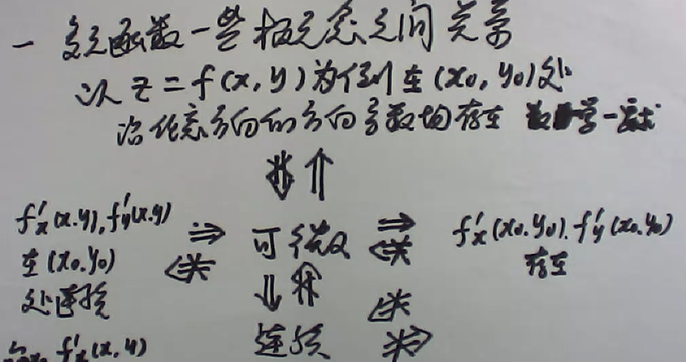
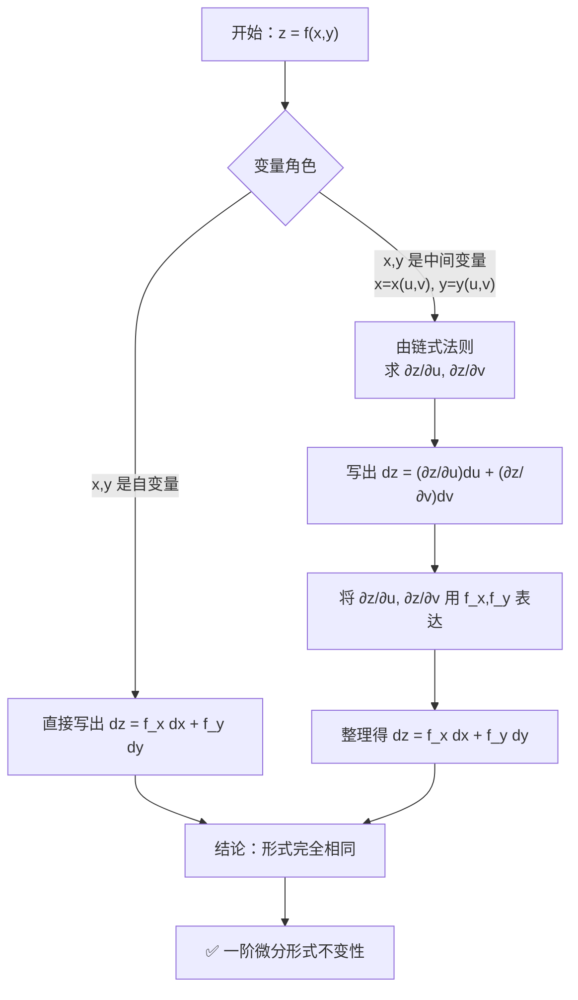

## 3.1 极限、连续、偏导、可微

偏导连续 $\Longrightarrow$ 可微 $\Longrightarrow$（连续 AND 偏导存在）  
反之不成立。

借用一下矿爷的讲义

---

#### 3.1.1.1 极限存在性

- **证明不存在（找反例）**：  
  找两条不同路径（如 $y = kx$、$y = kx^2$）趋近于目标点，若得到的极限值不相等或依赖于路径参数 $k$，则极限不存在。  
  也可找两个累次极限，若存在但不相等，则二重极限不存在。

- **证明存在**：  
  常用夹逼定理或极坐标。对于复杂函数，先判断是否连续，若连续则极限值等于函数值。

---

#### 3.1.1.2 偏导数（可导）

- **计算**：  
  在定义域内部，将其他变量视为常数直接求导。

- **定义法（必考点）**：  
  在分界点（如原点）或函数形式复杂处，使用偏导数定义：

  $$
  f_x(x_0, y_0) = \lim_{\Delta x \to 0} \frac{f(x_0 + \Delta x, y_0) - f(x_0, y_0)}{\Delta x}
  $$

  这个地方，我们让$x_0 +\Delta x  = x$则原式为
  $$
  f_x(x_0, y_0) = \lim_{\Delta x \to x_0} \frac{f(x, y_0) - f(x_0, y_0)}{x - x_0}
  $$

  这个形式一般更常用，用在我们对于某个顶点，断点的判断中

---

#### 3.1.1.3 可微性（可微）

- **充分条件（首选方法）**：  
  若 $f_x, f_y$ 在某点邻域内存在且在该点连续，则 $f$ 在该点可微。

- **必要条件**：  
  若 $f$ 可微，则 $f$ 必连续，且 $f$ 的所有一阶偏导数都存在。

- **定义法（根本方法）**：  
  在偏导数不连续或用充分条件难以判断时，使用可微的定义：

  $$
  \lim_{(\Delta x, \Delta y) \to (0, 0)} \frac{f(x_0 + \Delta x, y_0 + \Delta y) - f(x_0, y_0) - [f_x \Delta x + f_y \Delta y]}{\sqrt{\Delta x^2 + \Delta y^2}} = 0
  $$

### 3.1.2 方法论（规范研究连续可微可导）

有了上面的基本公式，我们大概就知道怎么求了

1. 遇到问连续？看两边趋近于某点的值是否等于某点的值
2. 遇到问微分？带入我们的公式来求解，看看$\rho$是不是等于0

$exp:$

设函数
$$
f(x,y) = 
\begin{cases} 
\dfrac{xy}{\sqrt{x^2 + y^2}}, & (x,y) \neq (0,0) \\[1em]
0, & (x,y) = (0,0)
\end{cases}
$$

讨论 $f(x,y)$ 在点 $(0,0)$ 处的**连续性**与**可微性**。

#### 3.1.2.1 连续性

连续性用夹逼定理看看我们的极限值和点上的值是否相等

先求 $f_x(0,0)$：

$$
f_x(0,0) = \lim_{h \to 0} \frac{f(h,0) - f(0,0)}{h}
$$

由于

$$
f(h,0) = \frac{h \cdot 0}{\sqrt{h^2 + 0}} = 0
$$

所以

$$
f_x(0,0) = \lim_{h \to 0} \frac{0 - 0}{h} = 0
$$

同理，

$$
f_y(0,0) = 0
$$

#### 3.1.2.2 可微性定义

$f(x,y)$ 在 $(0,0)$ 可微 $\iff$

$$
\lim_{(h,k) \to (0,0)} \frac{f(h,k) - f(0,0) - f_x(0,0)h - f_y(0,0)k}{\sqrt{h^2 + k^2}} = 0
$$

代入已知值 $f(0,0)=0,\ f_x(0,0)=0,\ f_y(0,0)=0$：

$$
\frac{f(h,k) - 0 - 0 \cdot h - 0 \cdot k}{\sqrt{h^2 + k^2}} = \frac{\dfrac{hk}{\sqrt{h^2 + k^2}}}{\sqrt{h^2 + k^2}} = \frac{hk}{h^2 + k^2}
$$

因此需要判断

$$
\lim_{(h,k) \to (0,0)} \frac{hk}{h^2 + k^2} \stackrel{?}{=} 0
$$

#### 3.1.2.3 路径依赖检验

取路径 $k = h$：

$$
\frac{h \cdot h}{h^2 + h^2} = \frac{h^2}{2h^2} = \frac12 \neq 0
$$

取路径 $k = 0$：

$$
\frac{h \cdot 0}{h^2 + 0} = 0
$$

极限值依赖于路径，因此该极限**不存在**（更不为 $0$）。

## 3.2 复合/隐函数

### 3.2.1 微分方程的一阶不变性

复合函数怎么求

链式法则方法论：
  1. 直接列出他们的变量，然后列出通往的链路
  2. 写出链式法则公式
  3. 公式求偏导，代入
更简单一点：
  直接找含有我们目标的公式，然后直接外导内导就行了

隐函数怎么求

直接套公式$\frac{\partial x}{\partial y}=-\frac{F_y'}{F_x'}$

## 3.3 方程组
方程组的情况下我们直接对所有的方程做我们想要的偏导

1. 确定几个自变量和几个因变量
2. 做想要的偏导
3. 在这个二元一次方程组中解出我们的偏导