[浙大线代周一345完整第二版备份1.pptx](../../assets/obsidian/Math_线性代数_0.1_开端/浙大线代周一345完整第二版备份1.pptx)
## ==线性==(只研究一次问题)代数（Linear Algebra）

### 线性代数的研究对象
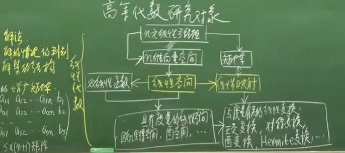
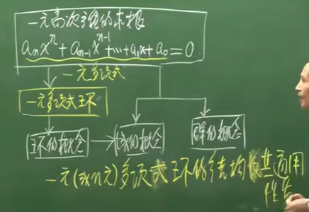
## 开端
方法：代入法，消元法（高斯消元）

行列式：
1.齐次：b1=b2=b3=...=bm=0
2.非齐次：b1=b2=b3=...=bm不全为0

**齐次一定有解**
1.唯一解（0解）
2.非零解（无数多解（乘系数k不变））

**非齐次**
1.无解
2.唯一解
3.无数多解

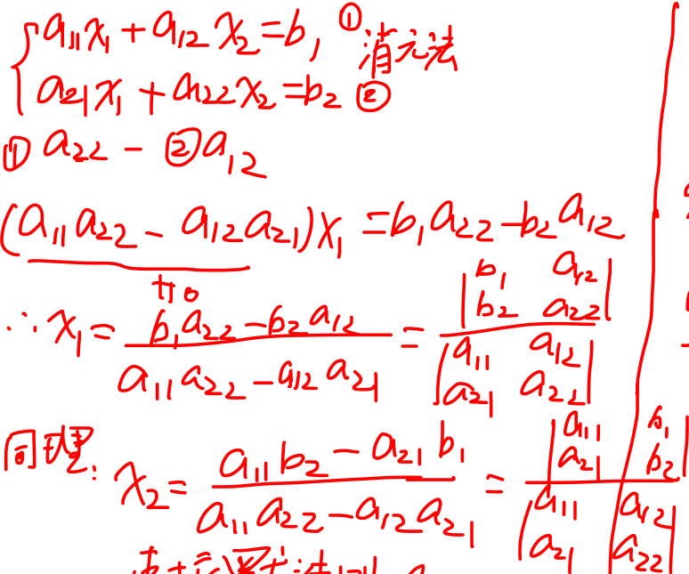
**Cramer's rule**（方程式的解能成为两个行列式的商）
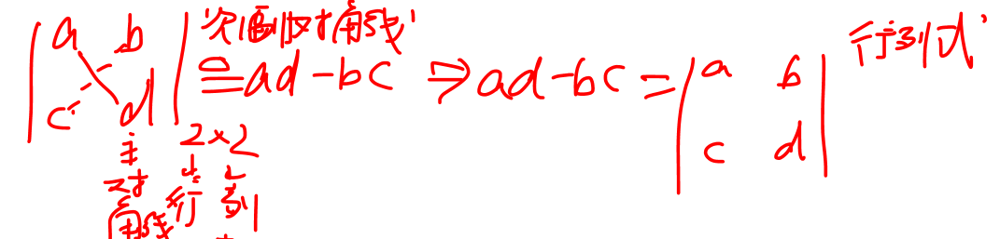三元一次方程也能用行列式解决吗？
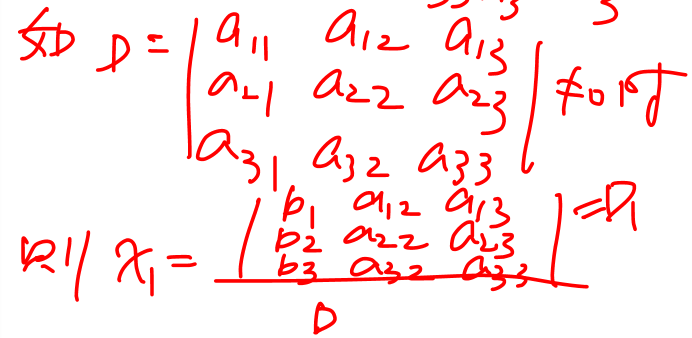
三元行列式的解法
Det(A)=
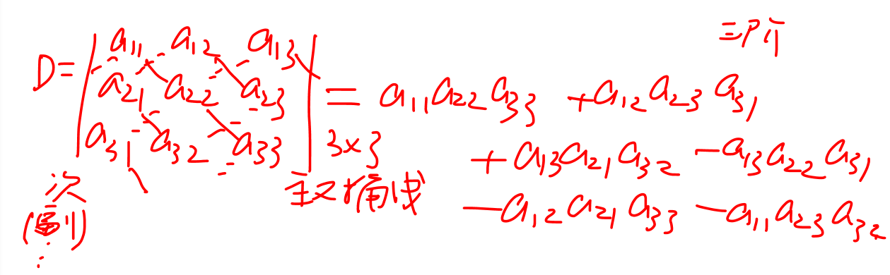

全排列与逆序数
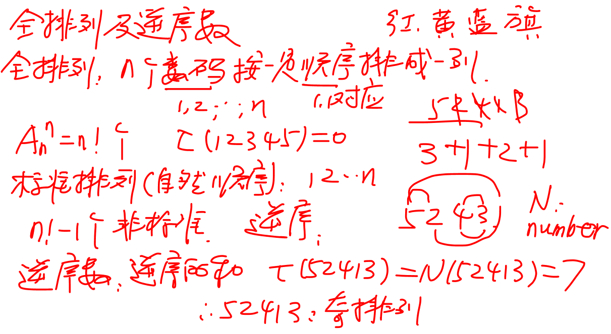
对换的逆序奇偶性将发生改变
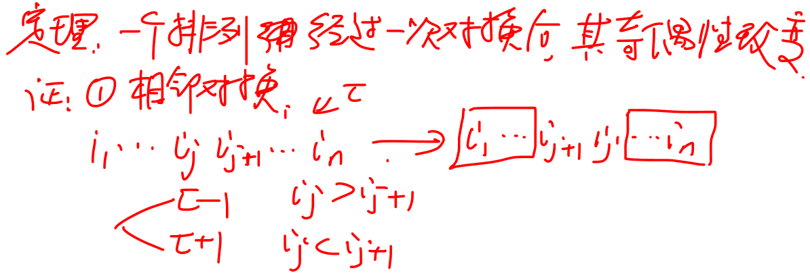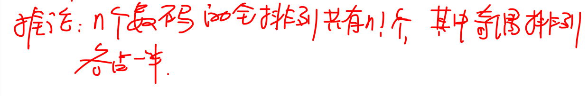
理解：所有奇排列都有与之一一对应的偶排列（即有镜像的偶集合）

行列式的完全形式
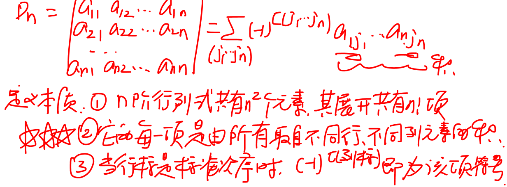上三角行列式
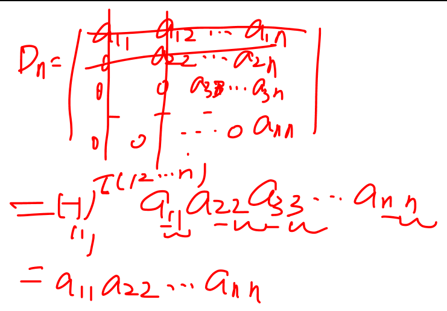
由于上三角行列式的值只有一项，因此可以将行列式向上三角转化方便计算

