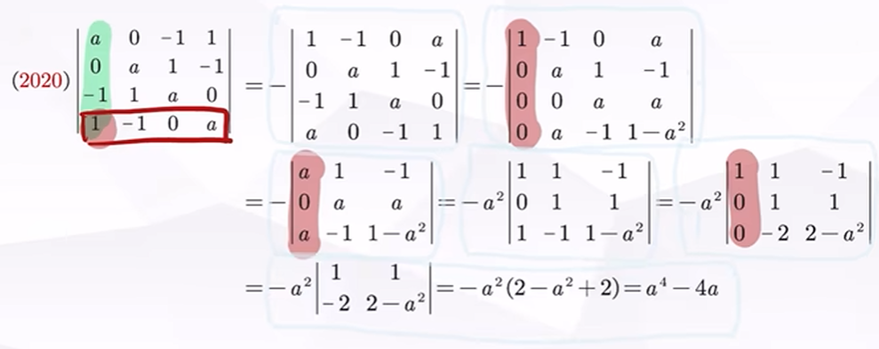
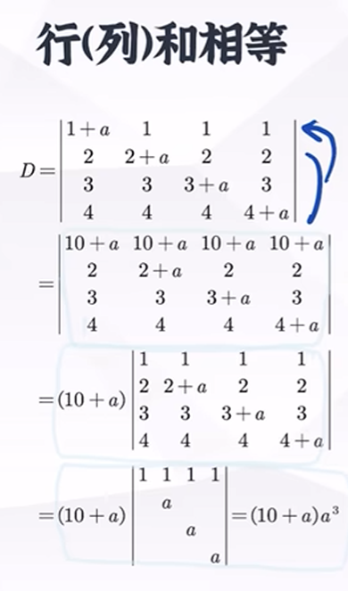
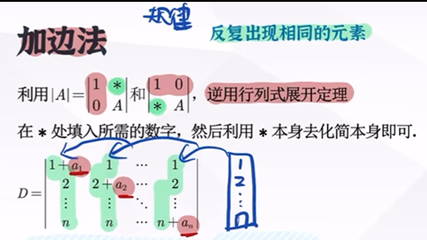
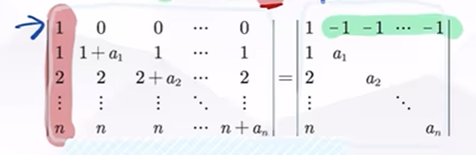
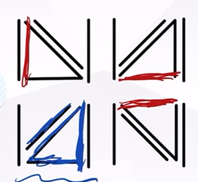
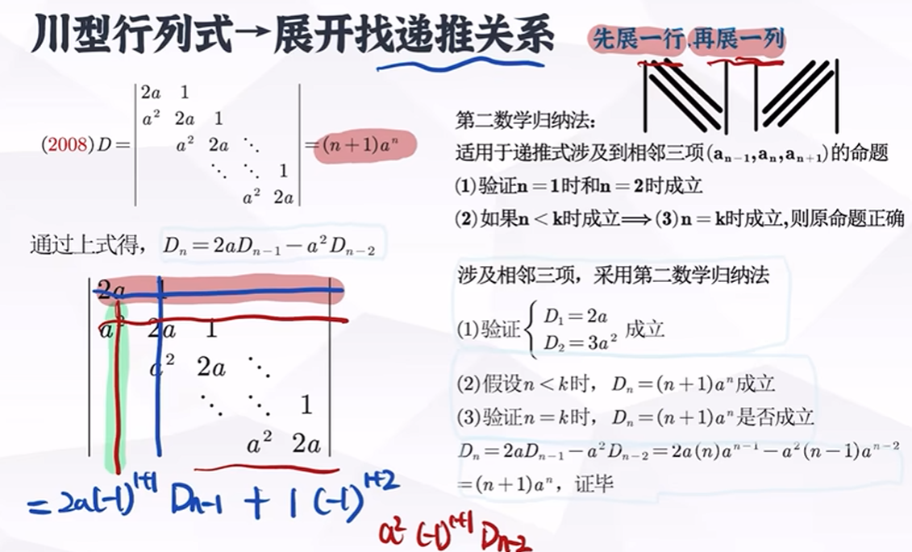
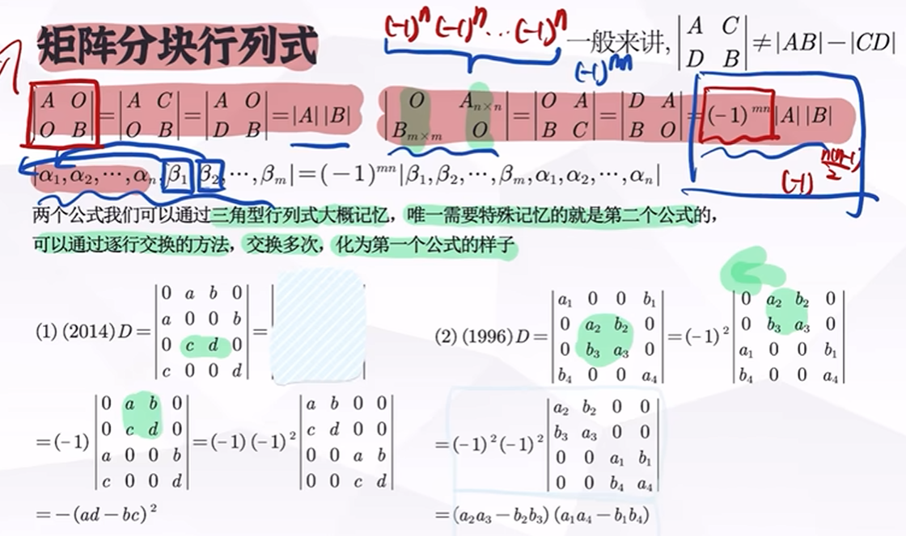
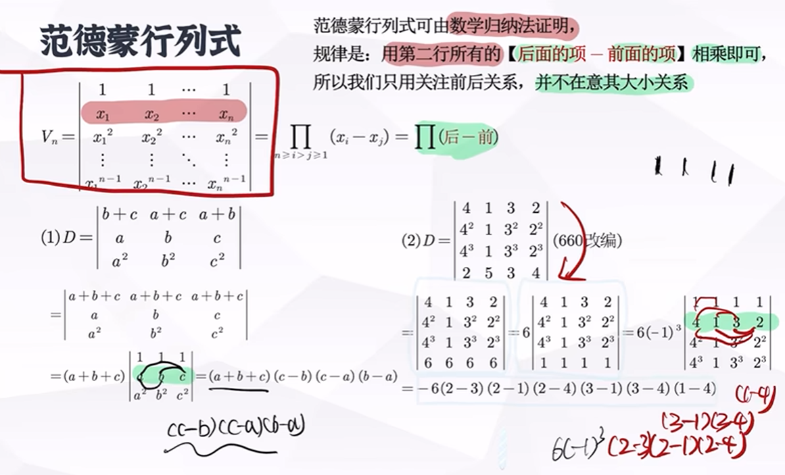

## 高斯消元法
直接通过移项将式子化为上三角式或下三角式

## 打洞降阶法（人话：将某行/列变成只有一项）

抓住全是0的行/列，进行展开（拉普拉斯定理）

## 行列相等/加边法（注意观察，特征：相加相等）
1. 行加起来全都相等，然后提出化三角行列式

2. 补足用来消元的“边”

此处用拉普拉斯定理构造与先前相同的行列式

然后我们能得到一个爪形行列式 #爪形行列式

## 么型行列式（递推法，解决办法：连成三角形）

按照能构成三角形的方向展开（尽可能少的元）

## 川型行列式（往往会产生相邻三项的关系）

先展一行，再展一列

## 广义拉普拉斯定理（矩阵块行列式）

## #范德蒙行列式 范德蒙行列式
最终形式（第二行中的所有数字下标依次大减小累乘）

