## 矩阵的乘法
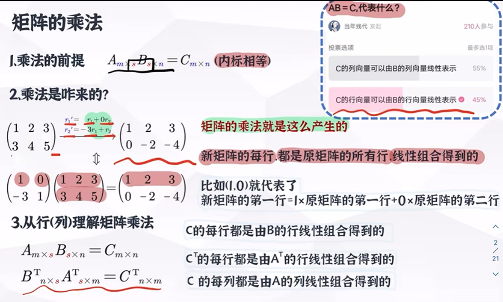
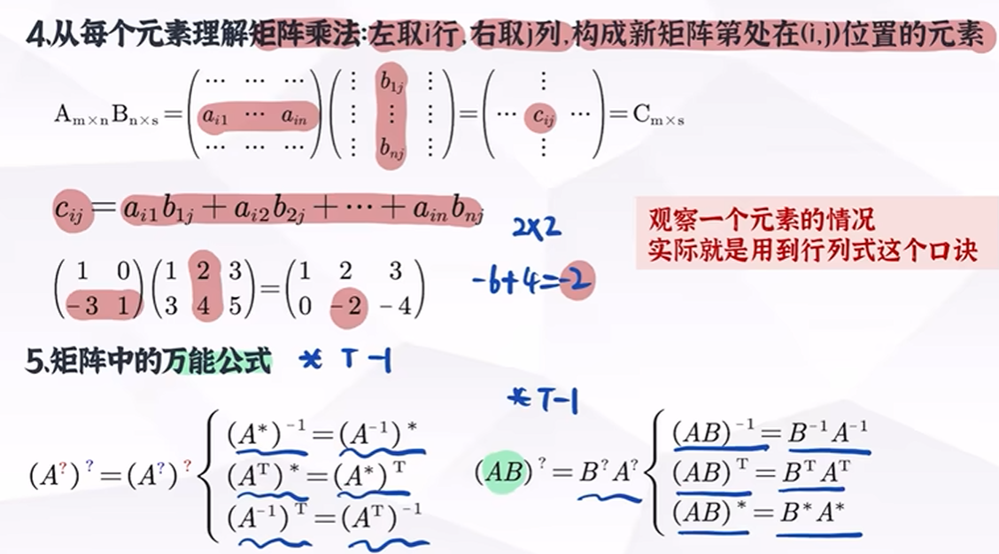
## 三种特殊的矩阵乘法
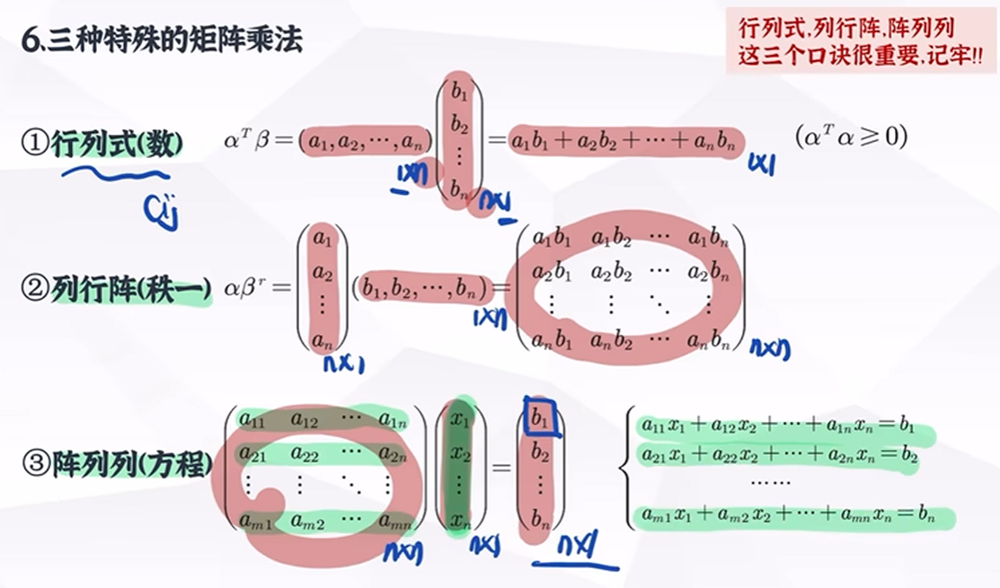
## 初等矩阵（将原式经过最高一次初等变换）
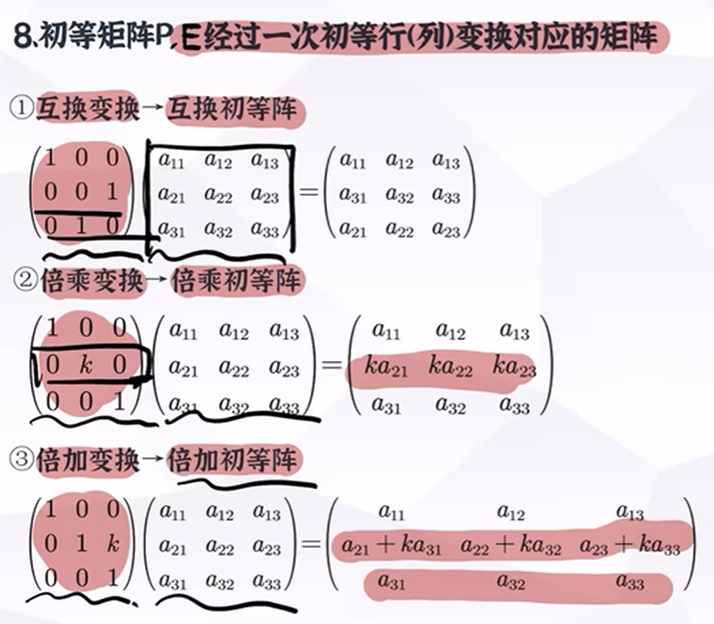
六种变换：行/列 的 互换/倍乘/倍加

从矩阵乘法本质来理解真是太方便了！！吧初等矩阵当成指令
左乘单位阵是在行方面的改变，由乘单位阵是在列方面的改变（不过也可以理解成右边原式对于单位是的行改变）

## 矩阵的初等变换与矩阵乘法的关系
矩阵的初等变换 ：
1. 将变换等于等式
2. 给出a逆的其他解法
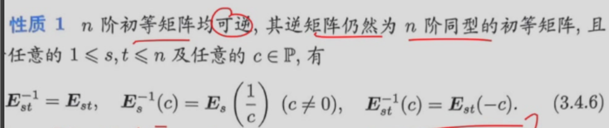
有关三的证明：
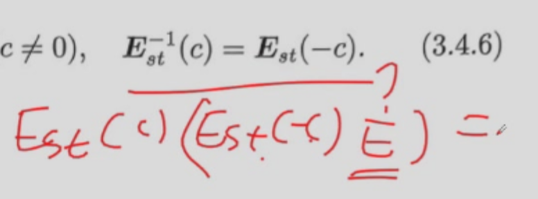

定义四
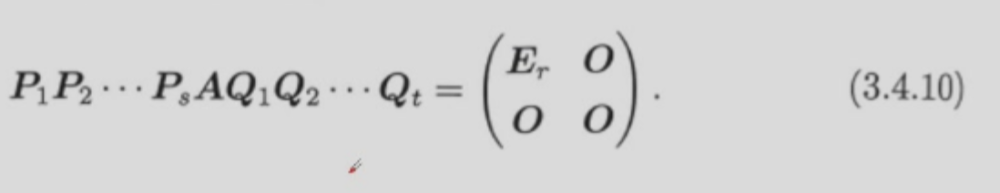
大意，任何以行列式经过有限次行列初等变换都能变成以秩为基准的相抵标准型。
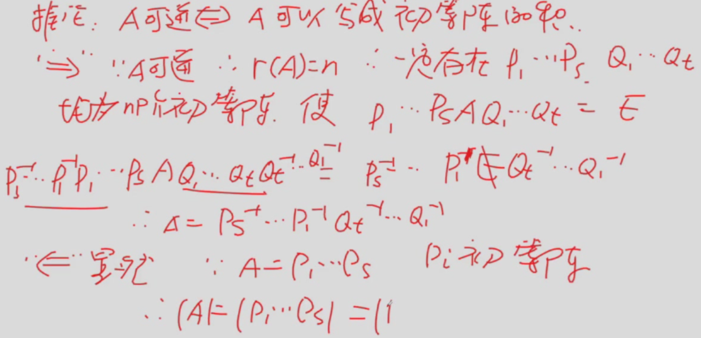
可逆的另外运算方式
推论：A可逆等价于A可写成初等阵乘积（为什么下面只剩行变换了）
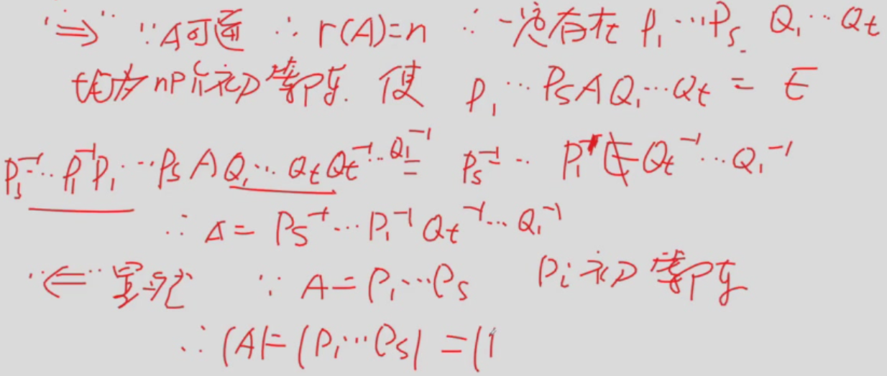

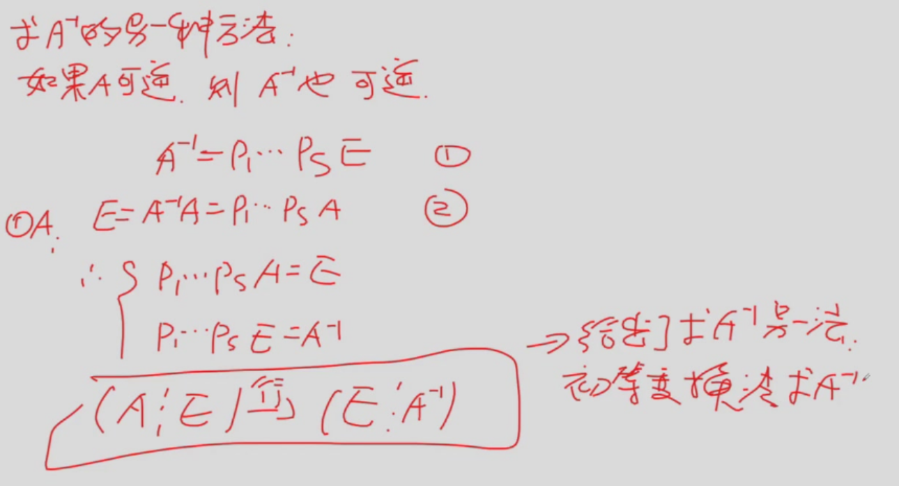
意味：A经过两次变为单位阵的行变换可以使A变为A逆
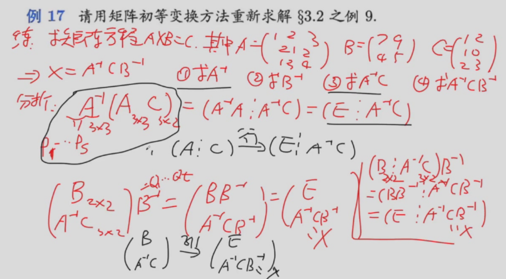
聪明的解法↑采用矩阵的结合（拉普拉斯逆用）

## 矩阵运算对矩阵秩的影响
1. 初等阵不改变矩阵的秩
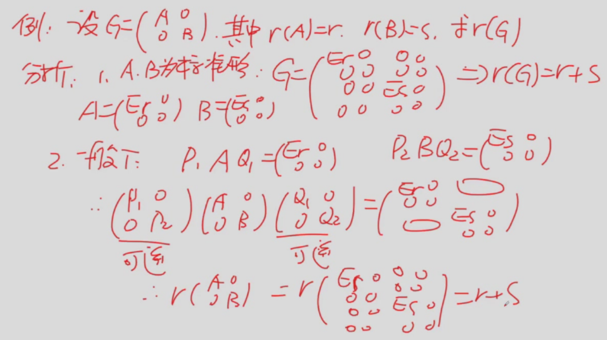

基于秩的证明
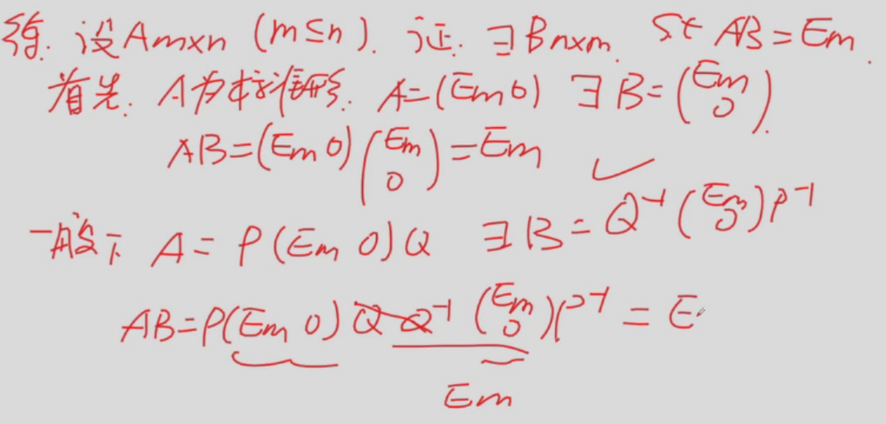
秩的8条性质（有关秩，能不能从更本质的角度来看）
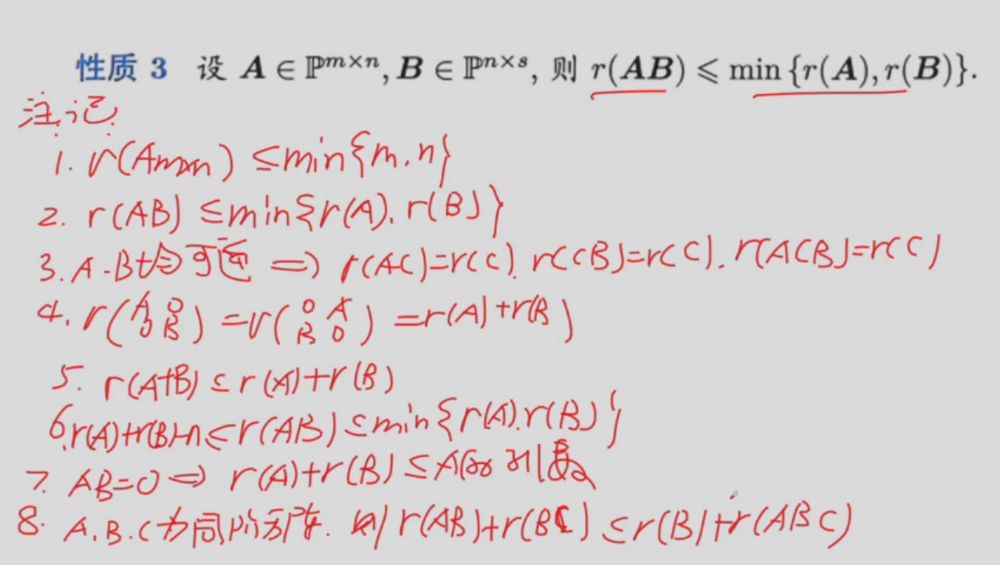
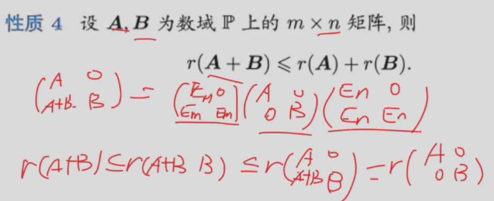
还是为了配凑出可以直接拆解的形式
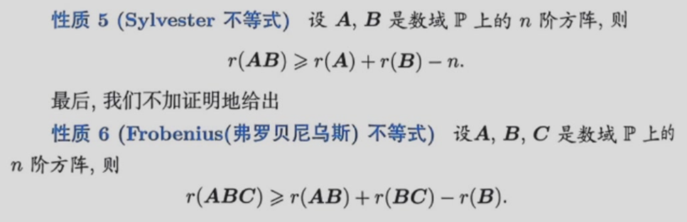
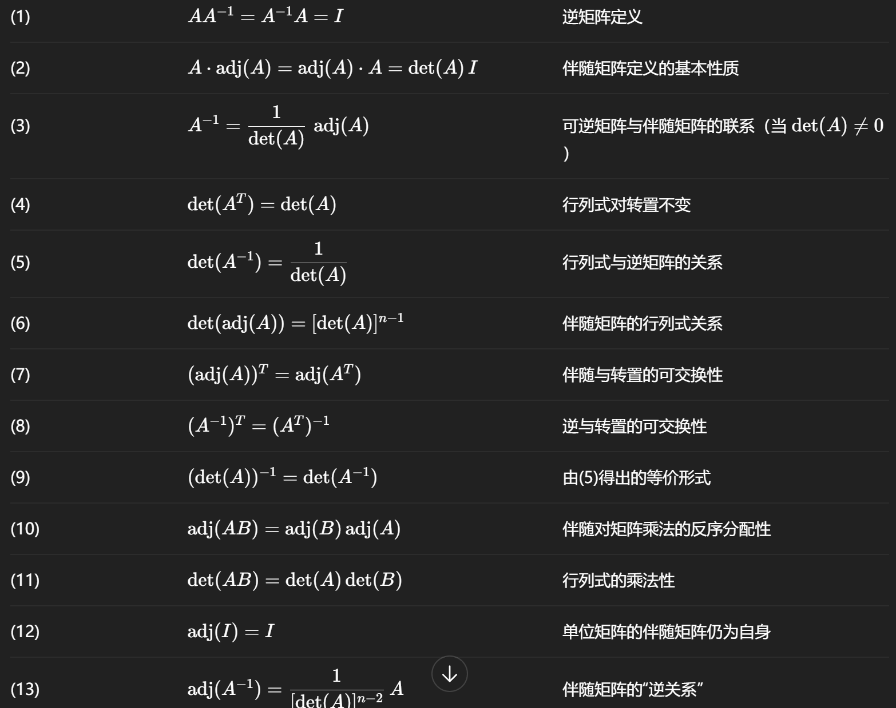

#### 一种比较特殊的解法
 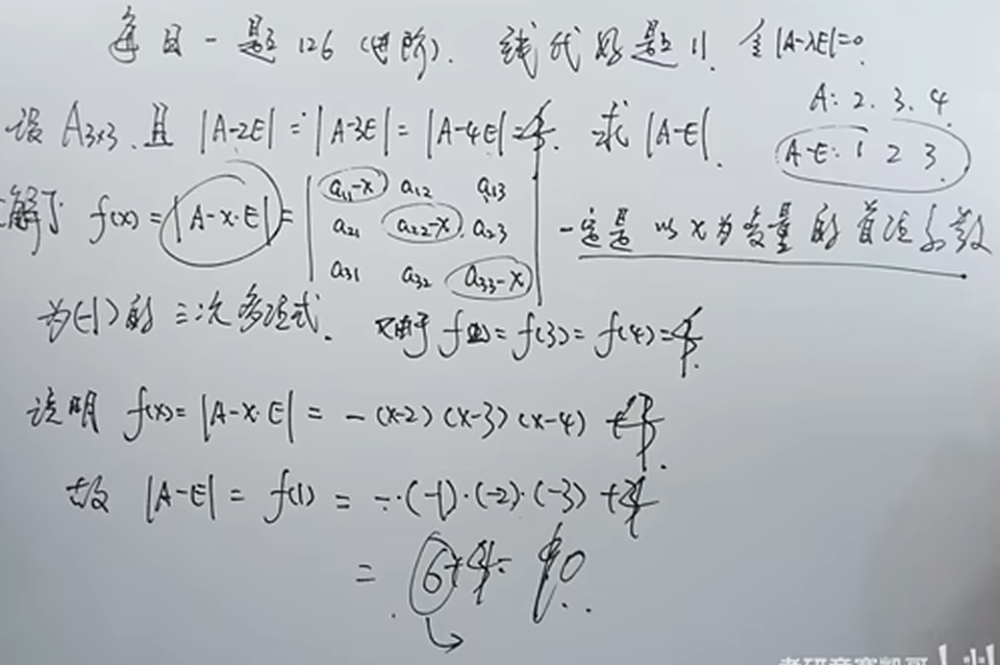
