1. 矩阵无交换律
本身无法交换（行列数不满足）
交换结果不同型（行变列）
交换结果不相等
由此，矩阵可交换，必为同阶方阵
2. 矩阵无消去律
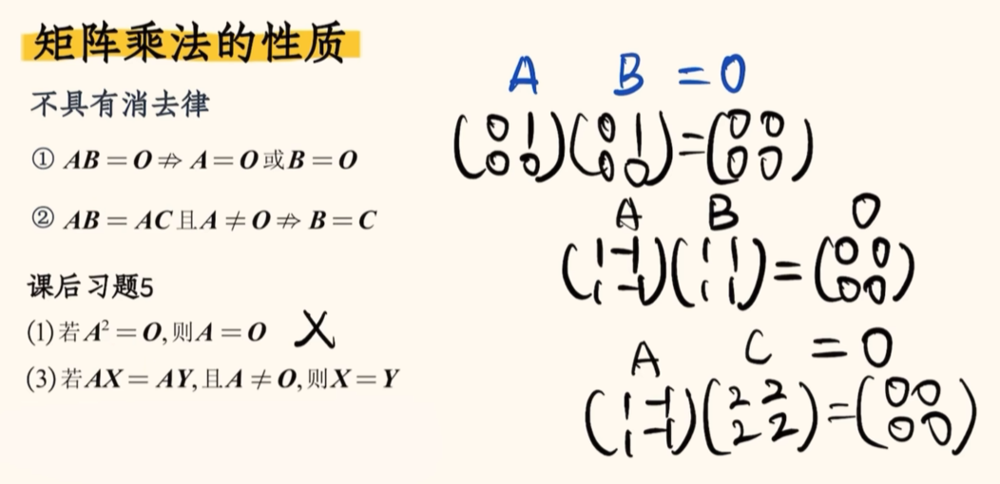
3. 矩阵有结合律和分配律
4. 特殊矩阵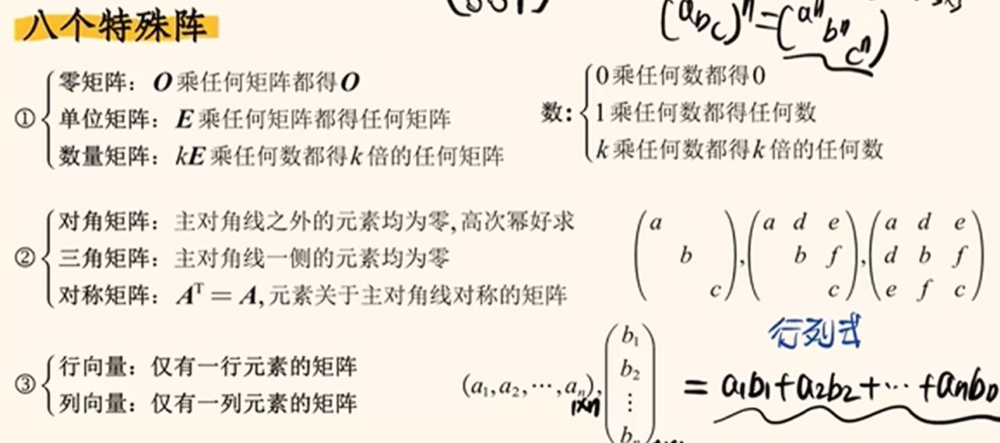
5. 逆矩阵求法：将目标式化为AB=E的形式
6. 矩阵方程请先判断可不可逆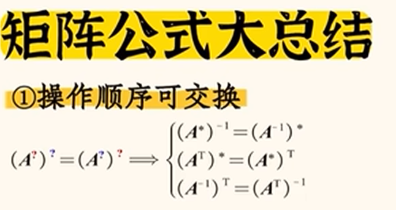
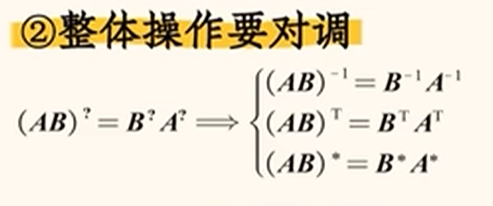
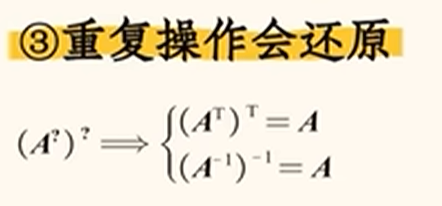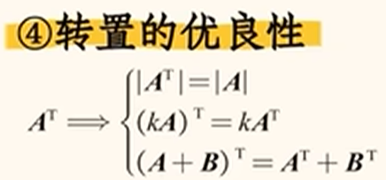
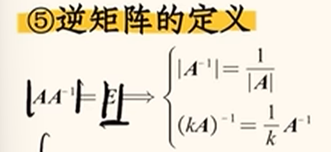
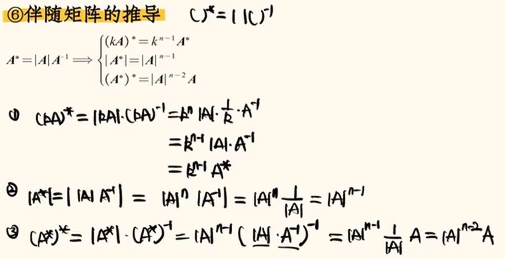
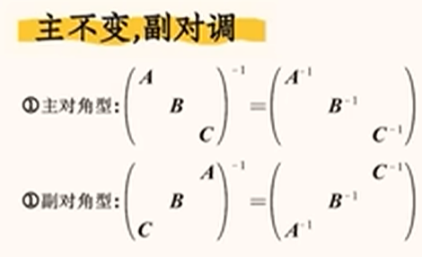

7. 有关矩阵的多次
可以将矩阵变为一个单位矩阵和一个普通矩阵的和
然后用二项式公式（直接乘也可以）
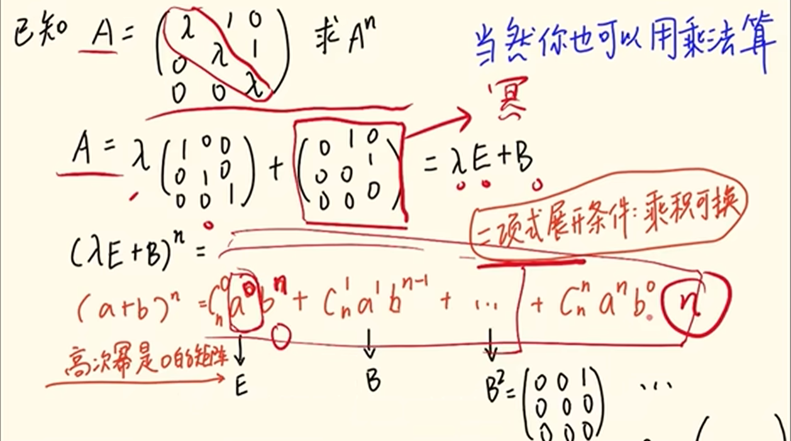

8. 约翰若当行列式在使用时要注意左右之分
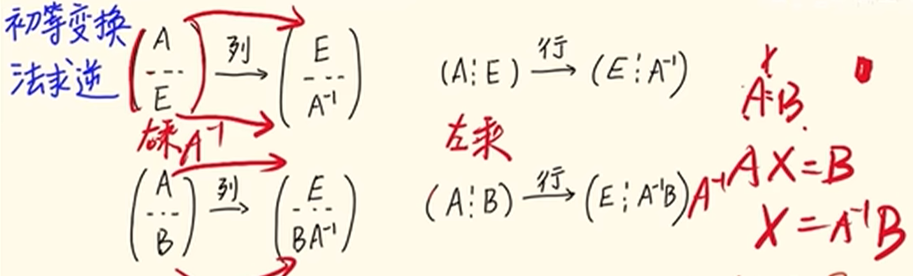
左乘用行，右乘用列

## AB=0的思考
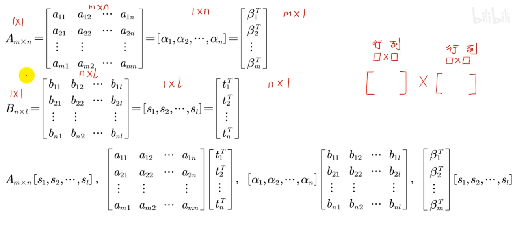
首先，行列式有多种表出形式，可以通过不同形式的意义来得到信息
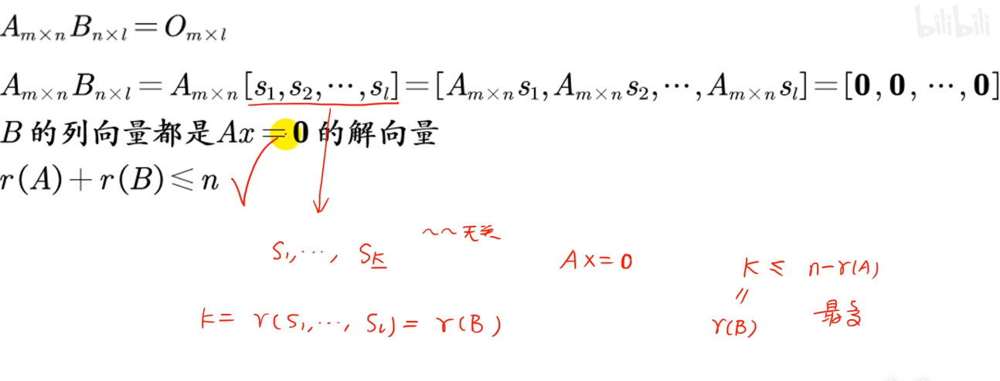从这个角度看，就是Ax=b（0矩阵的随意变化性），由此就有解的个数推广到维数

