1. 8条运算法则：（注意，此处讨论的基本都是向量空间的值，而不是简单的数）
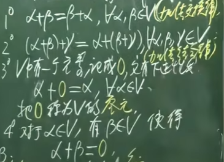
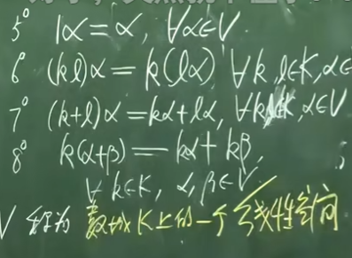

2. n元向量空间的基本思想来源
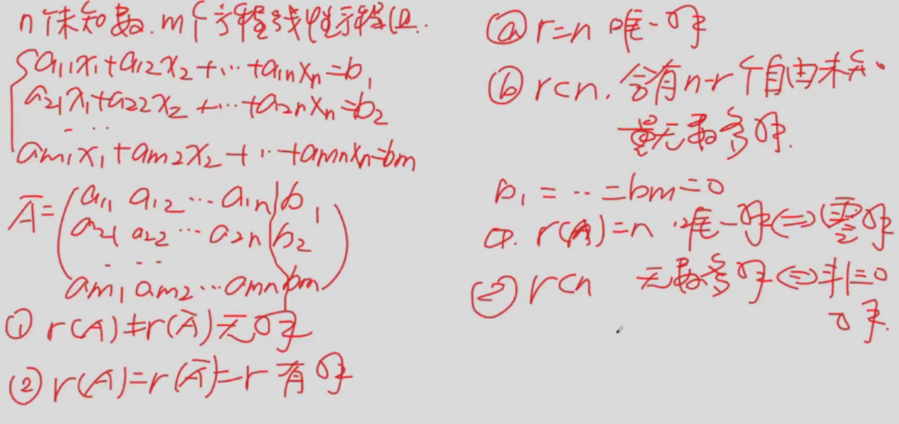
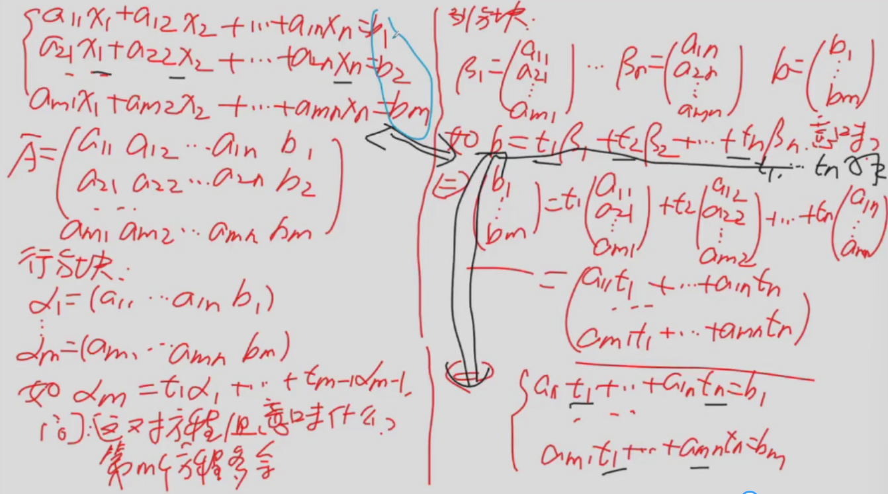
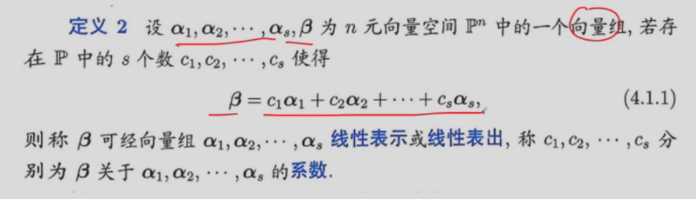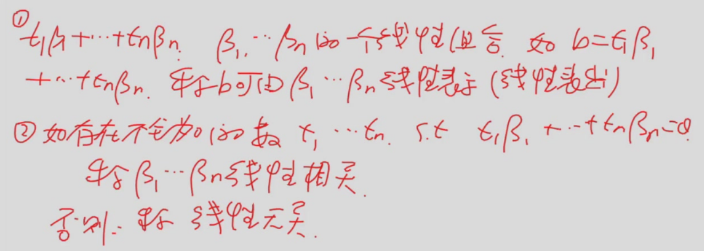
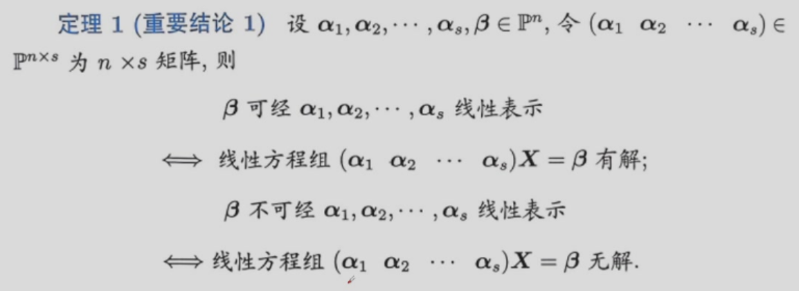
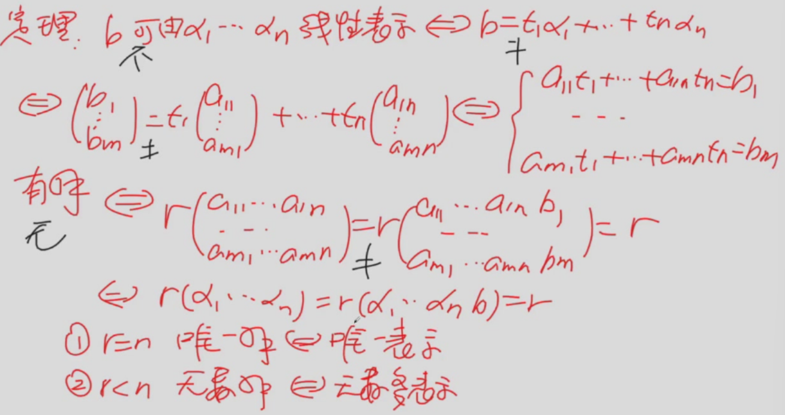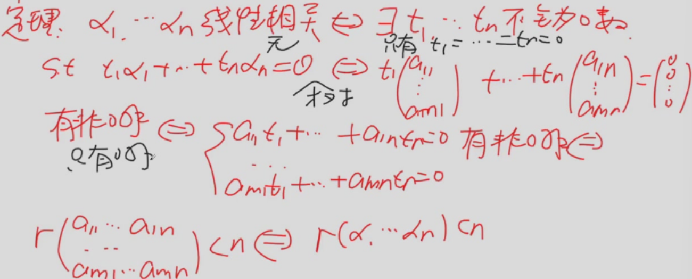

### 相关基本性质

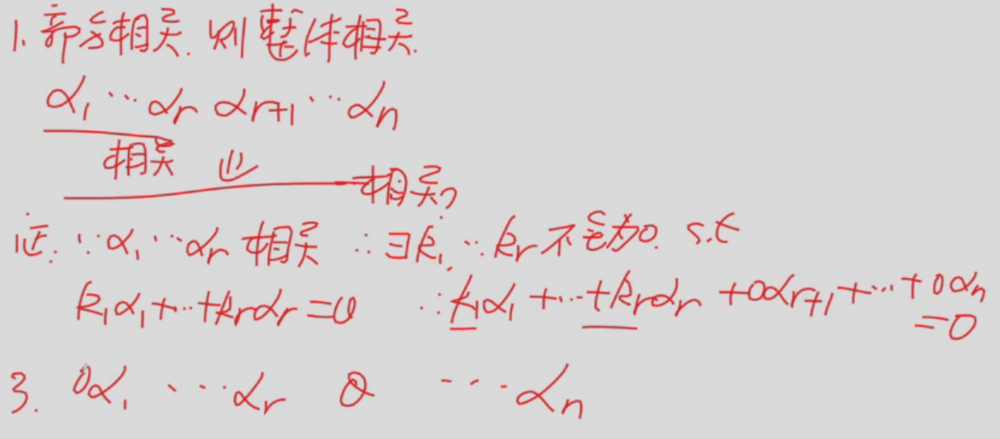
整体部分的例题
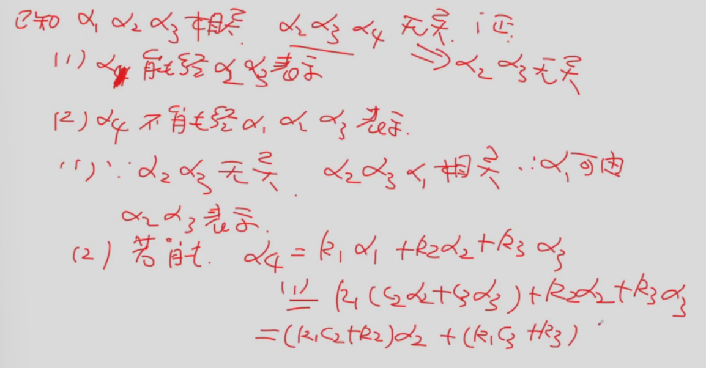

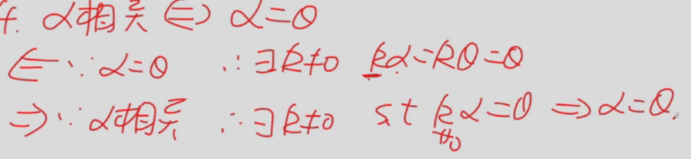
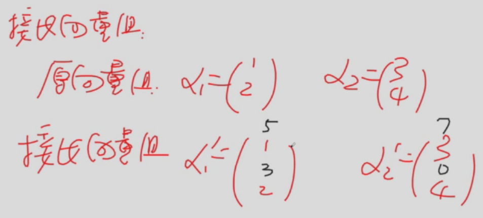

性质：原向量组线性无关，则接长向量组也无关
（原向量组使得系数矩阵全为0）

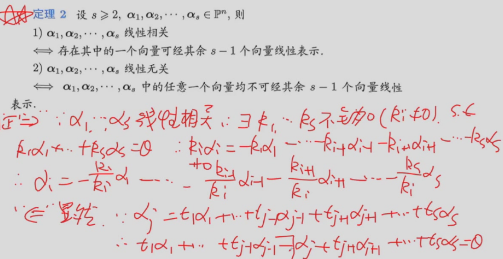

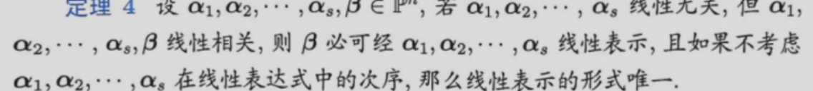
线性相关的向量组其中的某个n维列向量总能由其他的n维向量合成×

无关的线性向量组在添上新向量后相关，则添上的向量是原方程组的唯一表示√
### 证明
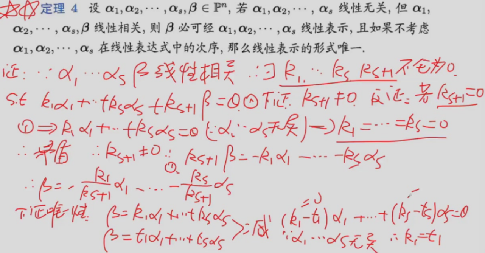

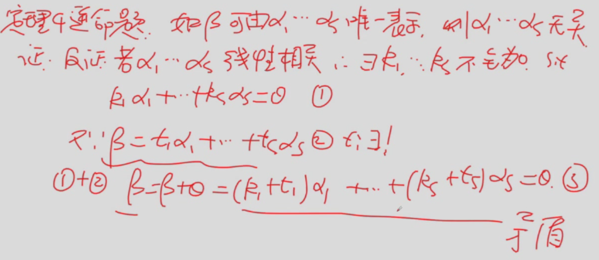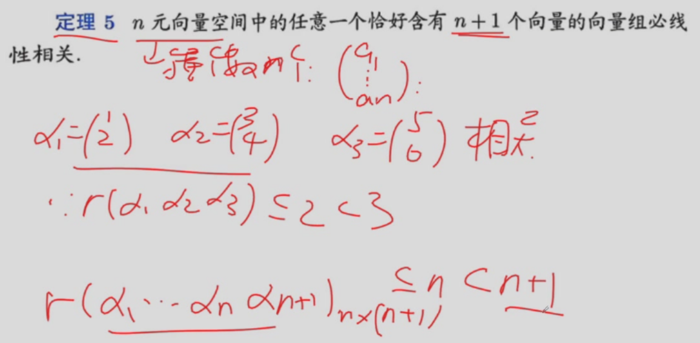

### 四个主要定理
1. 一个向量组线性相关，其中的一组向量必能有其他向量表示
2. 无关的线性向量组在添上新向量后相关，则添上的向量是原方程组的唯一表示
3. 多用少表示，则多相关
4. 一个无关向量能用另一个向量组表示，它的向量数小于另一个向量个数。

## 表示原理的实际操作
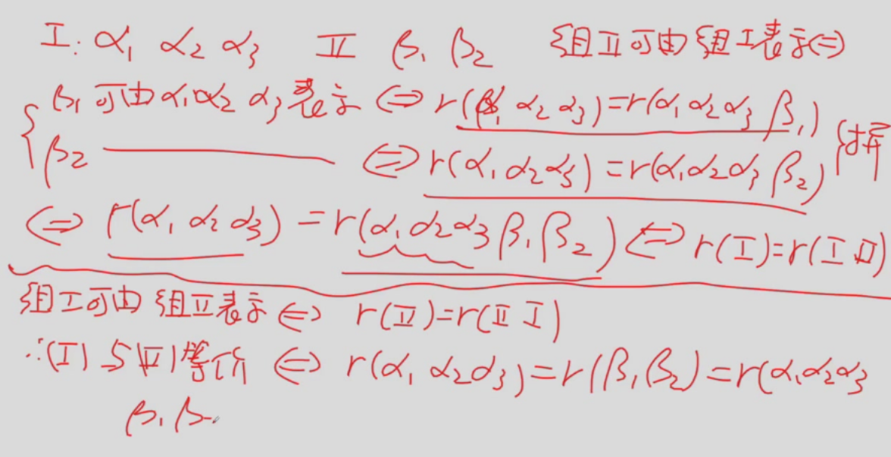
用阶数的变化衡量向量的可表示性

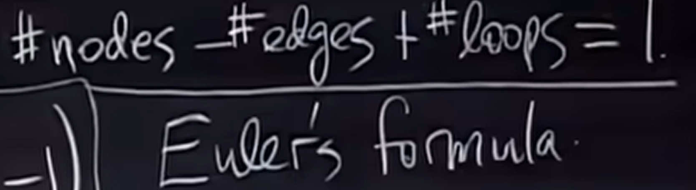
欧拉平面图论公式

