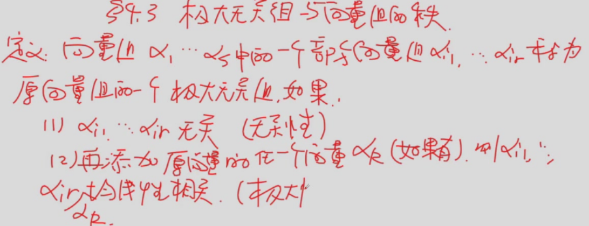
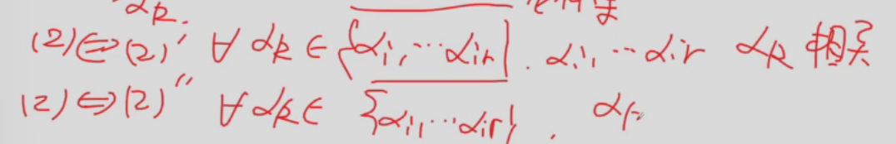
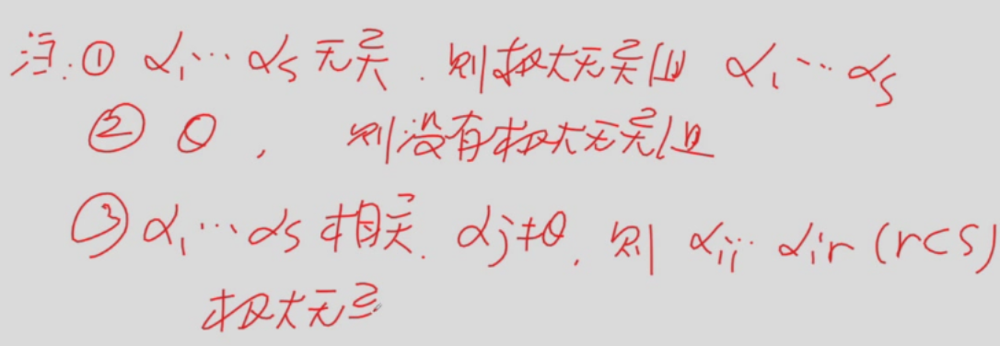
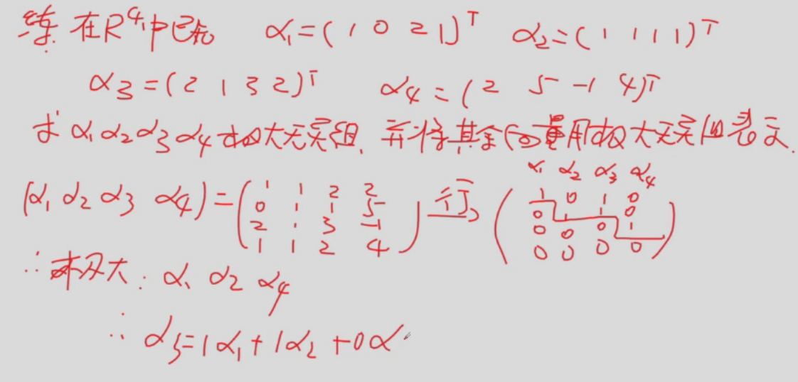
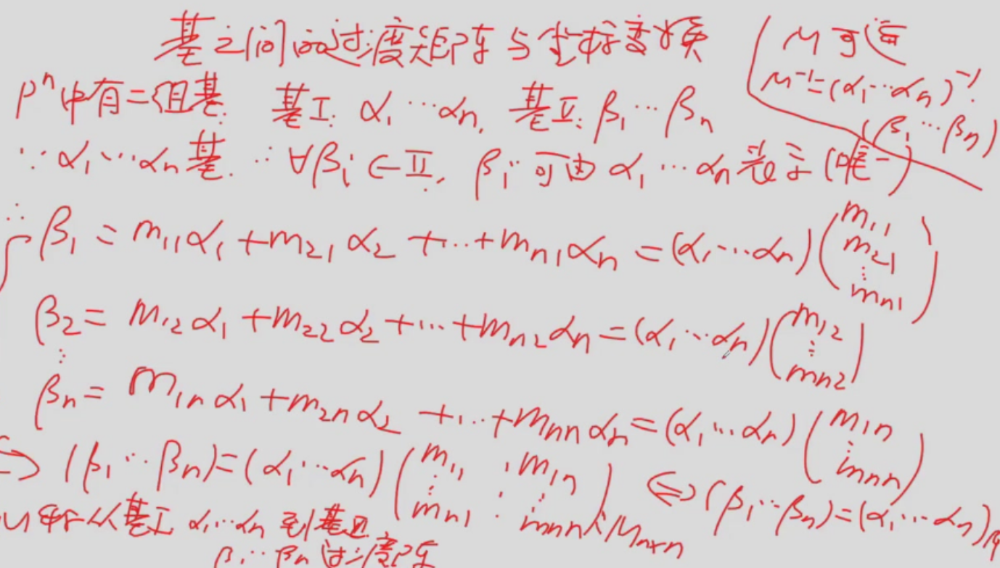
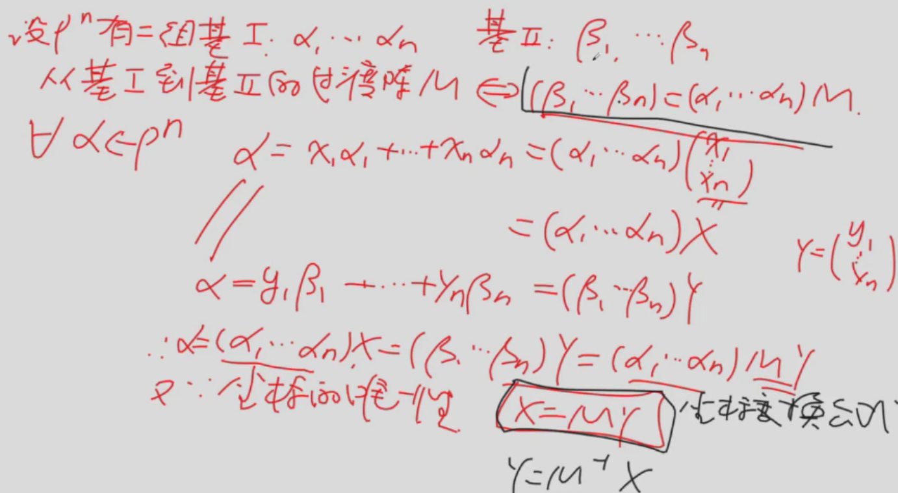
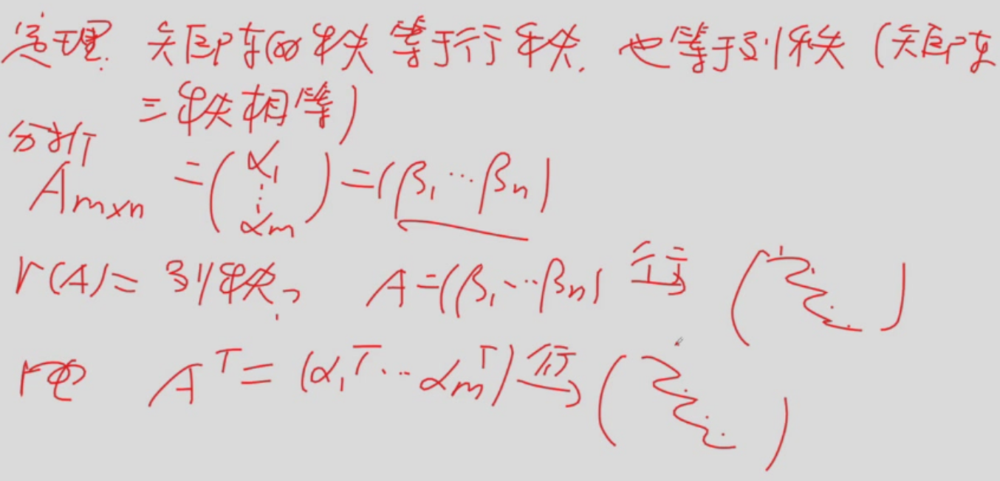
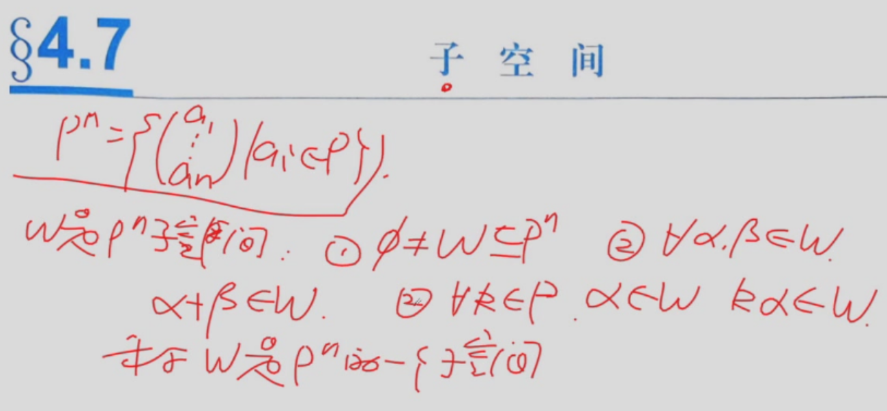
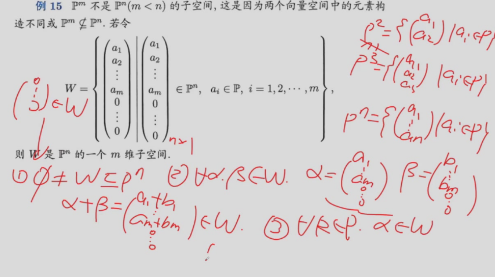

证明（定理2）：

向量组可对应多个极大无关组，但不同极大无关组中向量个数相同

原函数本身的角度看极大无关组

一个向量组的极大无关组是等价的，因而个数相等

向量组的秩：极大无关组的个数

极大无关组不唯一，极大无关组一般找阶梯头，确认后只要保证向量数相同就行。

## 基，维数，坐标
基是Pn中强调顺序的极大无关组
维数是基的个数（极大无关组个数）
坐标是向量用基的表示系数

## 基之间的过度矩阵，坐标变换

求M可以用高斯若当变换来求（本质是求逆）
## 矩阵的秩和向量组的秩

## 子空间

注意，子空间作为一种数域也要求封闭性（这里指维数的封闭）
两个平凡子空间（哪都有的子空间）零空间和自身
（加法/数乘）

子空间验证↑

