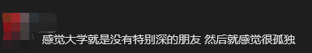
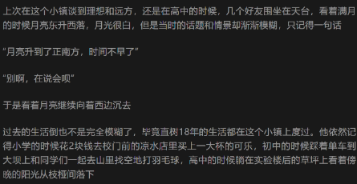

这篇文章的写作灵感完全是看到了高中同学给我发的一句话

对方在北京读大学，我们一年上下可能也就出门不到十次，有的时候吃顿饭，有的时候去旅游

他的朋友圈中经常能看到和十多个好朋友一起出去玩的九宫格，这也让我很难想到他竟然是我们几个高中同学中会感到孤独的人

我的大学其实也经历了一个由空心慢慢转变的过程，大学的原子化让太多人没有办法推心置腹地交流各自的精神状况，虽然我是个情绪阈值较高的人（好了说是不吃压力，换句话说是木头脑袋）

但是即便呆板如我也需要一个情绪的出口——这就回到了我们的标题

昨天和朋友出去唱K的时候谈到了语言通货膨胀的问题，随着互联网的发展，我们语言的信息密度似乎下降了很多，这导致我们需要用程度更深的词来表示我们的语义来表达，从250到司凤，我们的网络文化似乎在不断地消解着语言的严肃性，这也导致了语言的廉价。而传播的必要也逐渐消解了互联网的超链接属性，当网民的数量越来越多，没有门槛的低俗表达方式往往更容易被接受，所以我们现在会用程度更深，含义更浅的词来表示原来的意思

扯远了，上面说的好像和标题有关系但不多

我们后面提到了我们怎么放下我们的道德戒备让这种话说出口，一方面是词义的稀释让这种话变得寻常，另一方面则是我们和朋友交谈的时候确实处于一种较放松的精神状态中

我仔细想想好像确实是这样，能够让我亲口骂的大多数都是和我走的比较近的朋友，而这种朋友上了大学之后似乎就少很多了

其实这个现象我在之前的一篇小说中也提到过

高中纯粹的生活能够让人去思考活着的意义，也让同学之间的联系更加紧密，同时这种关系同样也是一种情绪的出口，然人能够在这个环境中生存下去

---

其实这篇文章是突发奇想写的，写一半忘了想些啥了，先这样好了[ac01]以后再改吧

2026/10/8