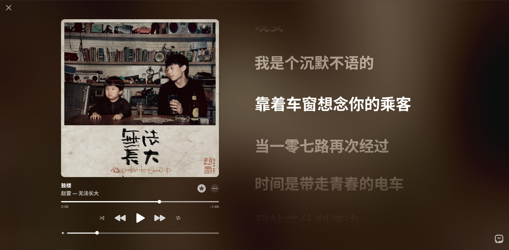

[原曲](https://music.apple.com/us/song/dream-lantern/1434005771)

あぁ「願ったらなにがしかが叶う」

その言葉の眼をもう見れなくなったのは

一体いつからだろうか なにゆえだろうか

あぁ 雨の止むまさにその切れ間と 虹の出発点 終点と

この命果てる場所に何かがあるって

いつも言い張っていた

いつか行こう 全生命も未到 未開拓の

感情にハイタッチして 時間にキスを

５次元にからかわれて それでも君をみるよ

また「はじめまして」の合図を 決めよう

君の名を 今追いかけるよ

最近经常做梦，刚好又想起了这首出现在君名中的插曲

不知道为什么，最近的梦境总是越来越真实，直到我很难分清梦境和现实的区别，身边发生的很多小事也逐渐渗透进我的脑海，最终和我的梦境相交织，直到分不清真实和虚假的区别

其实真的要我详细地说出最近梦到了什么，我可能也只能说出一些零散的碎片，比如我梦到回到学校走过很多熟悉的地方——小卖部、操场、很多只去过一两次的小道

其中我也会有时候梦到我高中的一些过往，可能是最近又看了一遍《情书》，我也会想起高中时有着好感的人，虽然现在看来高中没有三观的我其实不适合去处理这些更深入的人际关系，我也很多时候会想我的轨迹会不会因为当时做的一两个选择而发生改变，但是我觉得一切毕竟都是命运最好的安排

这种感觉有点像张爱玲说的：

「也許每一個男子全都有過這樣的兩個女人，至少兩個。娶了紅玫瑰，久而久之，紅的變了牆上的一抹蚊子血，白的還是『床前明月光』；娶了白玫瑰，白的便是衣服上沾的一粒飯黏子，紅的卻是心口上一顆硃砂痣。」

当见过的人越来越多，我也慢慢地开始意识到我到底在追求一种什么样的感情状态，很多时候对过去的追缅其实更多的是一种未尽的遗憾，如今的我可能会更去追求一种精神上的一致，也更相信命运的安排，人与人之间首先要有共同话题和一致的内核，然后才能接着去考虑接下来的柴米油盐

但是回到上面，脱离情感冲动的发心其实也是不完整的。或者换句话说，很多时候正是时间让一些过往的体验变得越来越香醇，然后在时间的长河中慢慢淡去，成为基因中的一个片段，在某些特定的时候激发你的思绪，其实仔细想来，我上面的这些体验很多时候其实也只是一种幻想和加戏，不过是在时间的长河中被冻结成了一块珍贵的琥珀

刚好听到了赵雷的《鼓楼》

时间不语，带走青春，周遭喧闹，与我无关，人群熙攘，而我孑然

2026/10/5
乱写