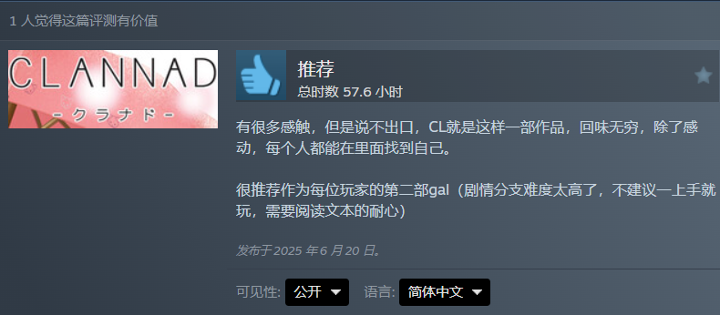

这两个作品都是在高中玩的，现在如果重新让我去玩说实话有点玩不动了，当时玩完其实这两部作品给我的感情冲击还是比较大的，以致于没有留下什么感触类的文字，导致现在看来已经记不起当初的感觉了

---

---

其实现在玩gal很少能给我带来灵魂上的触动（或者说我现在很少玩gal），我仔细想了下这是为是什么，其实感人的剧情还是在的，但是可能我真的无法再像以前那样投入地，连续地去玩一部gal了，看到一些情节地时候也难免地去思考他的必要性和真实程度

或许我真的失去了去阅读一个长故事的能力，也无法相信故事的发展就是如此简单，也很难相信男主真的就通过一些小事和所谓的真诚俘获了众多女主的芳心（cl不算），也无法相信每个巧合背后都暗藏着缘分和宿命

先写到这吧

2026/10/5
无题