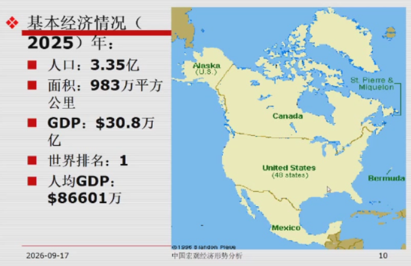
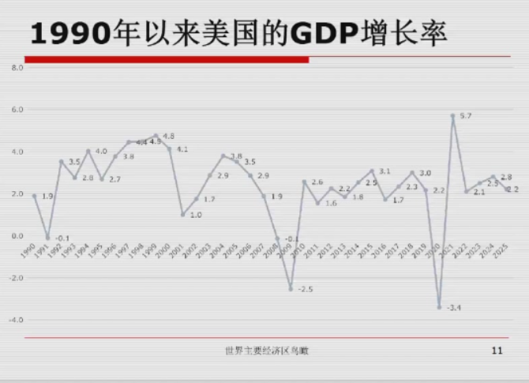
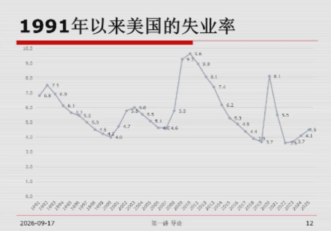
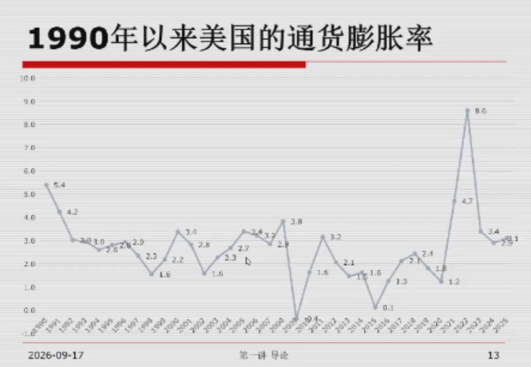
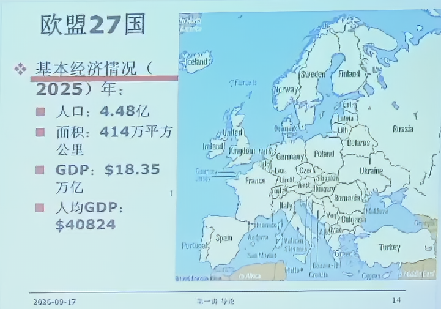
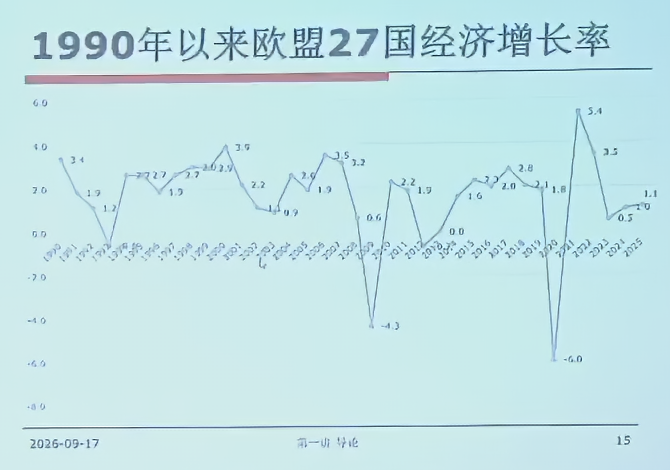
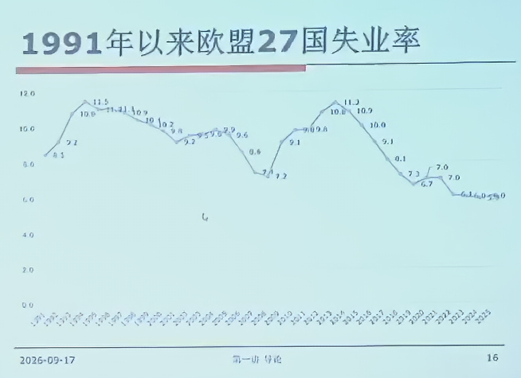
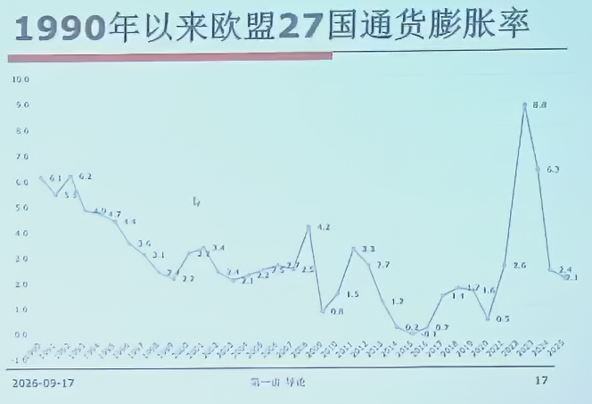
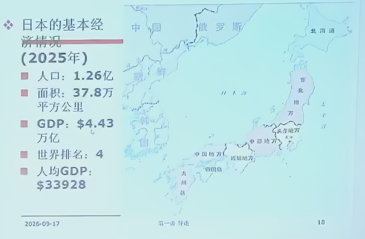

一国的经济主要看三个指标

 1. 产出（GDP）以及增长率
 2. 失业率
 3. 通货膨胀率

通胀的简单理解：低通胀有利于国内经济的坚挺，但不利于出口，高通胀在国内有不稳定性但有利于出口

然后我们以几个大的经济体来分析下

## 美国

东强西弱，今年西部崛起，展现出沿海强内陆弱

平均在3个点左右

2008年经济危机负增长，2020疫情负增长

90年代收到互联网红利，失业率下降

经济危机波动，美国失去的十年

疫情两年，不过回调很快

## 欧盟

西北强东北弱

增长点在2左右，但是和欧洲的民族文化有关系

9个点左右的事业率——福利病

公平第一，兼顾效率

中国经济的增长优化了供应链，通胀减少

## 日本

## 中国

