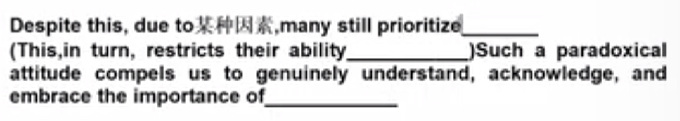
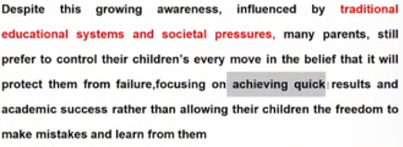
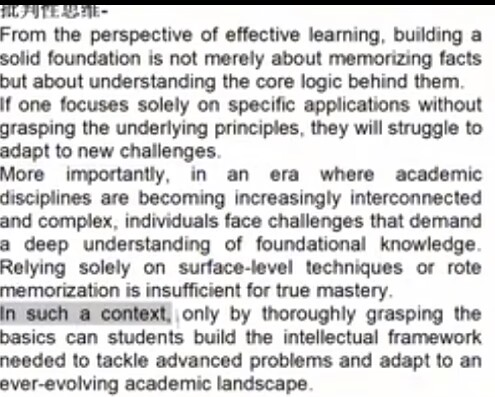

## 1（创造力）
1.众所周知+尽管如此+各种原因+反面超过了正面+依旧重视

**其实和高中语文作文差不多**
关键词-（下定义）-反面（诚然）让一步-正面说明（先解释是什么，有什么作用，再引入时代背景，说明这个时代正需要这样的品质，否则（如果只。。。就会。。。）会。。。，在此情景下，做。。。会。。。）

**扩充句子的句式**!

**如何说明重要性**
As 时代背景 continues to evolve,主题词 is increasingly recognized as a catalyst for 某方面，reshaping the landscape of 行业或者领域

**当能力和就业有关时**

写具体（和高中应用文很像）+

**结尾**
先反问-这个能力让我们···-结尾

