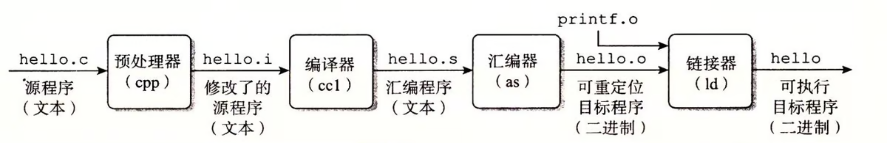
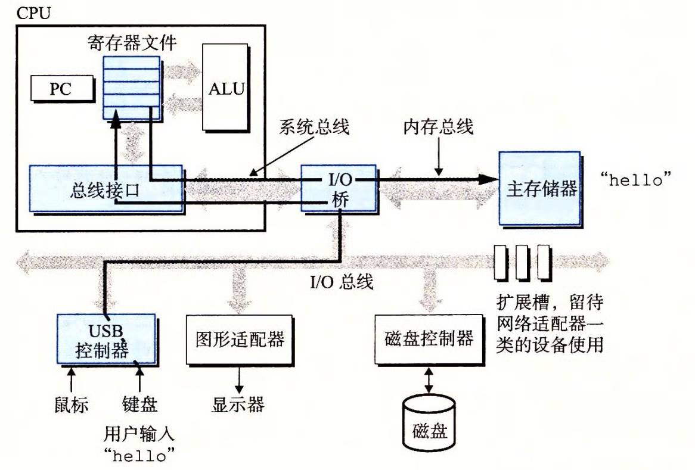
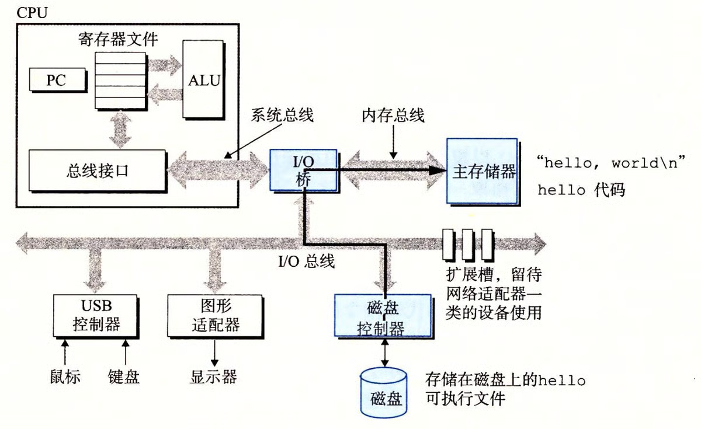
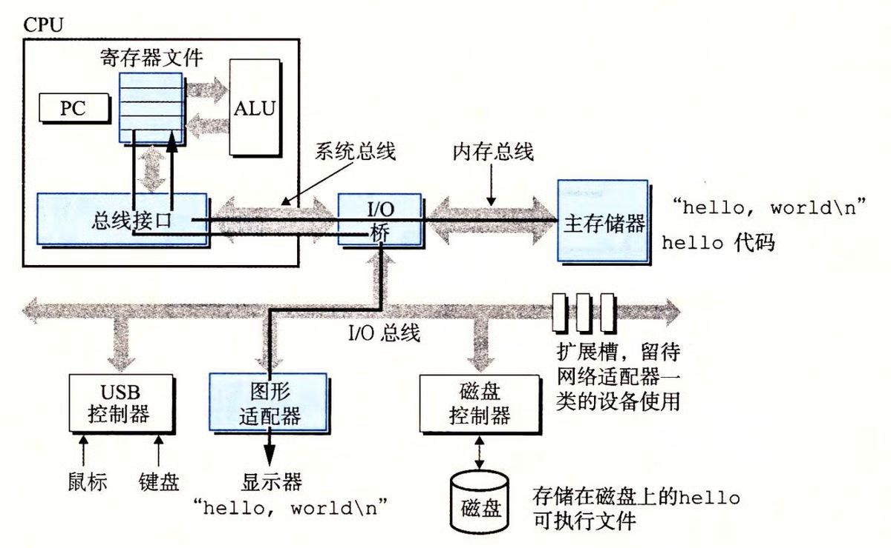

这个地方是我后来补上的，我现在十分推荐大家去看我们的csapp原本，真的写的太牛逼了，里面很多的图片真的都写得非常直观

```
hello 程序的生命周期是从一个高级 C 语言程序开始的，因为这种形式能够被人读懂。然而，为了在系统上运行 hello.c 程序，每条 C 语句都必须被其他程序转化为一系列的低级机器语言指令。然后这些指令按照一种称为可执行目标程序的格式打好包，并以二进制磁盘文件的形式存放起来。目标程序也称为可执行目标文件。
```

在 Unix 系统上，从源文件到目标文件的转化是由编译器驱动程序完成的

```
linux> gcc -o hello hello.c
```



这个地方展示了我们一张图片在进入我们电脑的执行过程

**预处理阶段。**预处理器（cpp）根据以字符 # 开头的命令，修改原始的 C 程序。比如 hello.c 中第 1 行的`#include <stdio.h>`

命令告诉预处理器读取系统头文件 stdio.h 的内容，并把它直接插入程序文本中。结果就得到了另一个 C 程序，通常是以 .i 作为文件扩展名。

编译阶段。编译器（cc1）将文本文件 hello.i 翻译成文本文件 hello.s，它包含一个汇编语言程序。该程序包含函数 main 的定义，如下所示∶

```asm
main:
    subq $8, %rsp
    movl $.LC0, %edi
    call puts
    movl $0, %eax
    addq $8, %rsp
    ret
```

定义中 2～7 行的每条语句都以一种文本格式描述了一条低级机器语言指令。汇编语言是非常有用的，因为它为不同高级语言的不同编译器提供了通用的输出语言。例如，C编译器和 Fortran 编译器产生的输出文件用的都是一样的汇编语言。

汇编阶段。接下来，汇编器（as）将 hello.s 翻译成机器语言指令，把这些指令打包成一种叫做可重定位目标程序（relocatable object program）的格式，并将结果保存在目标文件 hello.o 中。hello.o 文件是一个二进制文件，它包含的 17 个字节是函数 main 的指令编码。如果我们在文本编辑器中打开 hello.o文件，将看到一堆乱码。

链接阶段。请注意，hello 程序调用了 printf 函数，它是每个 C 编译器都提供的标准 C 库中的一个函数。printf 函数存在于一个名为 printf.o 的单独的预编译好了的目标文件中，而这个文件必须以某种方式合并到我们的 hello.o 程序中。链接器（ld）就负责处理这种合并。结果就得到 hello 文件，它是一个可执行目标文件（或者简称为可执行文件），可以被加载到内存中，由系统执行。

看过我们之前关于计算机体系基础的同学应该能很清楚的看出我们接下来的路线图

下面是我们hello文件的执行方式







接下来其实还有网络和操作系统的部分，不过这两个部分我在其他的板块讲的深得多这里就不赘述（私自品味）了
