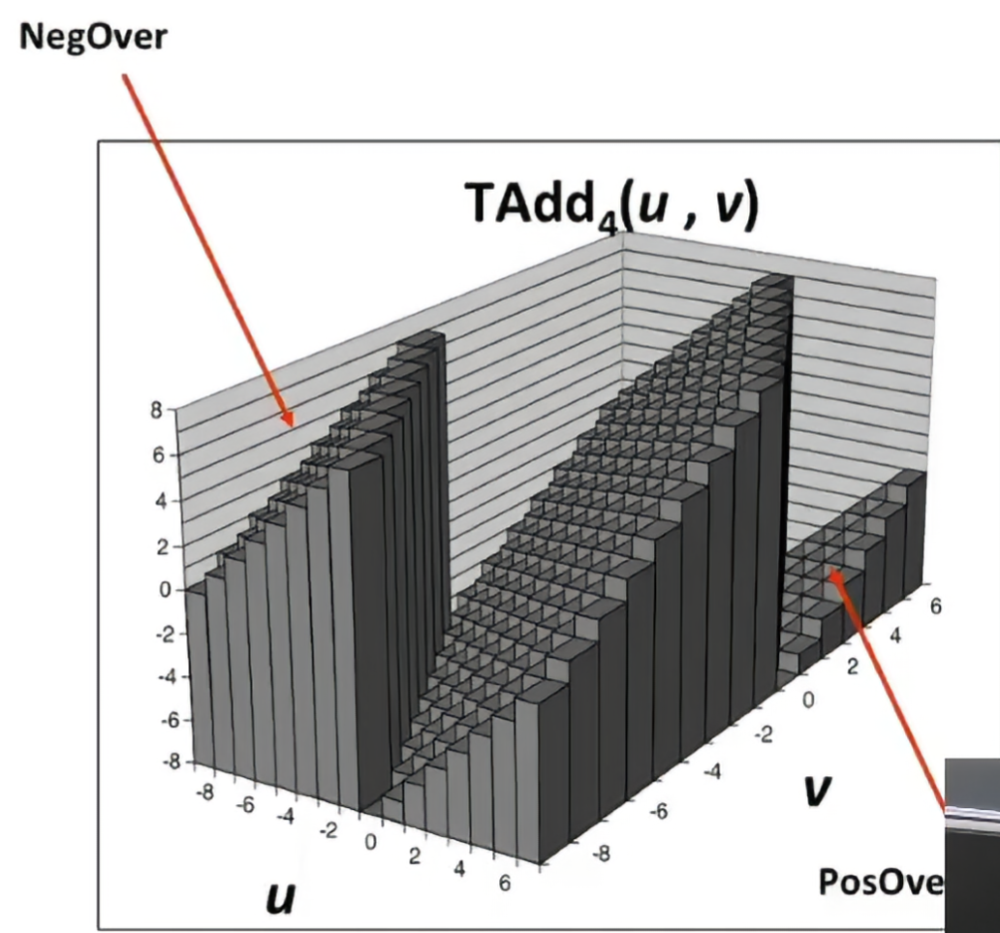
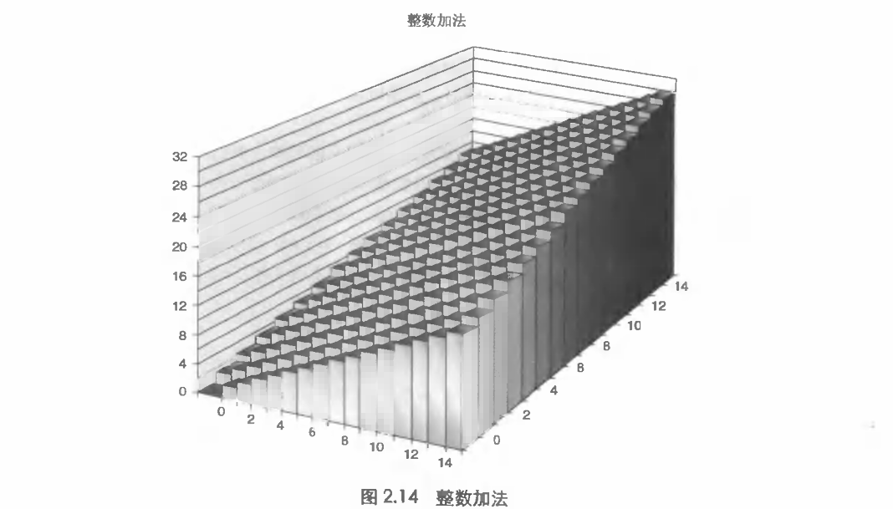
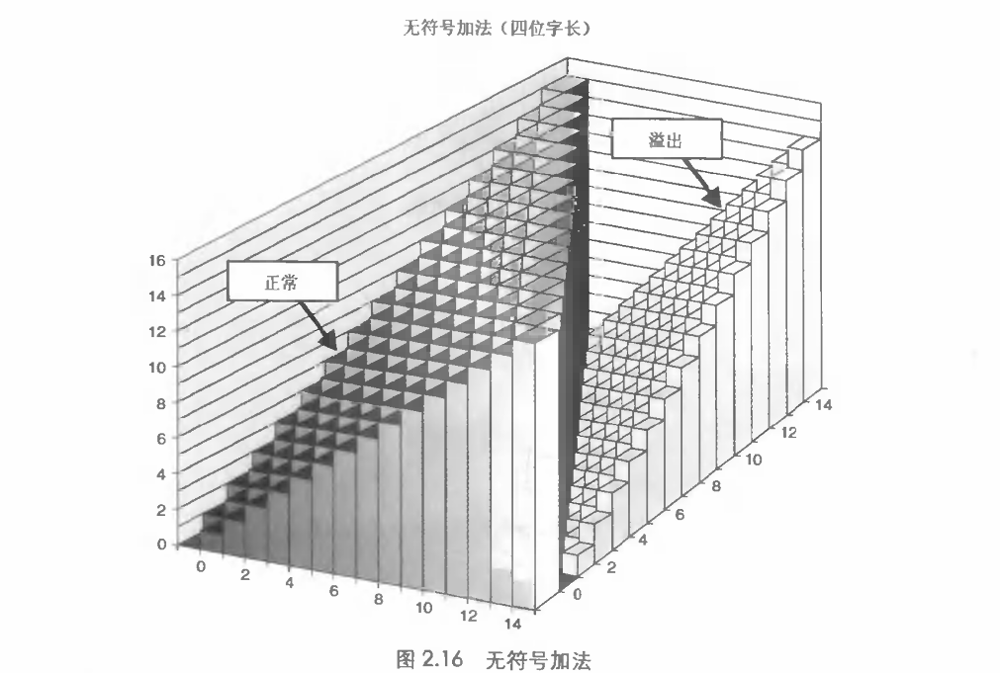
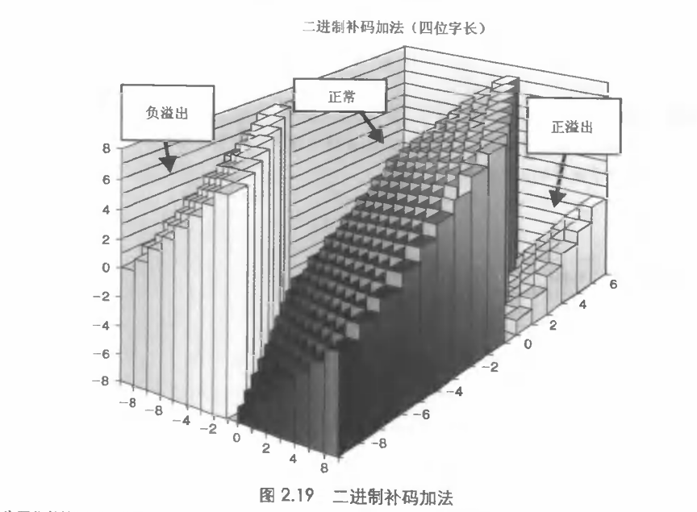
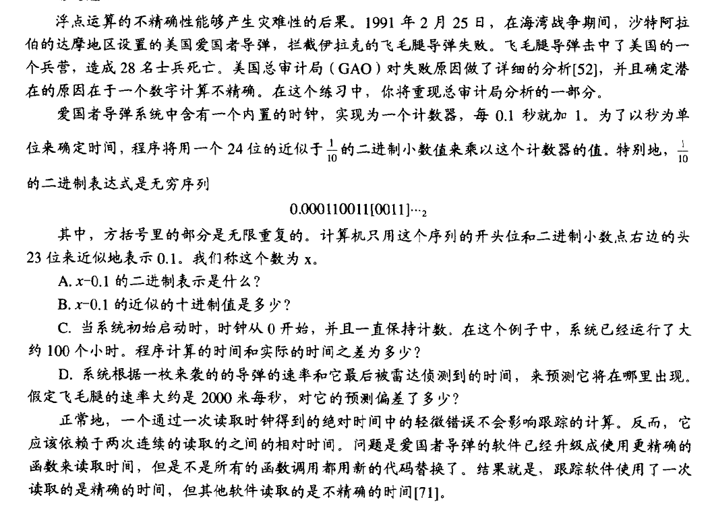
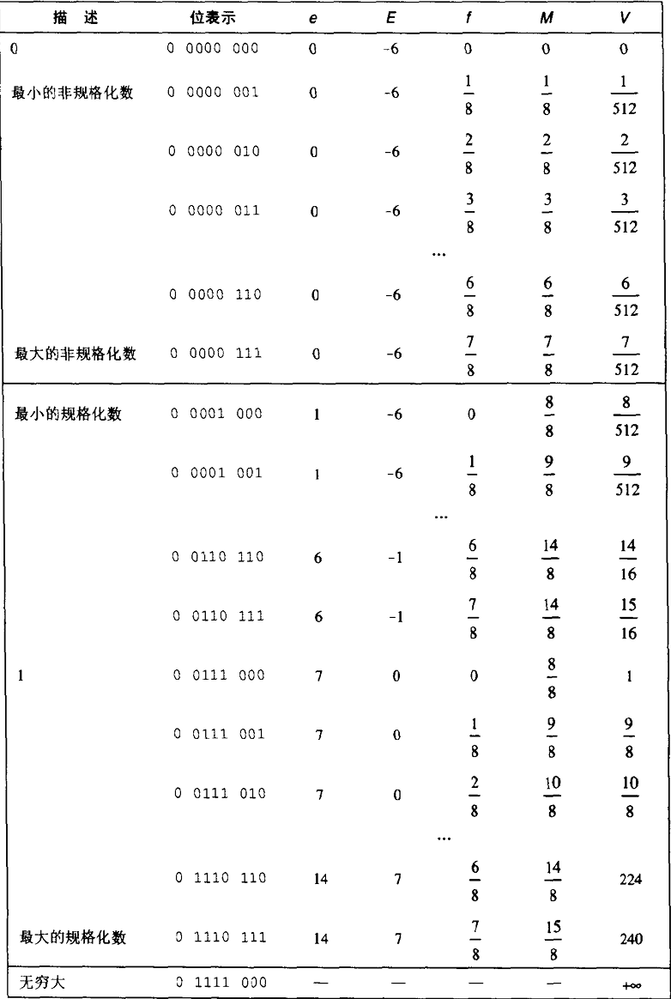
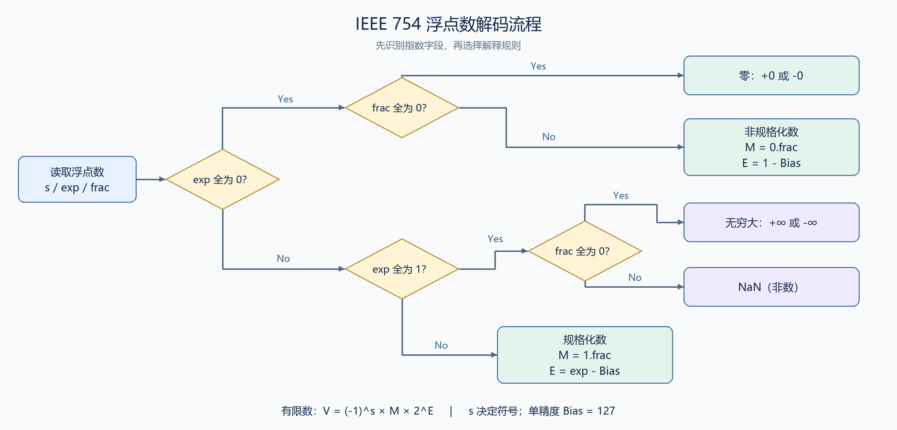
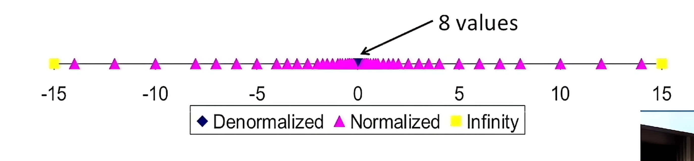

反码和补码的知识我们在c语言的学习中其实都已经知道了，现在的课程目的更多的是让我们对计算机底层的构成产生更深的理解，我在这个地方跳过了lecture1,2,直接从3开始我们的笔记



这个地方展示了我们的二进制补码表示循环，当我们的表示码超出当前的位数，多余的位置将会直接截断，留下正常位数的表示

卧槽还是得看原书，其实这种分成三种情况







当然，我们乘法怎么算呢？

这个地方我们的程序员采用了一个非常天才的方法：移位

为什么移位？（何移位）

因为**二进制每往左一位，位权就扩大 2 倍**。所以左移可以用来实现乘以 2、4、8等运算。

这和十进制竖式乘法是一样的：十位上的数参与相乘时，部分积要向左错一位，因为它代表的是原来的 10 倍。二进制中，错一位代表 2 倍。

例如计算 $5\times 3$，二进制是 `101 × 11`。乘数 `11` 表示：

$$
11_2=1\times2^1+1\times2^0=2+1
$$

所以：

$$
5\times3=5\times2+5\times1=(5\ll1)+5
$$

写成二进制竖式：

```text
     0101      5
×      11      3
---------
     0101      最低位是 1：取 5
+    1010      第二位是 1：取 5 左移一位，即 10
---------
     1111      15
```
你这个时候就会发现补码是怎么把我们的乘法完美的变成了简单的加法，这种处理在编译层面同样也具有美感——只要使用一个ext就行了

当然，我们的移位同样分成左移和右移

左移 $k$ 位，在结果可表示时，相当于乘以 $2^k$。

而右移分为**逻辑右移与算术右移**

| 操作 | 补位规则 | 常见场景 |
|---|---|---|
| 逻辑右移 | 高位始终补 0 | 无符号数缩小、提取位字段 |
| 算术右移 | 高位复制原符号位 | 有符号补码数缩小 |
| 左移 | 低位补 0 | 乘以 $2^k$、构造位掩码 |

```text
正数 8：00001000 → 00000100 = 4
        两种右移都补 0

负数 -8：11111000
逻辑右移 → 01111100 = 124
算术右移 → 11111100 = -4
```

**算术右移不是固定补 1：符号位为 0 就补 0，为 1 才补 1。**

对于负数，复制符号位可以维持最高位的负权重关系。例如右移一位时：

$$
-128+64=-64=\frac{-128}{2}
$$

而逻辑右移顾名思义，是为了从逻辑层面取出我们的内容，所以我们补0，防止污染我们的数据

## 浮点

我们的数终于来到了实数的领域

一开始人们肯定怀着从整数二进制中的幻想而来，认为我们的数也可以像用了泰勒展开被逼近，但是这种做法后来马上被证明是愚蠢的，比如下面这个例子



所以这个时候聪明的科学家想：我把他变成整数然后在缩回来不就好了

这是对的，比如我们下面这个例子

首先，让我们来看看我们的浮点是怎么在我们的内存中储存的
$$
V=(-1)^s\times M\times2^E
$$

| 字段 | 位数 | 规格化数的存储规则 |
|---|---:|---|
| 符号位 $s$ | 1 | 正数为 0，负数为 1 |
| 指数字段 $\mathrm{exp}$ | 8 | 保存 $E+127$ |
| 小数字段 $\mathrm{frac}$ | 23 | 只保存 $M$ 小数点后的部分 |

当你细看，你会发现这里面有**两个巧妙的设计：**

- **隐藏前导 1**：规格化数的 $M$ 一定是 $1.xxx_2$，因此开头的 1 不必存，读取时自动补回。用 **23 位存储，获得 24 位有效精度**。
- **指数加偏置**：保存 $\mathrm{exp}=E+127$，读取时 $E=\mathrm{exp}-127$，用偏置编码表示正负指数。

例如：

$$
15213=1.1101101101101_2\times2^{13}
$$

```text
符号：0
指数：13 + 127 = 140 → 10001100
小数：去掉前导 1，末尾补 0 至 23 位

最终：0 | 10001100 | 11011011011010000000000
```

以上规则适用于**规格化数**；零、非规格化数、无穷大和 NaN 有另外的编码规则。

这种转成幂指数的方法不仅扩大了我们这个数的储存能力，同时还帮助我们实现了有理数的精确定位

当然你也会发现，无穷大怎么表示？0怎么表示？这些问题我们把exp同时看作一个token，然后我们在读入的时候会选择不同的策略





这张图真清楚啊



但是聪明人一眼就能看出来——你这只能存有理数啊

没错，所以我们要讲到下一章——舍入

**舍入，就是精确结果放不进有限位时，选择一个可表示的数来代替它。** 它既可能发生在存储 $0.1$ 时，也可能发生在加减乘除之后。

**1. 舍入不等于直接截断**

假设二进制小数只能保留小数点后 2 位：

$$
x=1.011_2=1.375
$$

它左右两个可表示数是：

$$
1.01_2=1.25,\qquad1.10_2=1.5
$$

舍入要决定选哪一个。**直接删掉后面的位，只是其中一种选择方式。**

**2. 四种常见舍入方式**

| 方式 | 规则 | $1.375$ 的结果 | $-1.375$ 的结果 |
|---|---|---:|---:|
| 向零舍入 | 选择靠近零的一侧 | $1.25$ | $-1.25$ |
| 向正无穷舍入 | 选择不小于原值的一侧 | $1.5$ | $-1.25$ |
| 向负无穷舍入 | 选择不大于原值的一侧 | $1.25$ | $-1.5$ |
| 就近舍入，平局取偶 | 选最近的；正中间时取偶 | $1.5$ | $-1.5$ |

这里仍假设只保留小数点后 2 位。IEEE 浮点数默认采用**就近舍入，平局取偶**。

**3. “平局取偶”是什么意思？**

先看距离：

- 更接近较小值，就选较小值。
- 更接近较大值，就选较大值。
- **只有恰好在正中间，才使用“取偶”规则。**

二进制中的“偶”，指的是：**保留部分的最低位为 0**，不是整个数必须是偶整数。

例如保留小数点后 2 位：

```text
1.001₂ → 位于 1.00₂ 和 1.01₂ 正中间 → 选 1.00₂
1.011₂ → 位于 1.01₂ 和 1.10₂ 正中间 → 选 1.10₂
                              ↑ 选择末位为 0 的结果
```

为什么这样设计？如果正中间总向同一个方向舍入，会引入方向性偏差；取偶能减少这种偏差，但不保证所有数据的误差都能抵消。

**4. 二进制下，怎样快速判断？**

对于就近舍入，观察**被丢弃的部分**：

| 被丢弃的位 | 含义 | 操作 |
|---|---|---|
| `0…` | 不足半步 | 保留部分不变 |
| `100…0` | 恰好半步 | 保留末位为 0 则不变，为 1 则加一 |
| `1…` 且后面还有 1 | 超过半步 | 保留部分加一 |

这里的“加一”，是给**保留部分的最低位**加一。

例如，竖线右边是要丢弃的位：

```text
1.01 | 011 → 不足半步 → 1.01
1.01 | 100 → 恰好半步，保留末位为 1 → 1.10
1.10 | 100 → 恰好半步，保留末位为 0 → 1.10
1.10 | 101 → 超过半步 → 1.11
```

**5. 舍入也可能影响指数**

进位可能一路传到最前面。例如保留 3 位二进制有效数字：

$$
1.111_2\times2^E
\;\longrightarrow\;
10.00_2\times2^E
=
1.00_2\times2^{E+1}
$$

所以舍入不只是“删几位”，还可能需要重新规格化、增加指数。

**6. 对写程序有什么影响？**

每一步运算都可能舍入，所以：

- 很大的数加上很小的数，结果可能不变。
- 改变运算顺序，结果可能改变。
- 多次舍入不一定等于最后只舍入一次。

另外，上面为方便讲解用了“保留小数点后几位”。**实际规格化浮点数限制的是有效位数**：单精度为 24 位二进制有效数字，包括隐含的前导 1.
