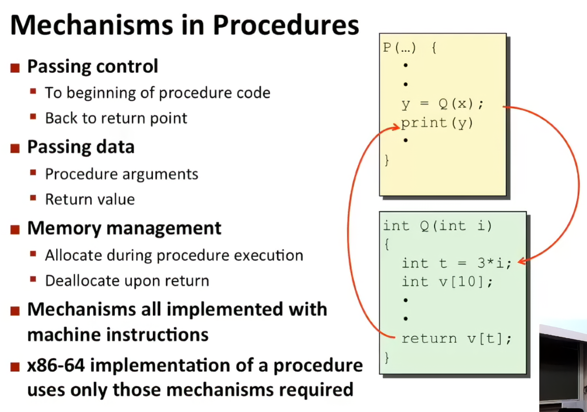
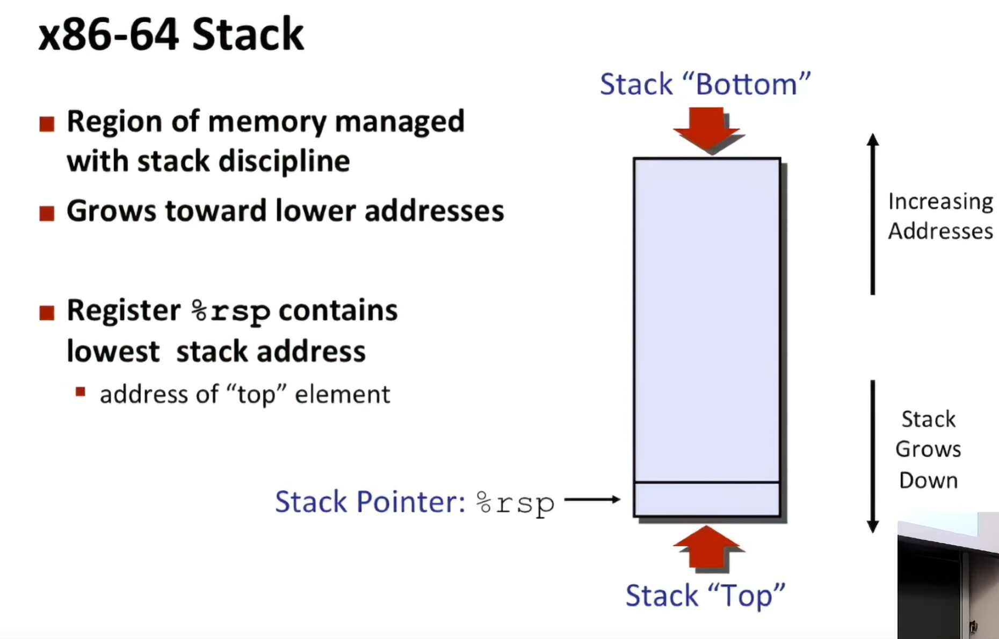
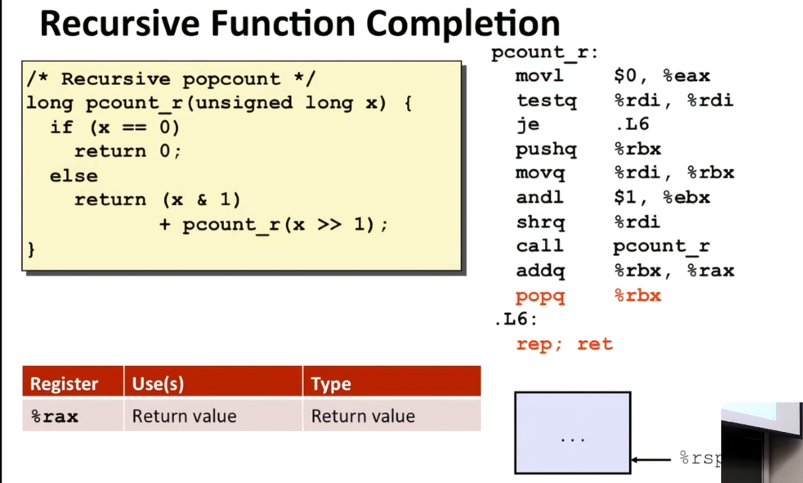

在用高级语言如C语言编程时，我们被屏蔽了程序具体的机器级实现。相比之下，在用汇编代码写程序时，程序员必须明确指定程序该如何管理存储器(memory)和用来执行计算的低级指令。大多数时候，在高级语言提供的较高抽象级别上工作会更有成效和可靠。编译器提供的类型检查能帮助你发现许多程序错误，并能够保证我们是按照一致的方式来引用和管理数据的。使用现代的优化编译器，产生的代码通常至少与一个熟练的汇编语言程序员手工编写的代码一样有效。最好的一点就是，用高级语言编写的程序可以在很多不同的机器上编译执行，而汇编代码则是与特定机器密切相关的。

虽然可以使用优化编译器，但是对于严谨的程序员来说，能够阅读和理解汇编代码仍是一项很重要的技能。启动编译器时带上适当的选项，编译器就会产生一个汇编代码文件，汇编代码非常接近于计算机执行的实际机器代码。与目标代码的二进制格式相比，它的主要特色在于它采用的是更加易读的文本格式。通过阅读这些汇编代码，我们能够理解编译器的优化能力，并分析出代码中潜在的低效率。就像我们将在第5章中看到的那样，一个试图优化一段关键代码性能的程序员，通常会尝试源代码的各种形式，每次编译并检查产生出的汇编代码，从而了解程序将要运行的效率是如何的。此外，也有些时候，高级语言提供的抽象层会隐藏我们想要理解的一些信息，如程序的运行时行为。例如，第13章中会讲到，当用线程包写并发程序时，知道用何种存储(storage)来保存各种程序变量是很重要的，而这些信息在汇编代码级是可见的。程序员学习汇编代码的需求随着时间的推移也发生了变化，开始时是要求程序员能直接用汇编语言编写程序，现在则是要求他们能够阅读和理解优化编译器产生的代码。

在本章中，我们将学习某种汇编语言的详细内容，明白C程序是如何编译成这种形式的机器代码的。为了阅读编译器产生的汇编代码，除了具备手工编写汇编代码的能力外，还包括其他一些技能。我们必须了解典型的编译器在将C程序结构变换成机器代码时所做的转换。相对于C代码中表示的计算操作，优化编译器能够重新排列执行顺序，消除不必要的计算并替换慢速操作，例如用加法和移位来代替乘法，甚至于将递归计算变换成迭代计算。理解源代码与对应的汇编码的关系通常不太容易--就像要拼出一幅跟盒子上的图片设计有点不太一样的拼图。这是一种逆向工程(reverseengineering)--通过研究系统和逆向工作，来试着了解系统被创建的过程。在这个情况中，系统是一个机器产生的汇编语言程序，而不是由人设计的某个东西。这简化了逆向工程的任务，因为产生的代码遵循相当规则的模式，且我们可以做试验，让编译器产生许多不同程序的代码。在我们的表述中，给出了许多示例和练习，来说明汇编语言和编译器的各个方面。精通细节是理解更深和更基本概念的先决条件，花点时间研究这些示例并完成练习是非常值得的。

这章的前一个部分在说我们的计算机硬件结构和我们die的结构，这部分我就不赘述了，有挖坟的可以通过我 服务器搭建-hpc101中的硬件部分 来补齐，哪些部分的硬件知识点还是很多的

好了，现在假定你和我有一样的知识储备

## 指令集架构

首先作为一个程序员，你难道不好奇我们平时说的x86 arm架构是怎么来的吗

我们要明确一个点，我们的架构通常指指令集架构（ISA），ISA决定了我们的明文代码怎么和我们的机器交互，比如我们的加法器怎么定义，我们怎么访存，我们有哪些寄存器，这些都要在我们的指令集中优先定义


开始的时候肯定是百花齐放，但是时代（资本）的力量肯定会推出某个人来做大一统的事情，这就是Intel

Intel早期的处理器分别这样编号

8086 → 80186 → 80286 → 80386 → 80486

你会发现他们都是86，那干脆就叫x86好了！随着发展，它从早期的 16 位扩展到 32 位，后来 AMD 设计了兼容既有 x86 软件的 64 位扩展，即 AMD64 / x86-64，Intel 随后也支持了它

而arm（acorn risc machine）则是另一条路线，ARM 起源于英国 Acorn 公司在 20 世纪 80 年代的处理器项目，最初名称是 Acorn RISC Machine。

它采用 RISC （精简指令集）的设计思路：让基本指令和编码更规整，例如通常通过专门的加载、存储指令访问内存，算术运算主要在寄存器之间进行。


所以我们会发现arm架构的机器往往更节能，当然他们的性能可能不尽人意（通常来说奥，我们的速度和耗电还和我们的芯片制造工艺，CPU 内部设计，缓存和核心数量，工作频率及功耗限制，软件优化和具体任务相关）

| 对比项 | x86-64 | AArch64 |
|---|---|---|
| 指令长度 | 可变，1～15 字节 | 固定 4 字节 |
| 通用整数寄存器 | 16 个，包括栈指针 | 31 个，另有专用栈指针 |
| 算术操作访问内存 | 很多指令允许 | 通常需先加载到寄存器 |
| 历史特点 | 延续大量早期 x86 设计 | 64 位指令集设计较规整 |

在0.5中我们说到一个程序会先被编译，然后再被编码，这个过程中我们终于接触到了从汇编角度编程，首先，汇编中的大部分操作基本都是基于寄存器执行的，所以寻址成为了一个很重要的话题


但是我们首先要分清楚几个概念——数值，地址，和内容

```asm
$0x100       # 数值 0x100 本身
%eax         # eax 寄存器里的值
(%eax)       # 把 eax 的值当地址，访问该地址的内存
```

比如 %eax = 0x100，内存 0x100 中存着 0xFF：

```text
%eax   → 0x100
(%eax) → 0xFF
```

在有了这些基本的概念以后，我们不妨讨论一点更深的语法

我们以AT&T 语法为例，我们通常用 源 目标 来表示我们的行为

```asm
movl %eax, %edx      # edx = eax，eax 不变
addl %eax, %edx      # edx = edx + eax
subl %eax, %edx      # edx = edx - eax
```

同时不同的寄存器也映射着不同的宽度

| 后缀 | 操作宽度 |
|---|---:|
| `b` | 8 位 |
| `w` | 16 位 |
| `l` | 32 位 |
| `q` | 64 位 |

这直接关系到你前面学过的截断和溢出。还要知道：在 x86-64 中，写入 %eax 会把 %rax 的高 32 位清零；写 %ax 或 %al 则不会清除其余位。

接下来我们就可以开始讲寻址了

我们通常以$D(Rb, Ri, S)$的形式来表示我们的寻址编码

而他对应的地址则是
$$
D+R_b+R_i \times S
$$

| 类别 | 重点指令 | 需要理解 |
|---|---|---|
| 数据传送 | `mov`、扩展指令 | 复制、宽度、补零或补符号 |
| 地址计算 | `lea` | 计算表达式，不访问内存 |
| 加减 | `add`、`sub`、`inc`、`dec` | 哪个操作数被修改 |
| 位操作 | `and`、`or`、`xor`、`not` | 掩码、设置位、翻转位 |
| 移位 | `shl`、`shr`、`sar` | 左移、逻辑右移、算术右移 |
| 乘除 | `imul`、`mul`、`idiv`、`div` | 有符号与无符号区别，部分形式有隐含寄存器 |

而这是我们常见的汇编代码

这个地方我通过一个计组复习课来学习我们的汇编代码


## 编译器优化

有了上面这些指令，我们终于可以看懂编译器在中间做的事情了。我们在C里面写一个乘法，最后不一定真的执行乘法；写一个switch，也不一定挨个比较每个case。高级语言表达的是我们想做什么，编译器还会替我们选择具体怎么做

### 跳转和switch

这个地方又出现了我们学C时不太推荐用的goto。不过到了汇编层面，我们的if、for、while本来就要靠条件跳转和无条件跳转来实现。用goto把代码展开，判断在哪里、循环从哪里跳回去就很清楚了。平时不推荐乱用，是因为代码容易绕晕，不代表跳转这个操作本身不好

比如循环可以在开头判断，也可以先判断一次能不能进入，然后在循环末尾判断要不要继续。编译器调整这些位置，在一些情况下就能减少循环中重复的跳转。所以这里看的其实是控制流程，不是让我们把for全部手动改成goto

switch更有意思，我们的case如果比较密集，编译器可以直接做一张跳转表，把每个分支的入口地址排好，用x当下标去取

```text
x → 找到第x个表项 → 读出代码地址 → 跳过去执行
```

结合前面的寻址，这张表每项如果占8字节，我们就有：

$$
\text{表项地址}=\text{表首地址}+x\times8
$$

这里取出来的是代码地址，再跳到那个地址执行。如果case从10开始，也可以用$x-10$作下标。没有写case的位置填default的地址，几个case共用一段代码，就填同一个地址。超出表范围的输入要先检查，不能拿着下标直接读出去

我一开始看到这里还以为是哈希表，其实这个地方就是数组下标，没有计算哈希，也没有处理冲突

| case的情况 | 可能采用的实现 |
|---|---|
| 只有两三个值 | 几次比较和跳转 |
| 数量较多，值比较密集 | 跳转表 |
| 值很稀疏 | 比较树，或者几种方式组合 |

比较树可以像二分查找一样缩小范围，但不一定严格对半分。如果编译器知道某个分支经常出现，也可能按照频率调整。所以switch只是给了编译器选择的空间，不是写上去就一定比if快

哈希当然也可以用，但我们需要先计算哈希，访问表，再核对键值，最后才拿到代码地址。就算这些case之间没有冲突，一个不属于任何case的输入也可能落到已有表项，仍然要把它识别出来送到default。只有几个整数时，可能两三次比较就结束了，哈希反而多干了活

这个地方也提醒我们，$O(1)$和$O(\log n)$描述的是规模增长的趋势，不是一次操作花的实际时间。分支少的时候，计算哈希、访问内存、缓存命中这些常数开销不能直接忽略

### 常见的优化方向

类似的处理其实还有很多，我们可以先看几个最容易从汇编里认出来的

**常量折叠**就是把编译时已经知道的东西直接算好。比如`3 * 7 + 2`可以直接变成23，运行的时候没有必要重新乘加。固定大小和常量表达式里经常能看到这种处理

**常数乘法转换**则是换一种指令来完成计算。乘8可以考虑左移，乘3可以用我们刚刚学过的lea：

```asm
leaq (%rdi,%rdi,2), %rax   # rax = rdi + rdi * 2
```

这在数组地址计算和大小换算里很常见。不过乘法指令本身也可能很快，换成多次移位和加法未必划算，所以我们不用看到乘法就手动去改，具体还要看目标机器的成本

**循环不变量外提**就是把每轮都一样的计算拿出去：

```c
for (int i = 0; i < n; i++)
    out[i] = in[i] * (a + b);
```

如果a和b在循环里不变，而且提前计算是安全的，编译器就可以在循环外只算一次`a + b`，后面一直用这个结果。这里的前提是它能证明不会变，如果指针写入或函数调用可能修改相关数据，就不能随便搬；原本不执行循环时不会发生的计算，也要确认提前做不会改变行为

**条件传送**适合从两个简单的值中选一个，比如：

```c
r = a < b ? a : b;
```

它可能变成比较加cmov，不需要真的跳到另一条路径，也就避开了该处分支预测错误的代价。但是如果两边是很贵的计算，或者调用函数会改变程序状态，就不能为了去掉跳转把两边全执行一遍。条件传送也有数据依赖，不一定比预测准确的跳转快

**SIMD向量化**则是把多个元素一起处理，数组相加就是很典型的例子：

```c
for (int i = 0; i < n; i++)
    c[i] = a[i] + b[i];
```

如果各轮之间没有妨碍并行的依赖，编译器就有机会用一条向量指令做多个元素的加法，图像处理和数值计算里经常用到。反过来，如果写成`a[i] = a[i - 1] + b[i]`，这一轮要等上一轮，就不能直接当作一组独立的加法。数组是否重叠、访存是否规则、循环里有没有复杂分支，也都会影响这种优化

所以我们以后看代码，可以先沿着这几个方向想：常量能不能提前算，循环里有没有重复计算，各轮能不能独立执行，分支的取值密不密、两条路径贵不贵

当然，编译器做这些事情的前提是保持程序规定的行为。指针可能指向同一块内存，浮点运算换个顺序也可能改变舍入结果，这些都限制了它能做的变换。我们平时先把意图写清楚，真要优化的时候再看生成的汇编和实际测量，代码短了不代表机器干的活就少了

## 过程的哲学



其实看到这张图我大概知道这章要讲什么了

一个过程调用包括将数据(以过程参数和返回值的形式)和控制从代码的一部分传递到另一部分。另外，它还必须在进入时为过程的局部变量分配空间，并在退出时释放这些空间。大多数机器，包括IA32，只提供简单的转移控制到过程和从过程中转移出控制的指令。数据传递、局部变量的分配和释放是通过操纵程序栈来实现的。

所以我们的程序都是由frame的形式构成的，不过不同frame之间我们之前其实只在cs61a里面简单了解过，现在我们要尝试详细了解一下我们的汇编实现

所以我们自然而然的就引入了进程的概念



这是一张栈的表示图，请记住他，我们的栈基本都是从上往下写，栈底在顶上，而且越往栈顶地址越小



我们不妨看一下下面这一段程序在汇编中的表示

```c
long pcount_r(unsigned long x)
{
    if (x == 0)
        return 0;
    return (x & 1) + pcount_r(x >> 1);
}
```

它统计二进制中有多少个 `1`：

- `x & 1`：取出最低位，得到 0 或 1。
- `x >> 1`：去掉最低位，递归处理剩余部分。
- 两部分相加，得到总数。

例如 $x=5=101_2$：

```text
pcount(5) = 1 + pcount(2)
pcount(2) = 0 + pcount(1)
pcount(1) = 1 + pcount(0)
pcount(0) = 0
```

最后返回 $2$。

**逐条看汇编**

```asm
movl $0, %eax          # 先准备返回值 0，同时清零整个 rax
testq %rdi, %rdi       # 检查参数 x 是否为 0
je .L6                # 是 0 就直接返回

pushq %rbx            # 保存调用者的 rbx
movq %rdi, %rbx        # 把本层的 x 复制到 rbx
andl $1, %ebx         # rbx = x & 1，得到本层要保留的最低位

shrq %rdi             # x 逻辑右移 1 位，准备下一层参数
call pcount_r         # 递归调用，返回结果放在 rax

addq %rbx, %rax        # 下一层结果 + 本层最低位
popq %rbx             # 恢复调用者的 rbx
.L6:
rep; ret              # 这里按 ret 理解：返回调用者
```

`andl` 写入 `%ebx` 会清零 `%rbx` 的高 32 位，所以整个 `%rbx` 最后就是 0 或 1。`shrq %rdi` 这种写法默认右移一位。

**真正巧妙的地方是 `%rbx` 怎样跨递归保存**

本层执行：

```asm
rbx = x & 1
call pcount_r
```

下一层也要使用 `%rbx`，看起来会覆盖本层的数据。但下一层在修改之前，会先执行自己的：

```asm
pushq %rbx
```

因此，**下一层先替上一层保存好 `%rbx`，等自己结束时再恢复它。**

以 `5 → 2 → 1 → 0` 为例：

| 当前层 | 进入时先压栈保存 | 然后把 `%rbx` 设为 |
|---|---|---:|
| `pcount(5)` | 外部调用者原来的 `%rbx` | 1 |
| `pcount(2)` | 上一层的 1 | 0 |
| `pcount(1)` | 上一层的 0 | 1 |
| `pcount(0)` | 不修改 `%rbx`，无需保存 | 仍为 1 |

返回时按相反顺序恢复：

```text
pcount(0) 返回 0
    ↓
pcount(1)：0 + 1 = 1，恢复 rbx = 0
    ↓
pcount(2)：1 + 0 = 1，恢复 rbx = 1
    ↓
pcount(5)：1 + 1 = 2，恢复外部调用者原来的 rbx
```

这就是“被调用者保存寄存器”的约定在递归中的作用。

至于这个地方的帧栈表示：

```text
高地址
┌────────────────────────────┐
│ 返回外部调用者的地址         │ ← 调用 pcount(5) 时压入
│ 外部调用者原来的 rbx         │ ← pcount(5) 保存
├────────────────────────────┤
│ 返回 pcount(5) 的地址        │
│ pcount(5) 的最低位：1        │ ← pcount(2) 保存
├────────────────────────────┤
│ 返回 pcount(2) 的地址        │
│ pcount(2) 的最低位：0        │ ← pcount(1) 保存
├────────────────────────────┤
│ 返回 pcount(1) 的地址        │ ← rsp，进入 pcount(0)
└────────────────────────────┘
低地址
```

此时 `pcount(1)` 的最低位 1 还在 `%rbx` 中，因为最深层不修改它。

每一层返回时：

- `popq %rbx` 恢复上一层的寄存器状态。
- `ret` 取出返回地址，回到上一层的 `call` 后面继续执行。

### 条件跳越

首先我们要知道，我们的c在编译成汇编之后往往是不会按照我们正常的条件判断来存储的

比如说;

```
if (a > b)
    x = 1;
else
    x = 0;
```
CPU 要先比较 a 和 b，再根据比较结果决定下一步。x86 通常把这个过程拆成计算并设置条件码 → 后面的指令读取条件码

而我们的条件码保存在我们的RFLAGS 寄存器中

最经典的像

| 条件码 | 含义 | 可以理解成 |
|---|---|---|
| `ZF` | 零标志 | 结果是不是 0 |
| `SF` | 符号标志 | 结果最高位是不是 1 |
| `CF` | 进位标志 | 无符号加法是否进位、减法是否借位 |
| `OF` | 溢出标志 | 有符号运算是否溢出 |

有了这个前提，我们就能开始做进一步的开发了

我们先看比较是怎么发生的。假设a放在`%edi`，b放在`%esi`，那么：

```asm
cmpl %esi, %edi       # 根据 a - b 的结果设置条件码
```

这里要注意AT&T的操作数顺序，前面是源，后面是目标，所以比较的时候算的是后面减前面，也就是$a-b$。

cmp和sub很像，只不过sub会把差写回目标寄存器，cmp只留下条件码，不修改原来的a和b。我们比较两个数，并不需要真的把其中一个改成它们的差

比如a是3，b是5，计算出来的差是-2，此时：

```text
ZF = 0    结果不为零
SF = 1    结果最高位是1
CF = 1    按无符号数理解，3不够减5，需要借位
OF = 0    按有符号数理解，-2没有超出表示范围
```

这些信息就留在RFLAGS里面，后面的跳转指令再去读取。这里没有什么自动记住整个条件表达式的机制，CPU只是留下了几个状态位

假设a和b都是有符号整数，前面的if就可以写成：

```asm
cmpl %esi, %edi       # 比较 a 和 b
jg .Lgreater         # 如果 a > b，跳到 .Lgreater

movl $0, %eax        # 否则 x = 0
jmp .Ldone           # 跳过另一个分支

.Lgreater:
movl $1, %eax        # x = 1

.Ldone:
                     # 从这里继续后面的代码
```

这里我们用`%eax`保存x。`.Lgreater`和`.Ldone`只是代码位置的标签，而jg和jmp才是真正改变执行位置的指令

jg是有条件跳转，不满足条件就继续执行下一条；jmp是无条件跳转。这里的`jmp .Ldone`不能随便删，不然我们刚把x设成0，接着往下执行又把它改成1了

### 有符号和无符号的比较

到了这里，我们之前讨论过的符号问题又回来了。同样一个`0xFFFFFFFF`，按32位有符号数解释是-1，按无符号数解释却是4294967295

所以拿它和1比较，大小关系完全相反。寄存器本身没有类型标签，编译器就需要根据C代码中的类型，选择不同的跳转指令

| 比较关系 | 有符号数 | 无符号数 |
|---|---|---|
| 等于 | `je` | `je` |
| 不等于 | `jne` | `jne` |
| 大于 | `jg` | `ja` |
| 大于等于 | `jge` | `jae` |
| 小于 | `jl` | `jb` |
| 小于等于 | `jle` | `jbe` |

相等只需要看两个位模式是否一致，所以可以共用je。判断大小就不能混用了，有符号数用greater、less，无符号数用above、below

对无符号比较来说，减法是否借位就很有用：

$$
a<b \iff CF=1
$$

而有符号比较不能只看SF，因为减法溢出时，保存结果的符号可能是错的。比如用8位补码计算：

$$
127-(-1)=128
$$

128装不下，最后留下`10000000`，按补码看是-128。明明前者更大，结果却看起来是负数，所以还需要OF来纠正这个影响

有符号小于的判断条件是：

$$
SF\ne OF
$$

有符号大于则是：

$$
ZF=0\quad\text{且}\quad SF=OF
$$

这些组合不需要我们在程序里手动拼出来，jl、jg已经规定好了怎么检查。我们写C时，编译器负责选择合适的指令；读汇编时，我们则要根据指令反推它采用了哪种比较方式

### test和条件结果

除了cmp，我们还经常看到：

```asm
testq %rdi, %rdi
je .Lzero
```

test做的是按位与，同样只设置条件码，不保存计算结果。因为$x\mathbin{\&}x=x$，所以把一个寄存器和自己做test，就能检查里面的值是不是0。结果为0时ZF置1，后面的je就会跳转

这正是前面递归函数检查终止条件的方式：

```asm
movl $0, %eax         # 先准备返回值0
testq %rdi, %rdi      # 检查x
je .L6               # x为0，直接去返回
```

不过条件码不一定非要拿来跳转，也可以直接变成一个数。比如我们最开始的if，其实就是想让x等于`a > b`的真假结果，可以写成：

```asm
cmpl %esi, %edi       # 比较a和b
setg %al             # a > b时写1，否则写0
movzbl %al, %eax      # 零扩展成完整的32位结果
```

setg和jg检查的是同一个条件，只是jg改变执行位置，setg把结果写成0或1。这样就不用分成两条执行路径了

这里还要注意，setg只写低8位的`%al`，不会清零`%eax`剩余的位，所以再用movzbl补零扩展，才能得到完整的整数0或1

### 条件码也会被覆盖

最后一个很容易在读汇编时忽略的地方，是条件码不会一直保存着某一次比较的结果

```asm
cmpl %esi, %edi       # 根据a-b设置条件码
addl $1, %ecx        # 又根据ecx+1更新条件码
jg .Lgreater         # 此时读到的已经是add留下的条件码
```

因此这里的jg不能再解释成“a大于b就跳转”

但mov和lea不改变这些条件码，所以：

```asm
cmpl %esi, %edi
movl $0, %eax
jg .Lgreater
```

仍然可以根据前面的比较跳转

我们以后看到条件跳转，就可以先看它检查什么条件，再往前找这些标志最后由谁设置，最后结合操作数顺序和有符号性，把它还原成C里的判断。这样一来，汇编里的分支就能和我们熟悉的if、循环接起来了

对，刚才只续写了条件跳转，还没接到你前面的栈帧。下面这段可以接在后面：

### 从跳转到函数调用

有了条件跳转，我们已经可以控制程序接下来执行哪一段代码。但是函数调用还多了一件事：执行完以后，要能回到原来的位置继续执行

所以普通的jmp只负责跳过去，而call还要先保存返回地址，也就是call后面那条指令的位置

```asm
call foo
addq $1, %rax         # foo返回后，从这里继续
```

在我们这里的x86-64近调用中，call会把8字节的返回地址压入栈，然后跳到foo。foo执行ret时，再从栈顶取出这个地址，跳回去

我们之前约定过，栈图上面是高地址，下面是低地址。栈向低地址增长，所以压栈时`%rsp`减小，出栈时`%rsp`增大

```text
pushq：rsp减8，再把数据写到新的栈顶
popq：从当前栈顶取出数据，再让rsp加8
```

### 栈帧保存一次调用的现场

函数执行时，除了返回地址，还可能需要保存寄存器、局部变量，以及通过栈传递的参数。一次调用对应的这部分栈上空间，我们就称为栈帧

不过不是所有变量都必须放在栈里，能放进寄存器的，编译器往往会直接放在寄存器中。栈帧也不一定使用`%rbp`，我们先看一种保留帧指针的经典写法：

```asm
foo:
    pushq %rbp           # 保存调用者的帧指针
    movq %rsp, %rbp      # 用rbp记录本层的固定基准位置
    subq $16, %rsp       # 给本层预留16字节空间

    # 在这里执行函数体

    movq %rbp, %rsp      # 收回本层预留的空间
    popq %rbp            # 恢复调用者的帧指针
    ret                  # 取出返回地址，回到调用者
```

假设调用foo之前`%rsp = 0x1000`，那么进入过程就是：

| 操作 | `%rsp` | 发生的事情 |
|---|---|---|
| `call foo` | `0x0FF8` | 保存返回地址 |
| `pushq %rbp` | `0x0FF0` | 保存调用者的rbp |
| `movq %rsp, %rbp` | `0x0FF0` | 本层rbp设为`0x0FF0` |
| `subq $16, %rsp` | `0x0FE0` | 预留16字节局部空间 |

此时的栈可以画成：

```text
高地址
0x1000  ─────────────────────
         调用前的栈顶边界
        ┌────────────────────┐
0x0FF8  │ 返回地址            │ ← 8(%rbp)
        ├────────────────────┤
0x0FF0  │ 调用者原来的rbp     │ ← %rbp
        ├────────────────────┤
0x0FE8  │ 本层预留空间        │ ← -8(%rbp)
        ├────────────────────┤
0x0FE0  │ 本层预留空间        │ ← %rsp，当前栈顶
        └────────────────────┘
低地址
```

这里就能看出rsp和rbp的区别了：rsp跟着压栈、出栈和空间分配移动，rbp在这种写法中保持固定，让我们方便地通过偏移访问本层的数据

释放空间时也没有把内存里的字节全部擦掉，只是把rsp恢复回去，表示这些空间不再由本层调用占用，后面可以重新使用

当foo继续调用bar时，bar会在更低的地址使用自己的栈空间。foo还没有执行完，它需要保留的信息就先留在上面，等bar返回后继续使用

寄存器则不会因为调用函数自动复制一套，所以还需要约定哪些值由谁保存。在课本采用的System V AMD64约定里，rbx就是被调用者需要保持的寄存器

这正好接上前面的递归：

```asm
pushq %rbx            # 先保存上一层交给我们的rbx
movq %rdi, %rbx
andl $1, %ebx         # rbx现在保存本层的最低位

shrq %rdi
call pcount_r         # 下一层也会遵守同样的保存约定

addq %rbx, %rax       # 下一层返回时，本层的rbx仍然可用
popq %rbx             # 用完以后，恢复上一层的rbx
ret
```

这里有两种不同的恢复：

- `popq %rbx`恢复的是上一层的数据。
- `ret`恢复的是上一层继续执行的位置。

因此，每一层不需要保存所有东西，只需要保留之后还会用到的信息。前面那个递归函数没有建立rbp帧指针，也没有专门给局部变量分配一大块空间，仍然可以靠返回地址和保存的rbx完成现场恢复

条件跳转解决了程序在本层走哪条路径，call、ret和栈帧则让程序能进入另一层调用，执行完以后再回到原来的现场。

所以我们程序在底层执行的时候，函数调用通常会形成一层层的栈帧，用来保存各次调用需要的现场。call和ret负责跳进函数以及执行完以后返回，push、pop和对rsp的调整则配合完成现场的保存与恢复。而我们在C里写的条件判断，在x86中通常会通过cmp、test或者其他运算设置条件码，再由跳转或条件传送指令决定接下来怎么执行。这样我们的数据操作、条件分支和函数调用就串起来了，不过程序里的数据也可以放在寄存器、堆和全局存储区中，不是所有东西都在栈帧里

## summary

所以我们这一章其实就是把C语言提供的抽象一层层拆开，看清楚我们写的变量、运算、条件判断和函数调用，最后到底是怎么被机器执行的。CPU执行的是机器指令，而汇编给这些指令提供了比较容易读懂的文本表示。我们学习汇编，也就能顺着它看见编译器做了什么

首先，我们在C里面写的变量，到了机器层面会被安排到寄存器或者内存中。通用寄存器本身没有int、指针这样的类型标签，只是保存一串位，具体怎么理解这些位，要看程序使用了什么指令。所以我们前面一直在区分数值、地址和地址里的内容：`%rdi`是直接使用寄存器里的值，`(%rdi)`在普通访存指令中则是把这个值当地址，再去访问内存。mov负责复制数据，lea负责计算地址，操作宽度和符号扩展、零扩展则决定了这些位在搬运过程中怎么处理

有了数据，我们就可以计算。加减乘除、按位与或异或、移位，都是机器操作这些位的方式。不过我们在C里写了乘法，最后不一定真的出现乘法指令，编译器可能用移位、加法或者lea完成相同的事情。浮点数又有自己的表示和运算规则，我们看到的x87用浮点寄存器栈组织数据，常见的x86-64浮点代码则更多使用XMM寄存器。它们都在计算，但使用的寄存器、指令和数值解释并不完全相同

接下来是控制流程。我们写的if、while、for和switch，最后要变成机器能执行的判断与跳转。在x86中，cmp、test或者其他运算会先设置条件码，后面的条件跳转、set或条件传送指令再读取这些状态。这里就又用到了有符号和无符号的区别，同样一串位可以代表不同的数，比较时也就需要选择不同的条件。循环则是在这些判断之间反复跳回，而switch在合适的时候可以通过跳转表直接找到对应的代码入口，不需要挨个比较

再往下，我们的程序开始调用其他函数。函数调用通常会形成一层层的栈帧，用来保存各次调用需要的现场。call和ret负责进入函数以及执行完以后返回，push、pop、mov和对rsp的调整则配合完成寄存器保存、局部空间分配和现场恢复。参数放在哪里、结果从哪里返回、哪些寄存器需要保持原值，都由调用约定来协调。递归也没有另外一套神秘机制，每一层仍然使用同一套寄存器，只是把暂时需要保留的信息放到各自的栈上，返回的时候再一层层恢复

数组、指针和结构体则让我们看清楚，C里的数据结构怎样落实到内存布局。数组下标最终变成首地址加上元素偏移，二维数组还要把行和列换算成一维位置；结构体成员通过固定偏移访问，中间可能因为对齐要求插入空隙。所以看起来很复杂的数据访问，到了机器层面，往往就是计算地址，再读取或者写入指定宽度的数据。不过这些数据可以位于栈、堆或全局存储区，并不是所有东西都属于栈帧

也正因为机器指令通常只是按照算出来的地址访问内存，不会自动替C检查数组边界，越界写入才可能破坏其他变量，甚至覆盖返回地址。栈随机化、不可执行栈和canary分别从地址预测、执行权限和破坏检测这些角度提供保护。看到这里，前面讲的地址、栈帧和控制转移就又连到一起了：数据写错了位置，有时甚至会改变程序接下来执行什么

所以我们学完这一章，真正要得到的能力，是能把一段程序拆成数据怎么存、指令怎么算、执行路径怎么走，以及函数现场怎么保存和恢复。编译器会在保持程序规定行为的前提下调整这些实现，因此源码和汇编不一定一一对应。我们能沿着汇编把这些关系还原出来，就能开始解释程序为什么这样运行、错误发生在哪里，以及某种优化到底减少了什么工作