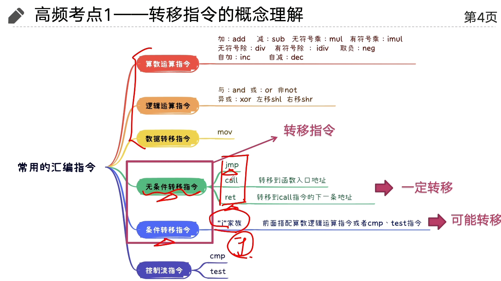

在用高级语言如C语言编程时，我们被屏蔽了程序具体的机器级实现。相比之下，在用汇编代码写程序时，程序员必须明确指定程序该如何管理存储器(memory)和用来执行计算的低级指令。大多数时候，在高级语言提供的较高抽象级别上工作会更有成效和可靠。编译器提供的类型检查能帮助你发现许多程序错误，并能够保证我们是按照一致的方式来引用和管理数据的。使用现代的优化编译器，产生的代码通常至少与一个熟练的汇编语言程序员手工编写的代码一样有效。最好的一点就是，用高级语言编写的程序可以在很多不同的机器上编译执行，而汇编代码则是与特定机器密切相关的。

虽然可以使用优化编译器，但是对于严谨的程序员来说，能够阅读和理解汇编代码仍是一项很重要的技能。启动编译器时带上适当的选项，编译器就会产生一个汇编代码文件，汇编代码非常接近于计算机执行的实际机器代码。与目标代码的二进制格式相比，它的主要特色在于它采用的是更加易读的文本格式。通过阅读这些汇编代码，我们能够理解编译器的优化能力，并分析出代码中潜在的低效率。就像我们将在第5章中看到的那样，一个试图优化一段关键代码性能的程序员，通常会尝试源代码的各种形式，每次编译并检查产生出的汇编代码，从而了解程序将要运行的效率是如何的。此外，也有些时候，高级语言提供的抽象层会隐藏我们想要理解的一些信息，如程序的运行时行为。例如，第13章中会讲到，当用线程包写并发程序时，知道用何种存储(storage)来保存各种程序变量是很重要的，而这些信息在汇编代码级是可见的。程序员学习汇编代码的需求随着时间的推移也发生了变化，开始时是要求程序员能直接用汇编语言编写程序，现在则是要求他们能够阅读和理解优化编译器产生的代码。

在本章中，我们将学习某种汇编语言的详细内容，明白C程序是如何编译成这种形式的机器代码的。为了阅读编译器产生的汇编代码，除了具备手工编写汇编代码的能力外，还包括其他一些技能。我们必须了解典型的编译器在将C程序结构变换成机器代码时所做的转换。相对于C代码中表示的计算操作，优化编译器能够重新排列执行顺序，消除不必要的计算并替换慢速操作，例如用加法和移位来代替乘法，甚至于将递归计算变换成迭代计算。理解源代码与对应的汇编码的关系通常不太容易--就像要拼出一幅跟盒子上的图片设计有点不太一样的拼图。这是一种逆向工程(reverseengineering)--通过研究系统和逆向工作，来试着了解系统被创建的过程。在这个情况中，系统是一个机器产生的汇编语言程序，而不是由人设计的某个东西。这简化了逆向工程的任务，因为产生的代码遵循相当规则的模式，且我们可以做试验，让编译器产生许多不同程序的代码。在我们的表述中，给出了许多示例和练习，来说明汇编语言和编译器的各个方面。精通细节是理解更深和更基本概念的先决条件，花点时间研究这些示例并完成练习是非常值得的。

这章的前一个部分在说我们的计算机硬件结构和我们die的结构，这部分我就不赘述了，有挖坟的可以通过我 服务器搭建-hpc101中的硬件部分 来补齐，哪些部分的硬件知识点还是很多的

好了，现在假定你和我有一样的知识储备

## 指令集架构

首先作为一个程序员，你难道不好奇我们平时说的x86 arm架构是怎么来的吗

我们要明确一个点，我们的架构通常指指令集架构（ISA），ISA决定了我们的明文代码怎么和我们的机器交互，比如我们的加法器怎么定义，我们怎么访存，我们有哪些寄存器，这些都要在我们的指令集中优先定义


开始的时候肯定是百花齐放，但是时代（资本）的力量肯定会推出某个人来做大一统的事情，这就是Intel

Intel早期的处理器分别这样编号

8086 → 80186 → 80286 → 80386 → 80486

你会发现他们都是86，那干脆就叫x86好了！随着发展，它从早期的 16 位扩展到 32 位，后来 AMD 设计了兼容既有 x86 软件的 64 位扩展，即 AMD64 / x86-64，Intel 随后也支持了它

而arm（acorn risc machine）则是另一条路线，ARM 起源于英国 Acorn 公司在 20 世纪 80 年代的处理器项目，最初名称是 Acorn RISC Machine。

它采用 RISC （精简指令集）的设计思路：让基本指令和编码更规整，例如通常通过专门的加载、存储指令访问内存，算术运算主要在寄存器之间进行。


所以我们会发现arm架构的机器往往更节能，当然他们的性能可能不尽人意（通常来说奥，我们的速度和耗电还和我们的芯片制造工艺，CPU 内部设计，缓存和核心数量，工作频率及功耗限制，软件优化和具体任务相关）

| 对比项 | x86-64 | AArch64 |
|---|---|---|
| 指令长度 | 可变，1～15 字节 | 固定 4 字节 |
| 通用整数寄存器 | 16 个，包括栈指针 | 31 个，另有专用栈指针 |
| 算术操作访问内存 | 很多指令允许 | 通常需先加载到寄存器 |
| 历史特点 | 延续大量早期 x86 设计 | 64 位指令集设计较规整 |

在0.5中我们说到一个程序会先被编译，然后再被编码，这个过程中我们终于接触到了从汇编角度编程，首先，汇编中的大部分操作基本都是基于寄存器执行的，所以寻址成为了一个很重要的话题


但是我们首先要分清楚几个概念——数值，地址，和内容

```asm
$0x100       # 数值 0x100 本身
%eax         # eax 寄存器里的值
(%eax)       # 把 eax 的值当地址，访问该地址的内存
```

比如 %eax = 0x100，内存 0x100 中存着 0xFF：

```text
%eax   → 0x100
(%eax) → 0xFF
```

在有了这些基本的概念以后，我们不妨讨论一点更深的语法

我们以AT&T 语法为例，我们通常用 源 目标 来表示我们的行为

```asm
movl %eax, %edx      # edx = eax，eax 不变
addl %eax, %edx      # edx = edx + eax
subl %eax, %edx      # edx = edx - eax
```

同时不同的寄存器也映射着不同的宽度

| 后缀 | 操作宽度 |
|---|---:|
| `b` | 8 位 |
| `w` | 16 位 |
| `l` | 32 位 |
| `q` | 64 位 |

这直接关系到你前面学过的截断和溢出。还要知道：在 x86-64 中，写入 %eax 会把 %rax 的高 32 位清零；写 %ax 或 %al 则不会清除其余位。

接下来我们就可以开始讲寻址了

我们通常以$D(Rb, Ri, S)$的形式来表示我们的寻址编码

而他对应的地址则是
$$
D+R_b+R_i \times S
$$

| 类别 | 重点指令 | 需要理解 |
|---|---|---|
| 数据传送 | `mov`、扩展指令 | 复制、宽度、补零或补符号 |
| 地址计算 | `lea` | 计算表达式，不访问内存 |
| 加减 | `add`、`sub`、`inc`、`dec` | 哪个操作数被修改 |
| 位操作 | `and`、`or`、`xor`、`not` | 掩码、设置位、翻转位 |
| 移位 | `shl`、`shr`、`sar` | 左移、逻辑右移、算术右移 |
| 乘除 | `imul`、`mul`、`idiv`、`div` | 有符号与无符号区别，部分形式有隐含寄存器 |

而这是我们常见的汇编代码

这个地方我通过一个计组复习课来学习我们的汇编代码



## 编译器优化

有了上面这些指令，我们终于可以看懂编译器在中间做的事情了。我们在C里面写一个乘法，最后不一定真的执行乘法；写一个switch，也不一定挨个比较每个case。高级语言表达的是我们想做什么，编译器还会替我们选择具体怎么做

### 跳转和switch

这个地方又出现了我们学C时不太推荐用的goto。不过到了汇编层面，我们的if、for、while本来就要靠条件跳转和无条件跳转来实现。用goto把代码展开，判断在哪里、循环从哪里跳回去就很清楚了。平时不推荐乱用，是因为代码容易绕晕，不代表跳转这个操作本身不好

比如循环可以在开头判断，也可以先判断一次能不能进入，然后在循环末尾判断要不要继续。编译器调整这些位置，在一些情况下就能减少循环中重复的跳转。所以这里看的其实是控制流程，不是让我们把for全部手动改成goto

switch更有意思，我们的case如果比较密集，编译器可以直接做一张跳转表，把每个分支的入口地址排好，用x当下标去取

```text
x → 找到第x个表项 → 读出代码地址 → 跳过去执行
```

结合前面的寻址，这张表每项如果占8字节，我们就有：

$$
\text{表项地址}=\text{表首地址}+x\times8
$$

这里取出来的是代码地址，再跳到那个地址执行。如果case从10开始，也可以用$x-10$作下标。没有写case的位置填default的地址，几个case共用一段代码，就填同一个地址。超出表范围的输入要先检查，不能拿着下标直接读出去

我一开始看到这里还以为是哈希表，其实这个地方就是数组下标，没有计算哈希，也没有处理冲突

| case的情况 | 可能采用的实现 |
|---|---|
| 只有两三个值 | 几次比较和跳转 |
| 数量较多，值比较密集 | 跳转表 |
| 值很稀疏 | 比较树，或者几种方式组合 |

比较树可以像二分查找一样缩小范围，但不一定严格对半分。如果编译器知道某个分支经常出现，也可能按照频率调整。所以switch只是给了编译器选择的空间，不是写上去就一定比if快

哈希当然也可以用，但我们需要先计算哈希，访问表，再核对键值，最后才拿到代码地址。就算这些case之间没有冲突，一个不属于任何case的输入也可能落到已有表项，仍然要把它识别出来送到default。只有几个整数时，可能两三次比较就结束了，哈希反而多干了活

这个地方也提醒我们，$O(1)$和$O(\log n)$描述的是规模增长的趋势，不是一次操作花的实际时间。分支少的时候，计算哈希、访问内存、缓存命中这些常数开销不能直接忽略

### 常见的优化方向

类似的处理其实还有很多，我们可以先看几个最容易从汇编里认出来的

**常量折叠**就是把编译时已经知道的东西直接算好。比如`3 * 7 + 2`可以直接变成23，运行的时候没有必要重新乘加。固定大小和常量表达式里经常能看到这种处理

**常数乘法转换**则是换一种指令来完成计算。乘8可以考虑左移，乘3可以用我们刚刚学过的lea：

```asm
leaq (%rdi,%rdi,2), %rax   # rax = rdi + rdi * 2
```

这在数组地址计算和大小换算里很常见。不过乘法指令本身也可能很快，换成多次移位和加法未必划算，所以我们不用看到乘法就手动去改，具体还要看目标机器的成本

**循环不变量外提**就是把每轮都一样的计算拿出去：

```c
for (int i = 0; i < n; i++)
    out[i] = in[i] * (a + b);
```

如果a和b在循环里不变，而且提前计算是安全的，编译器就可以在循环外只算一次`a + b`，后面一直用这个结果。这里的前提是它能证明不会变，如果指针写入或函数调用可能修改相关数据，就不能随便搬；原本不执行循环时不会发生的计算，也要确认提前做不会改变行为

**条件传送**适合从两个简单的值中选一个，比如：

```c
r = a < b ? a : b;
```

它可能变成比较加cmov，不需要真的跳到另一条路径，也就避开了该处分支预测错误的代价。但是如果两边是很贵的计算，或者调用函数会改变程序状态，就不能为了去掉跳转把两边全执行一遍。条件传送也有数据依赖，不一定比预测准确的跳转快

**SIMD向量化**则是把多个元素一起处理，数组相加就是很典型的例子：

```c
for (int i = 0; i < n; i++)
    c[i] = a[i] + b[i];
```

如果各轮之间没有妨碍并行的依赖，编译器就有机会用一条向量指令做多个元素的加法，图像处理和数值计算里经常用到。反过来，如果写成`a[i] = a[i - 1] + b[i]`，这一轮要等上一轮，就不能直接当作一组独立的加法。数组是否重叠、访存是否规则、循环里有没有复杂分支，也都会影响这种优化

所以我们以后看代码，可以先沿着这几个方向想：常量能不能提前算，循环里有没有重复计算，各轮能不能独立执行，分支的取值密不密、两条路径贵不贵

当然，编译器做这些事情的前提是保持程序规定的行为。指针可能指向同一块内存，浮点运算换个顺序也可能改变舍入结果，这些都限制了它能做的变换。我们平时先把意图写清楚，真要优化的时候再看生成的汇编和实际测量，代码短了不代表机器干的活就少了
