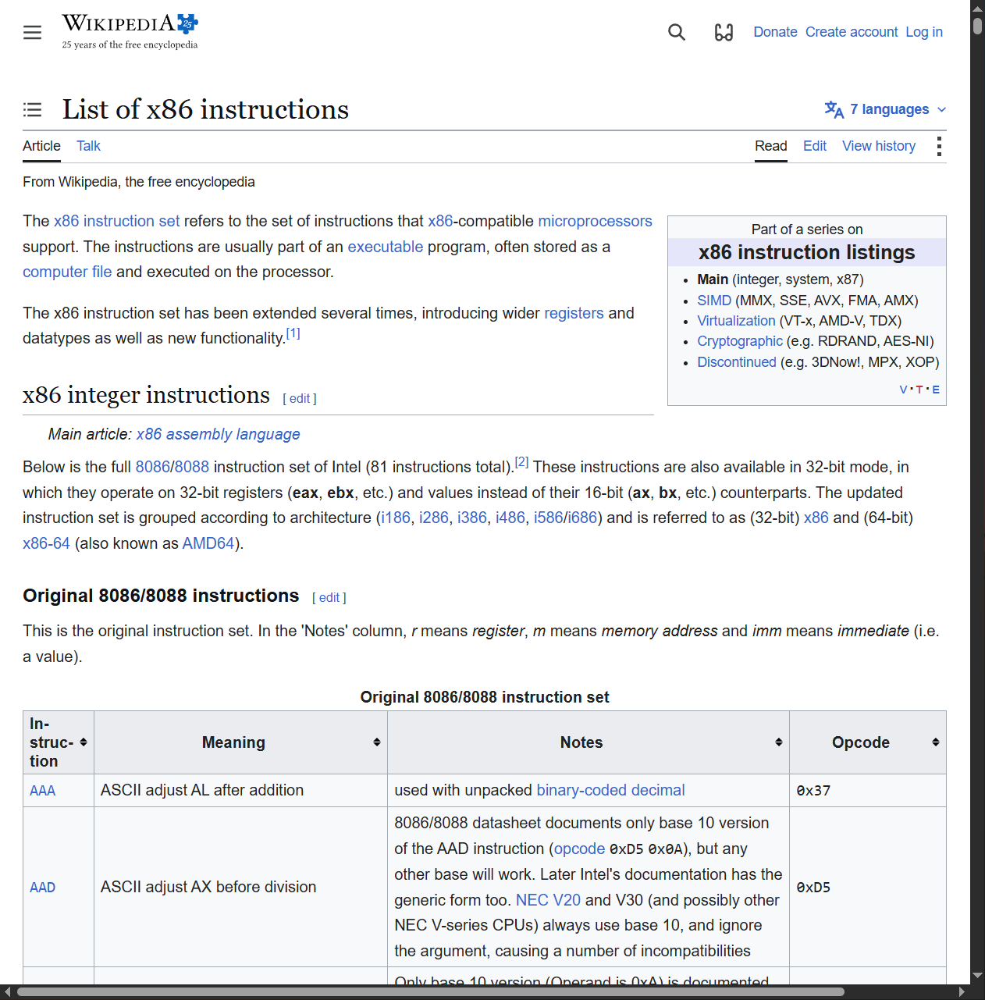
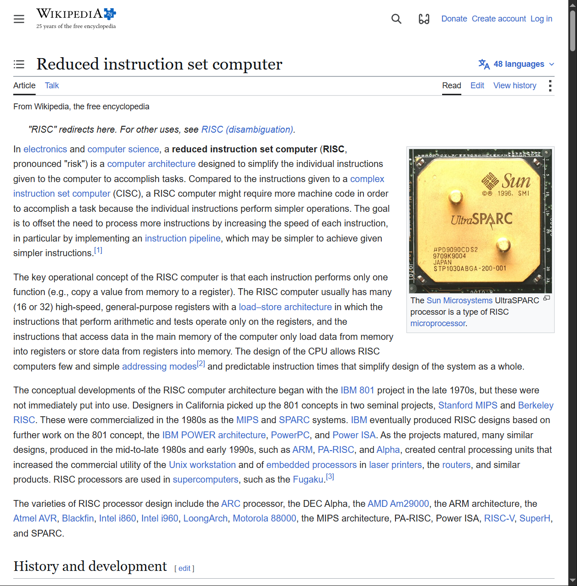
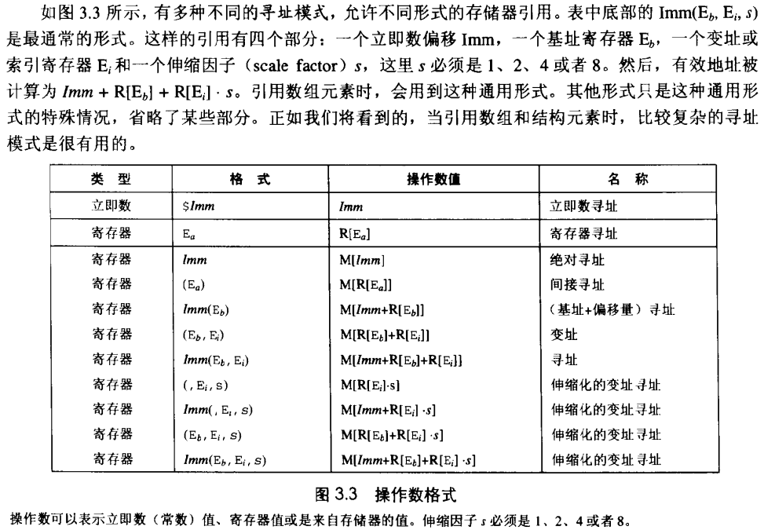

在用高级语言如C语言编程时，我们被屏蔽了程序具体的机器级实现。相比之下，在用汇编代码写程序时，程序员必须明确指定程序该如何管理存储器(memory)和用来执行计算的低级指令。大多数时候，在高级语言提供的较高抽象级别上工作会更有成效和可靠。编译器提供的类型检查能帮助你发现许多程序错误，并能够保证我们是按照一致的方式来引用和管理数据的。使用现代的优化编译器，产生的代码通常至少与一个熟练的汇编语言程序员手工编写的代码一样有效。最好的一点就是，用高级语言编写的程序可以在很多不同的机器上编译执行，而汇编代码则是与特定机器密切相关的。

虽然可以使用优化编译器，但是对于严谨的程序员来说，能够阅读和理解汇编代码仍是一项很重要的技能。启动编译器时带上适当的选项，编译器就会产生一个汇编代码文件，汇编代码非常接近于计算机执行的实际机器代码。与目标代码的二进制格式相比，它的主要特色在于它采用的是更加易读的文本格式。通过阅读这些汇编代码，我们能够理解编译器的优化能力，并分析出代码中潜在的低效率。就像我们将在第5章中看到的那样，一个试图优化一段关键代码性能的程序员，通常会尝试源代码的各种形式，每次编译并检查产生出的汇编代码，从而了解程序将要运行的效率是如何的。此外，也有些时候，高级语言提供的抽象层会隐藏我们想要理解的一些信息，如程序的运行时行为。例如，第13章中会讲到，当用线程包写并发程序时，知道用何种存储(storage)来保存各种程序变量是很重要的，而这些信息在汇编代码级是可见的。程序员学习汇编代码的需求随着时间的推移也发生了变化，开始时是要求程序员能直接用汇编语言编写程序，现在则是要求他们能够阅读和理解优化编译器产生的代码。

在本章中，我们将学习某种汇编语言的详细内容，明白C程序是如何编译成这种形式的机器代码的。为了阅读编译器产生的汇编代码，除了具备手工编写汇编代码的能力外，还包括其他一些技能。我们必须了解典型的编译器在将C程序结构变换成机器代码时所做的转换。相对于C代码中表示的计算操作，优化编译器能够重新排列执行顺序，消除不必要的计算并替换慢速操作，例如用加法和移位来代替乘法，甚至于将递归计算变换成迭代计算。理解源代码与对应的汇编码的关系通常不太容易--就像要拼出一幅跟盒子上的图片设计有点不太一样的拼图。这是一种逆向工程(reverseengineering)--通过研究系统和逆向工作，来试着了解系统被创建的过程。在这个情况中，系统是一个机器产生的汇编语言程序，而不是由人设计的某个东西。这简化了逆向工程的任务，因为产生的代码遵循相当规则的模式，且我们可以做试验，让编译器产生许多不同程序的代码。在我们的表述中，给出了许多示例和练习，来说明汇编语言和编译器的各个方面。精通细节是理解更深和更基本概念的先决条件，花点时间研究这些示例并完成练习是非常值得的。

这章的前一个部分在说我们的计算机硬件结构和我们die的结构，这部分我就不赘述了，有挖坟的可以通过我 服务器搭建-hpc101中的硬件部分 来补齐，哪些部分的硬件知识点还是很多的

好了，现在假定你和我有一样的知识储备

## 指令集架构

首先作为一个程序员，你难道不好奇我们平时说的x86 arm架构是怎么来的吗

我们要明确一个点，我们的架构通常指指令集架构（ISA），ISA决定了我们的明文代码怎么和我们的机器交互，比如我们的加法器怎么定义，我们怎么访存，我们有哪些寄存器，这些都要在我们的指令集中优先定义

开始的时候肯定是百花齐放，但是时代（资本）的力量肯定会推出某个人来做大一统的事情，这就是Intel

Intel早期的处理器分别这样编号

8086 → 80186 → 80286 → 80386 → 80486

你会发现他们都是86，那干脆就叫x86好了！随着发展，它从早期的 16 位扩展到 32 位，后来 AMD 设计了兼容既有 x86 软件的 64 位扩展，即 AMD64 / x86-64，Intel 随后也支持了它

而arm（acorn risc machine）则是另一条路线，ARM 起源于英国 Acorn 公司在 20 世纪 80 年代的处理器项目，最初名称是 Acorn RISC Machine。

它采用 RISC （精简指令集）的设计思路：让基本指令和编码更规整，例如通常通过专门的加载、存储指令访问内存，算术运算主要在寄存器之间进行。

所以我们会发现arm架构的机器往往更节能，当然他们的性能可能不尽人意（通常来说奥，我们的速度和耗电还和我们的芯片制造工艺，CPU 内部设计，缓存和核心数量，工作频率及功耗限制，软件优化和具体任务相关）

| 对比项 | x86-64 | AArch64 |
|---|---|---|
| 指令长度 | 可变，1～15 字节 | 固定 4 字节 |
| 通用整数寄存器 | 16 个，包括栈指针 | 31 个，另有专用栈指针 |
| 算术操作访问内存 | 很多指令允许 | 通常需先加载到寄存器 |
| 历史特点 | 延续大量早期 x86 设计 | 64 位指令集设计较规整 |

在0.5中我们说到一个程序会先被编译，然后再被编码，这个过程中我们终于接触到了从汇编角度编程，首先，汇编中的大部分操作基本都是基于寄存器执行的，所以寻址成为了一个很重要的话题

但是我
