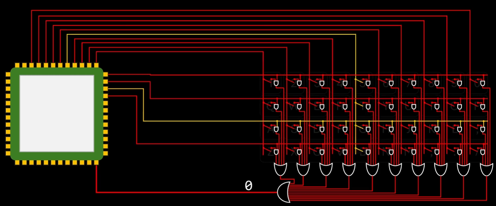
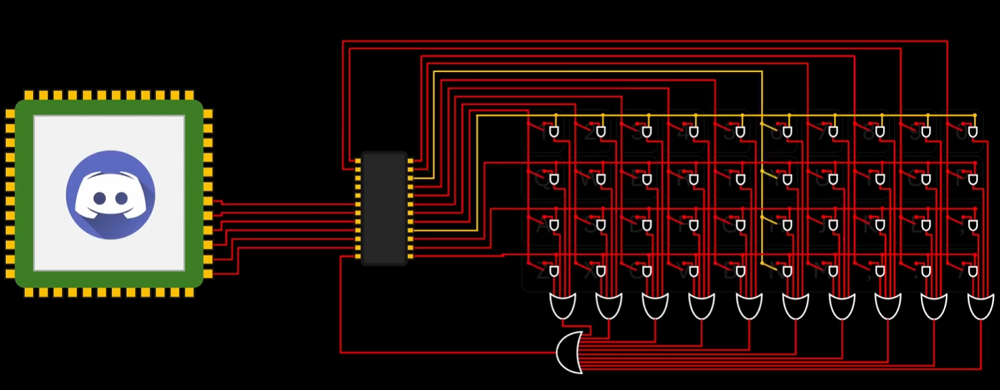
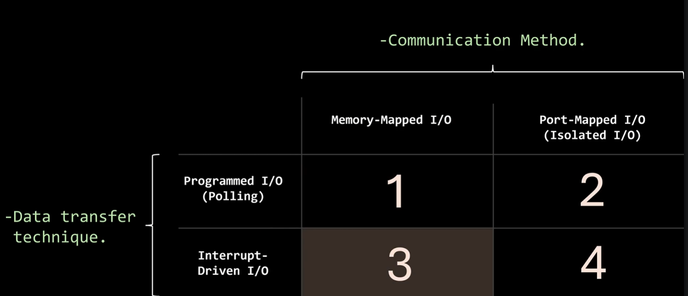
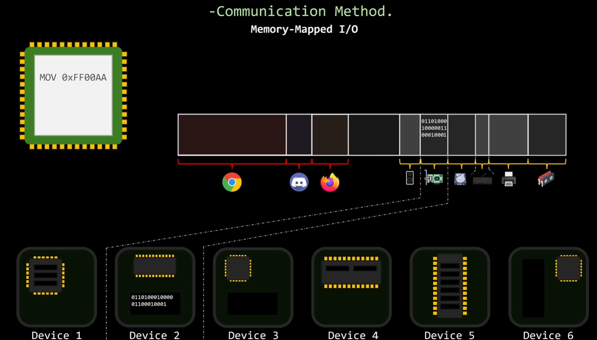
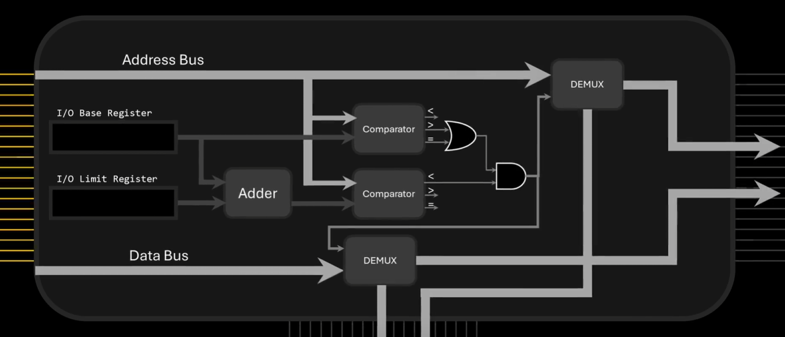
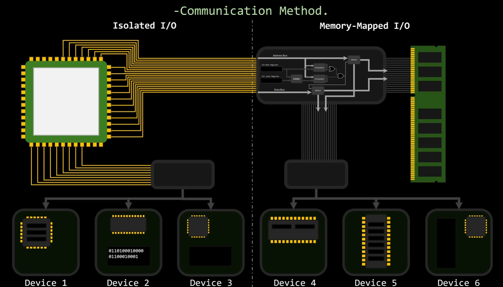
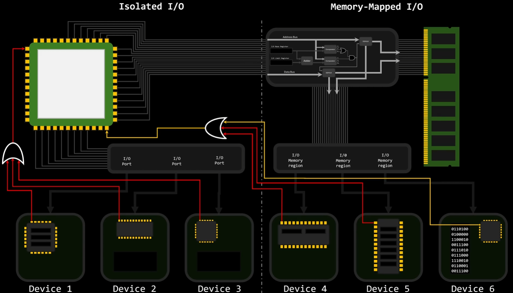
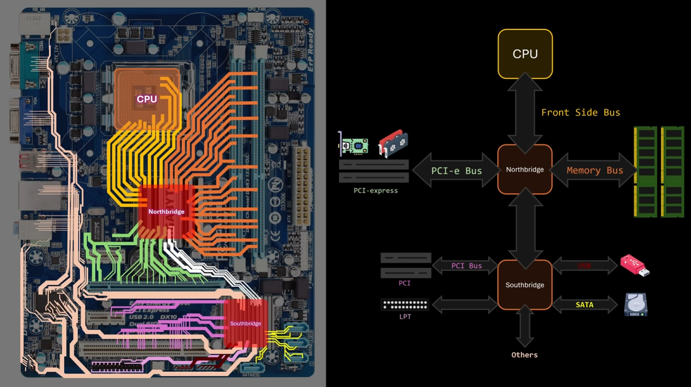
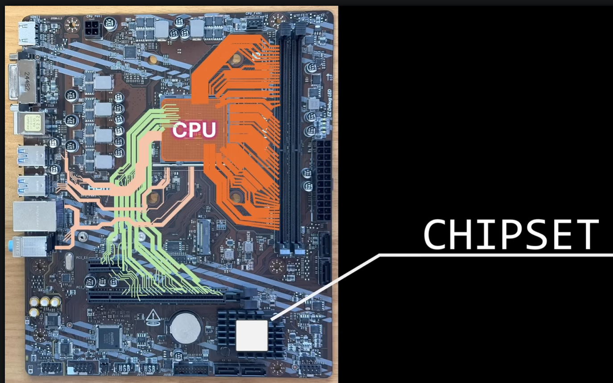
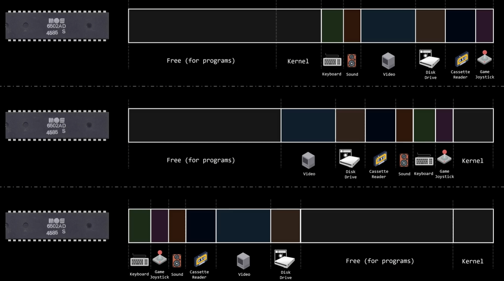

io的概念就是输入输出设备

但是我们怎么实现cpu和我们的外界io设备链接呢？

首先你会想到我们直接用连接线把引脚和设备连一起就行了

当时这样的操作问题其实很大——我们的cpu没必要用这么多的先去控制一个外设

以一个键盘为例，键盘的工作方式是轮询

如果都与cpu相连，cpu本身也要陷入信号等待，这是我们不想看到的

于是我们采用微控制器来实现交互，而微控制器再用总线和我们的cpu相连

这就是为什么我们机械键盘旁边还有电路板的原因，他要负责拿到cpu的请求，然后读取，然后返回，这也是为什么我们机械键盘总会慢几拍的原因

在设计io的时候我们要考虑两个东西——通信方式和数据传输技术

通信方式的优化方法如下：

我们的设备中肯定会具有缓存或者锁存器，我们其实只要把我们的这部分内存映射到我们的真实内存上就行了，这样我们进程读写内存其实只要在虚拟内存上修改就行了

当然，我们也要考虑连接方式，我们中间肯定不能只有一条总线，我们肯定还需要区分我们到内存和到我们io内存的信号处理器

当然，除了我们内存映射形式的io，我们也有直连的io，这部分你会在我们电脑上的io面板看到

这种的好处很明显，我们的cpu能够有更快的访问，带宽更大，和我们的内存映射并行，这样就很安全且小白了

但是我们怎么让我们的cpu知道哪个io需要干活呢？在上面我们谈到了分线器，但是我们在实操的时候我们还需要阻断cpu的工作流

第一种方法是轮询，我们设备内存中有专门的一个寄存器用于存储我们是否有io的活动，当检测到有活动的时候直接输出并阻断我们的设备

第二种方法是像之前一样用个或门直接连到cpu的引脚上，

这种阻断让你的io有了更高的回报率

接下来让我们从数据传输层面看，首先我们拿一块老的板子 

看过我计组相关的帖子的应该都能知道这张图的含义，在早期的主板设计中，我们cpu和内存没有直连，全部通过北桥走转发，然后北桥链接高速信道

而南迁走北桥的路由，连接低速信道

然而，现在的主板设计可不同了

现在的主板更多采用去除北桥，让io，内存，pcie直连我们的CPU，但是为什么会这样呢？这种直连的方式不是说开销更大吗？

首先是应为我们的cpu性能更强，能够实现超多ping和超高的频率

其次是各个厂商都在尝试着去做去内存映射化

因为早期的io内存分配其实是呗厂家写死的，一台机器的io到了另一台机器上就不一样，这是很灾难的，你可以想象一段播放声音的程序最后却直接让内核被修改了，这是很恐怖的（更别说那个时候还没有虚拟内存技术

当然，我们能够通过动态内存分配来实现我们内存映像依旧成立，但是这需要额外的握手协议，在这个过程中其实我们已经发生了通信了，既然如此为什么我们不直接通过这个协议通信呢？内存映射也显得没必要了