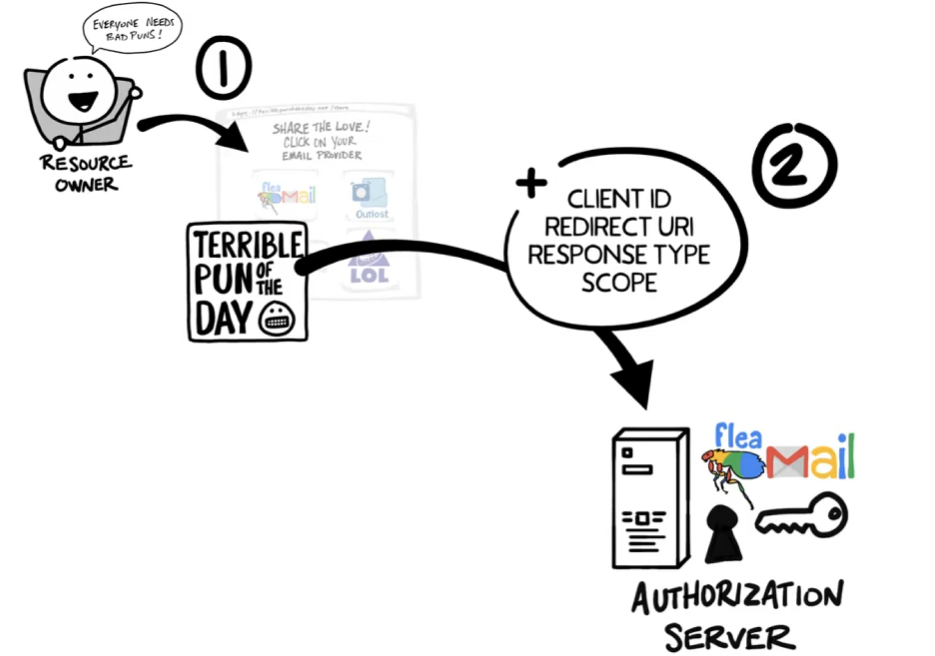
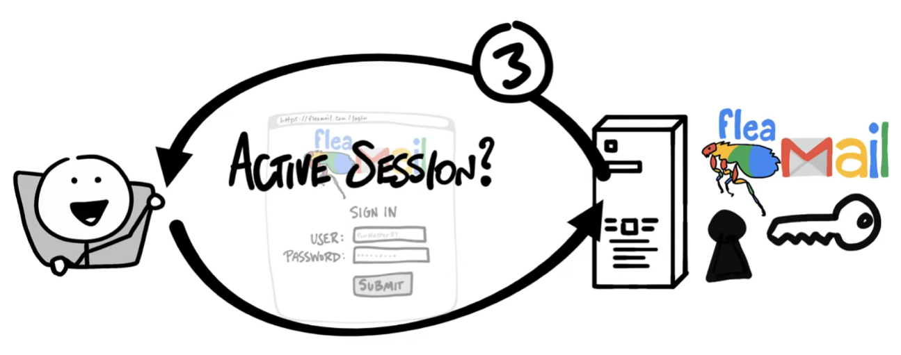
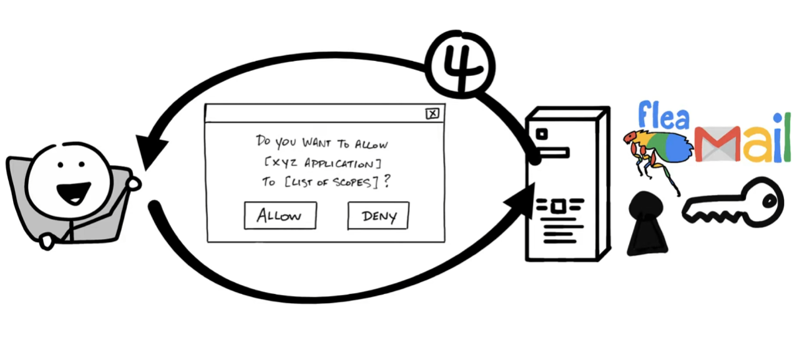
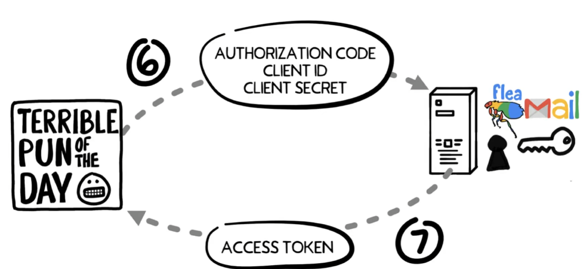
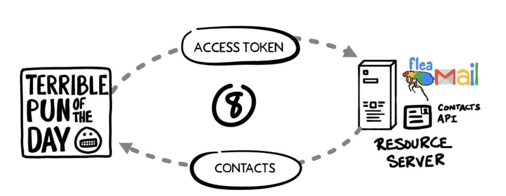

在计算机的远古时期，我们网页鉴权的方式很简单——你只要交出你的账号密码就行了

当然，没人保证这些信息是安全的（

不过跳过我们中间采用的很多加密技术历史，我们现在最多采用的是oauth2

当我们在另一个软件中登陆时，我们不用提供账密，我们只要给出一把钥匙，这把钥匙用来访问我们的特定数据或者执行操作

这就是鉴权

而我们的具体操作可能如下

比如说我们遇到了一个网站，当他请求我们的oauth认证时，我们将被重定向到我们的认证页面，认证页面是一个开放oauth接口的网址，可能是邮箱 ,github ,钉钉 and so on. 当我们登陆后，我们会重定向回我么的网站，这就是我们常见的oauth流程

在我们进一步深入前，我们不妨了解一下我们的一些术语

resource owner : 用户

cliebt : 客户端

authorization server : 鉴权方

resourc e server : 给出api接口，提供鉴权服务的服务商，又是可能不是同一个服务器

redirect url : 重定向的url

response code : 客户端期望的信息类型，比如code

scope : 客户端需要的权限粒度

consent : 向用户索取的确认请求

client id : 在鉴权服务器鉴别客户端身份

client secrect : 客户端和服务器知道的密钥，用于加密

authorization code : 授权服务器返回给客户端的短期密钥，客户端回发挥来兑换访问令牌

access token : 一把解锁权限的key

1. 资源拥有者想要访问

2. 客户端重定向到授权服务器，请求包含客户端id 重定向url 响应类型 以及 权限范围

3. 授权服务器回验证身份，在必要的时候提示您登录

4. 授权服务器发送一个基于客户端请求的同意表单

5. 授权服务器返回将临时授权码返回给服务端

6. 客户端直接联系授权服务器，其中不经过资源所有者的浏览器，安全的发送客户端id，客户端密钥和授权码
7. 授权服务器验证后返回令牌

8. 访问令牌是客户端无法理解的值，但是能被验证服务器理解，如果验证成功，返回相关数据

## openid connect (OIDC)

OIDC是一个轻量的拓展层

OIDC像一个工牌，不仅赋予客户端权限，还提供了关于你身份的基本信息，让客户端之间能够建立登录会话

这实现了一次登录就能通行多个应用，也就是我们常说的SSO

以一个atm为例，atm就是客户端，他的职责是访问数据并且提交请求

而我们的银行卡就是我们的令牌，他提供我们的姓名，身份和进入客户端user的权力

atm离不开银行的基础设施建设，就像oidc离不开oauth

你会发现我们的id token和我们的正常令牌很不一样

我们的id token 被称为json web token(jwt)

客户端能够获取jwt中的内容，这些数据被称为声明

通过上面的方式，我们的服务之间才能够实现相互的鉴权，这也是我们web开发安全性的基石