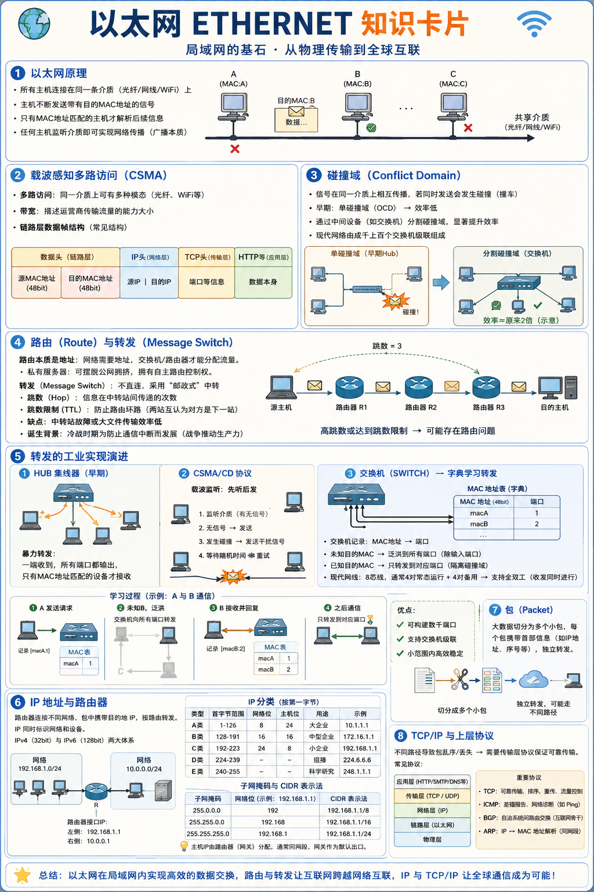
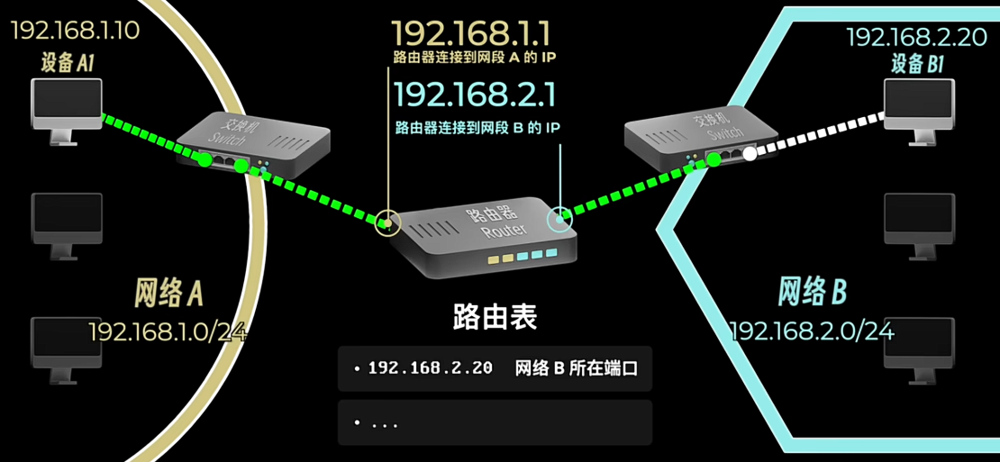
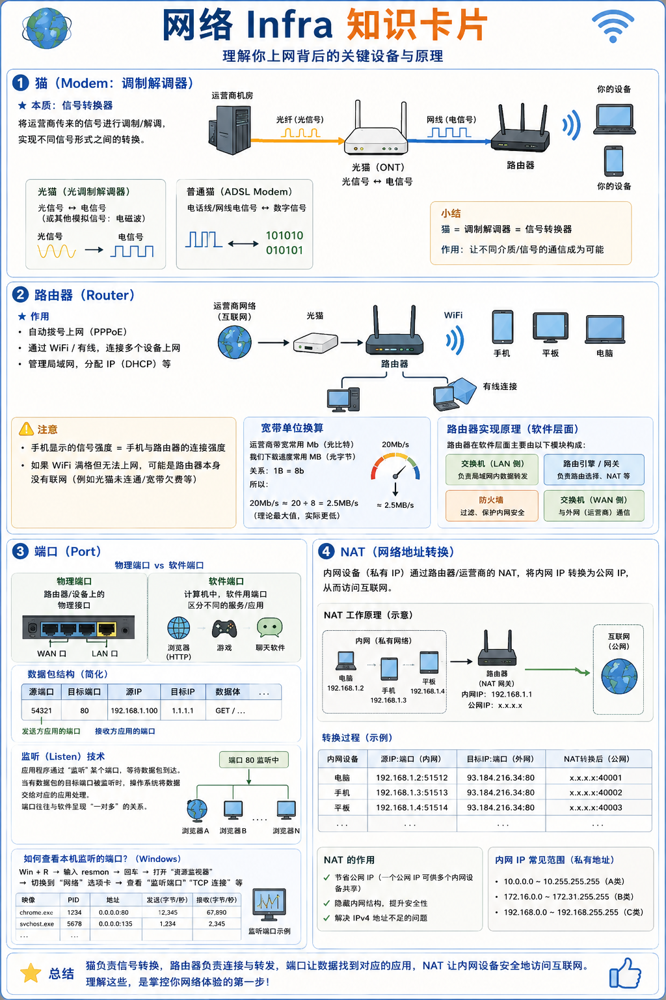

早期的计算机数据传输一般依靠人在不同机房中运送磁带来实现

（是不是有点太早了）

可幸的是，光纤的出现改变了这一切

## 以太网 ETHERNET
以太网工作的原理是通过将所有主机连在同一条光纤上，主机不断发送带有对应特殊字符（MAC地址）的信号，得到对应字符（MAC地址）的主机才会解析接下来的信息，主机只要监听以太网就鞥能实现网络传播

### 载波感知多路访问
多路体现在我们的介质可以不一样，像光纤，像wifi，我们有不同模态的运输方式

所以`带宽`这个概念就是来描述我们运营商输送流量的大小的

我们数据的本质就是01构成的电信号，当经过多层抽象以后我们传输的数据在链路层中一般以这样的结构传输

**[[数据头：原MAC地址，目的地MAC地址] [[IP源 目] [TCP] [HTTP] 数据本身]]**

### 碰撞域 conflict domain
从信号传播的原理上看，我们很容易看出，如果两股信号相撞，我们的信号就会混乱——撞车了

所以，为了防止碰撞的发生，网络专家把原来的单碰撞域（OCD）改成了两部分——中间加上一个调节器，手上拿着对面地址的字典来查询（谁家拉普拉斯妖），这让我们的通信效率变成了原来的两倍

当然，我只是举了个最简单的例子，我们正常的计算机网络阵列还是非常庞大的——由成千上百个switch构成

### 路由 route
路由本质上就是我们的地址，我们的网络需要地址，不然switch开关就不知道怎么分配我们的流量了

同样，我们看到网络之间的忙线让我们为了一点流量分配叫苦不堪，所以，如果我们有钱购买一台私域服务器，我们就可以免受其害

#### 转发 message switch
或者我们还可以考虑另一种方法：我们或许不需要直连，可以像邮政传输一样运送我们的信息

其中，信息在不同中转站之间的传递次数叫做`跳数`，当我们看到高跳数（或者说达到`跳数限制`）的情况，说明我们的消息传播有问题：比如两个站都认为对方才应该是下一站

当然，这种方法同样也有缺点，比如说当我们进行大文件传输的时候，如果我们还剩下最后一点文件，但是我们的中转站报废了，这个时候我们的信息传输同样不算成功，或者传的很慢

这种技术是在冷战背景下产生的，为了防止数据传输中断（我说战争可以推动生产力）

下面我们来详细看一下转发的工业实现原理：

1. HUB集线器

早期我们用HUB进行技术实现，HUB集线器一般采用暴力转发的方式，即当一条通路接收到输入，所有通路都会输出，只有MAC地址对应才接受

2. CSMA/CD协议
我们处理碰撞问题也有了新的方法，我们采用CSMA/CD协议来进行载波监听，只有没有数据发送的时候才可以发送

当然，上面的实现方法也有缺陷——我们只能在同时发送一条信息，信息的利用率太低了——所以我们采用了SW交换机（SWITCH）

3. 技术细节

SW的实现方式我们在上面说过了——通过字典——但是字典上记录卡了什么呢？我们的字典上记录了主机的地址(48bit)和对应端口信息

而且我们的网线也迎来了升级，我们现在的网线一般有八条通路，其中一般四条常态运行，而另外四条idle，这使得我们的计算机网络沟通可以实现`全双工`的特性——两台设备之间可以随便传播

当我们买来一台交换机时，我们的交换机上没有任何的信息

当我们接入设备发送请求时

我们的设备A发送请求并被记录[macA:1]

在表中查无时，我们向所有设备发送请求

B接受并返回参数[macB:2]

得到[macA:1, macB:2]

这种表可以构建出几千的端口，而且交换机之间也可以相互链接

在小范围内，这种交换器架构十分优越

但是当我们到了大范围呢？全球几亿台计算机不可能全放在一起？新建映射时候的广播时间也是一个问题

一开始人们想到可以用路由器（网关）把几个网络之间链接在一起，每个包上带上我们目的地的地址，这种地址由互联网定义，简称`协议`（internet protocol IP），是一种标准供大家执行

IP地址同时标识了我们的网络和设备

我们的网络采用两个体系表示，一个是IPv4一个是IPv6

例如我们的网络可能是：192.168.0.0/24

而我们的主机可能是：192.168.0.102

你可能能猜到我们路由器的工作原理了：他同时有两边的IP

但是怎么解读我们的IP地址呢？IP地址是8bit的，所以范围是0.0.0.0~255.255.255.255

但是我们怎么读呢？

**首先是我们的IP大小分类**

| 类型 | 用途 | 网络位 | 主机位 | 地址示例 |
|------|------|--------|--------|-----------|
| A类 (1-126) | 大企业 | 8 | 24 | 10.1.1.1 |
| B类 (128-191) | 中型企业 | 16 | 16 | 172.16.1.1 |
| C类 (192-223) | 小企业 | 24 | 8 | 192.168.1.1 |
| D类 (224-239) | 组播 | 无 | 无 | 224.6.6.6 |
| E类 (240-255) | 科学研究 | 无 | 无 | 248.1.1.1 |

这是第一位，第一位一般都是网络码

而我们有几位网络码（255），决定了我们网络的

| 子网掩码        | IP 地址       | 网络位（示例） | CIDR 表示法       |
|----------------|---------------|----------------|-------------------|
| 255.0.0.0      | 192.168.1.1   | 192             | 192.168.1.1/8     |
| 255.255.0.0    | 192.168.1.1   | 192.168         | 192.168.1.1/16    |
| 255.255.255.0  | 192.168.1.1   | 192.168.1       | 192.168.1.1/24    |

那我们主机的IP地址是怎么决定的呢？就是通过我们路由器的IP地址

#### 包 packet
回到上面，所以怎么解决传输中断的问题？程序员发现了一种方法——将大数据切成很多小的包，然后再配上我们的IP地址，就能直接实现我们的数据转发了

#### TCP/IP
我们也有一些别的问题产生：包之间走不一样的路径怎么办？这很有可能导致我们最后的包到达是乱序的

所以，一些凌驾在IP协议上的协议产生了，用来解决这个问题，这些站点之间用特殊协议通信，例如互联网消息控制协议（ICMP）和边界网关协议（BGP）

## 网络Infra

### 猫

猫本质是调制解调器，就是将网线上的电信号做转变，而光猫就是将光信号转变成电信号或者其他模拟信号——电磁波

### 路由器

没有路由器时，我们每次上网都需要拨号上网，路由器会帮我们自动拨号，然后路由器通过wifi，让手机和电脑都连接到路由器上，让其他设备也可以上网

我们手机信号本质上表示的是我们的手机和路由器的连接强度，所以有的时候我们wifi满格但是没有网络，很有可能就是我们的路由器没有网

同时，我们还有一个注意点，就是我们的宽带大小一般用的单位是Mb，而我们平时一般是用MB做单位

他们之间的关系是：1B=8b

所以有的时候我们可能会发现我们的宽带是20M，但是下载速度只有2.5M

路由器的实现原理：

路由器在软件层面主要由两层交换机，防火墙，和网关（软件层面路由器）构成

#### 端口

物理端口：顾名思义，网关上的网口

软件端口：当我们的计算机收到数据包的时候，怎么知道我们的数据包是那个软件的，这个时候，我们的软件本身其实也有像物理端口一样的端口

一个数据包中往往包含以下内容：源端口，目标端口，源IP，目标IP，数据体……

这些结构注定了我们数据本身其实也是可以像网络信息一样去找我们的端口的

这个时候，我们或许就能理解我们的`监听`技术

监听技术通过监控我们的端口来实现我们端口的监听，如果我们的数据发现有对应的端口被监听，我们的数据也得到相应的传输，而我们的端口往往和软件呈现一对多的关系

技术层面，要知道我们所监听的端口，我们通过win+R弹出运行窗口，输入resmon然后回车，然后查看“网络”选项卡就行了

### NAT

我们一般的上网需要公网的IP，原IP只是内网IP，通过运营商的NAT系统我们可以实现IP到公网地址的转变
