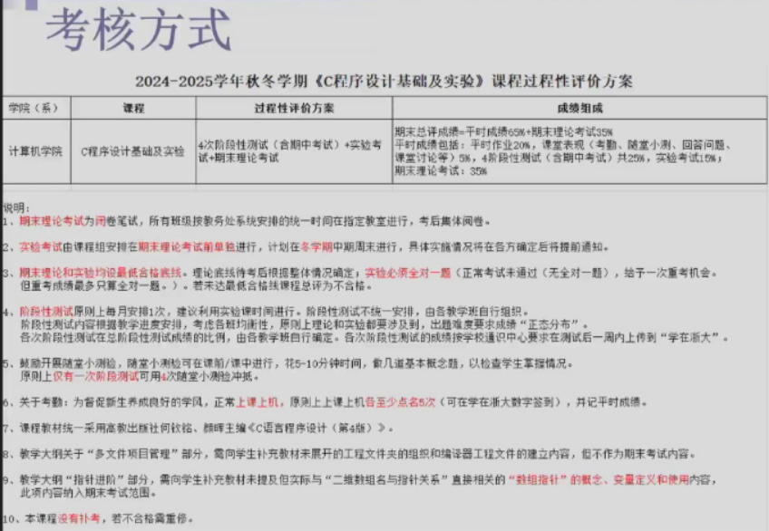
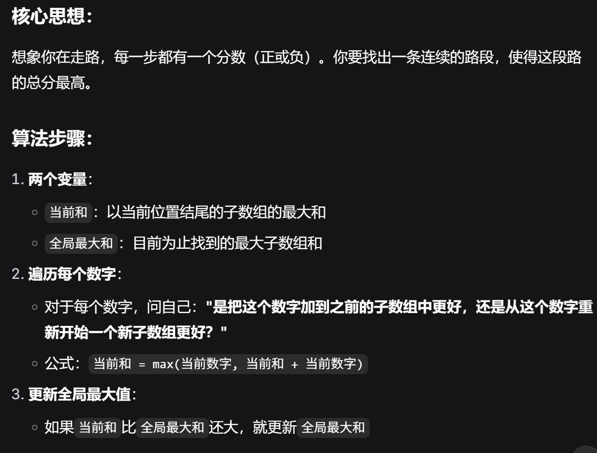

有关字符题的写入思路：

`#include <stdio.h>`
`int main(){`
    `int a[80];`
    `int c,i=0,count=0;`
    `while(1){`
        `if((c=getchar())!=EOF){`
            `if(c == '\n'){`
                `break;`
            `}`
            `a[i] = c;`
            `i++;`
        `}else{`
            `break;`
        `}`
    `}`

## 卡丹算法解释（o(n1)的方法）

`#include <stdio.h>`

`int main(){`
    `int c, count = 0;`
    `char a[80] = {0};  // 改为char数组`
    
    `while((c = getchar()) != '\n'){`
        `if(c >= 'A' && c <= 'Z'){`
            `int found = 0;  // 标记是否已存在`
            
            `// 检查是否已经存在`
            `for(int i = 0; i < count; i++){`
                `if(c == a[i]){`
                    `found = 1;`
                    `break;`
                `}`
            `}`
            
            `// 如果不存在，才添加`
            `if(!found){`
                `a[count] = c;`
                `printf("%c", c);`
                `count++;`
            `}`
        `}`
    `}`
    
    `if(count == 0){`
        `printf("Not Found");`
    `}`
    `return 0;`
`}`

数位标记法

`#include <stdio.h>`
`#include <string.h>`

`int findString(char arr[][80], int n, char *target) {`
    `for(int i = 0; i < n; i++) {`
        `if(strcmp(arr[i], target) == 0) {`
            `return i; // 找到，返回索引`
        `}`
    `}`
    `return -1; // 未找到`
`}`

## 注意事项：

1. **区分大小写**：`strcmp` 是大小写敏感的
    
2. **需要头文件**：必须包含 `#include <string.h>`
    
3. **比较的是内容**：不是比较指针地址
    
4. **保证字符串以`\0`结尾**：否则会导致未定义行为
    

## 相关函数：

- `strncmp`：比较前n个字符
    
- `stricmp`/`strcasecmp`：不区分大小写的比较（非标准）
    
- `strcoll`：根据本地化设置比较
    

`strcmp` 是字符串处理中最基础和重要的函数之一，理解它的工作原理对于C语言字符串操作至关重要！

[stdio函数库](stdio函数库.md)
[math函数库](math函数库.md)
