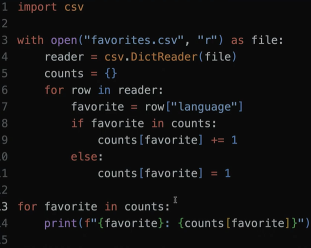
python csv模组的最优点就是能对列表进行强大的管理，能直接添加并引用列进行计数
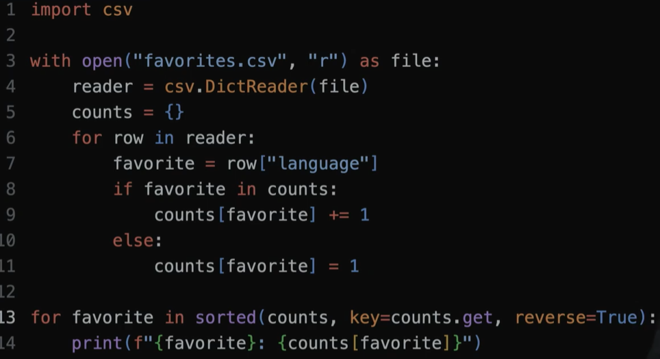 

有没有更快的解决方法
## SQL

（CRUD）
CREATE， INSERT
READ
UPDATE
DELETE， DROP

指令
sqlite3 xxxxx.db (database) (create a file)
.mode csv (shift to sql mode)
.import xxxxxx.xlxs
.quit (back)

能直接对文件进行操作
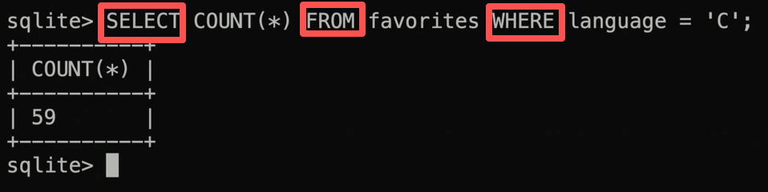
注意其中的关键词
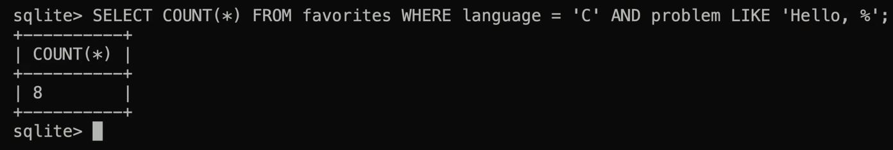
LIKE语法，注意其中若有' use ''
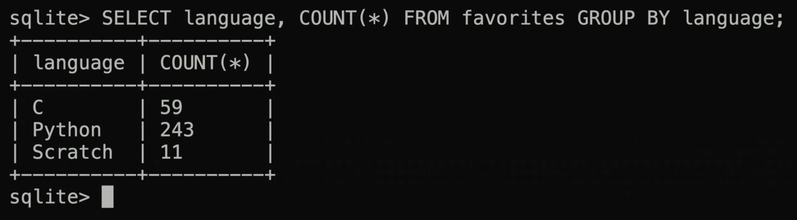
GROUP BY语法
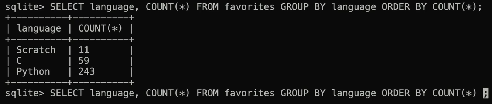

IMDb
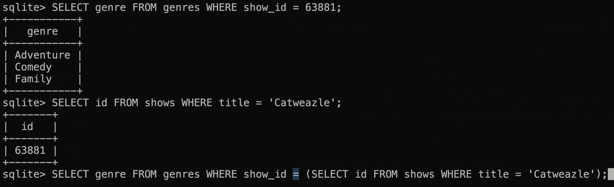
对于多行处理
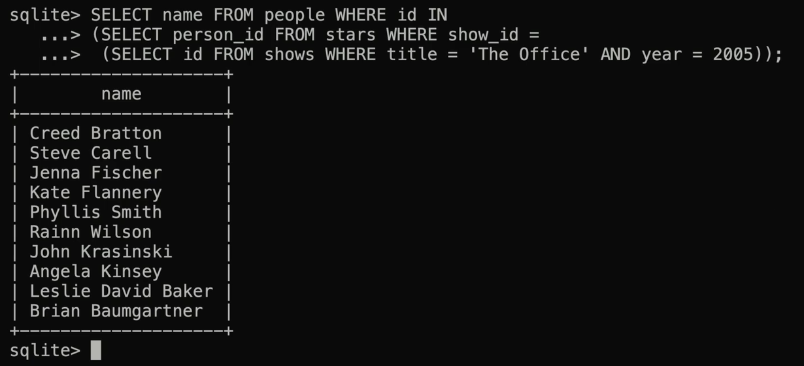
使用嵌套的方法
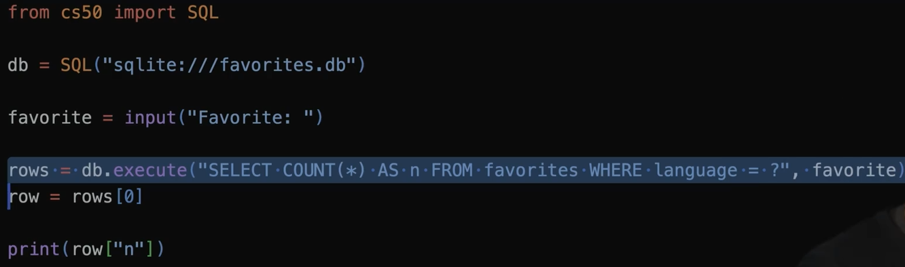
同样，通过引入SQL模组（cs50）可以在py中实现终端中才能实现的功能

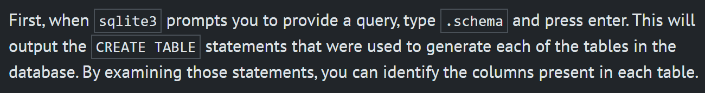
用 .schema 来查找组内元素
一步步，我们慢慢增加SQL语句的功能
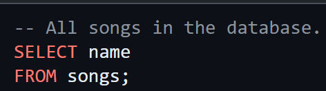
从songs中选取name
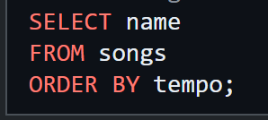
接着再加上顺序
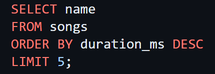
限制 降序 长度查找
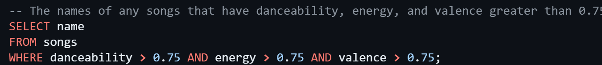
加上条件语句

调用函数
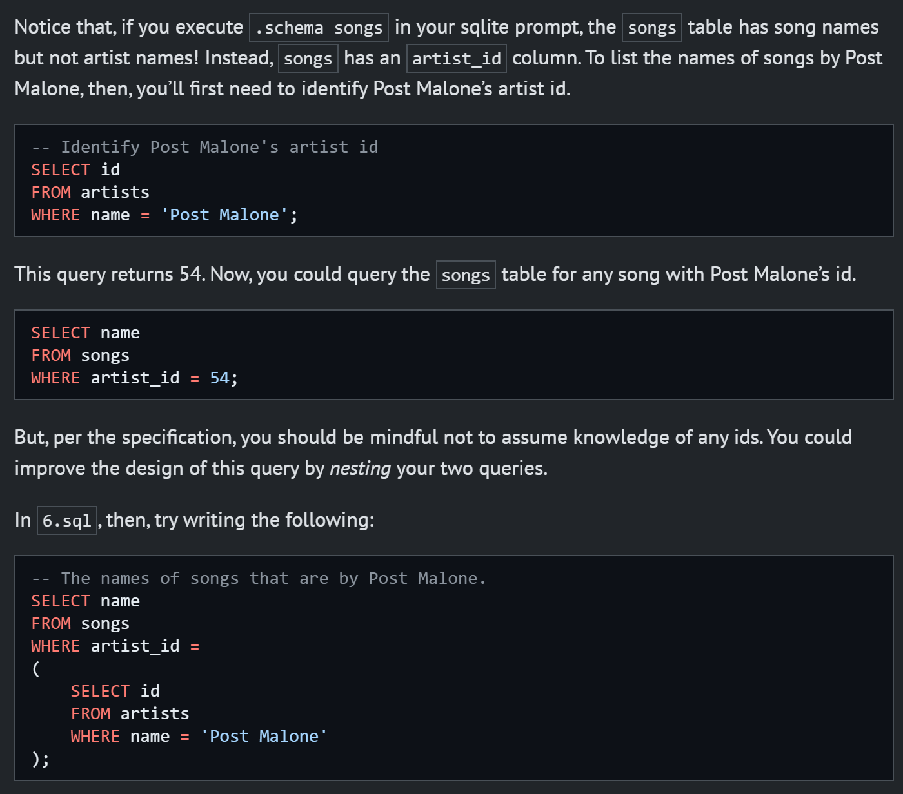
多层嵌套
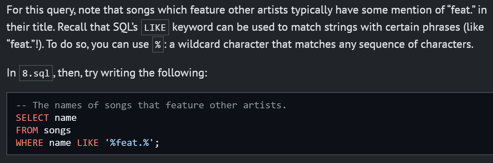
待输入/未定

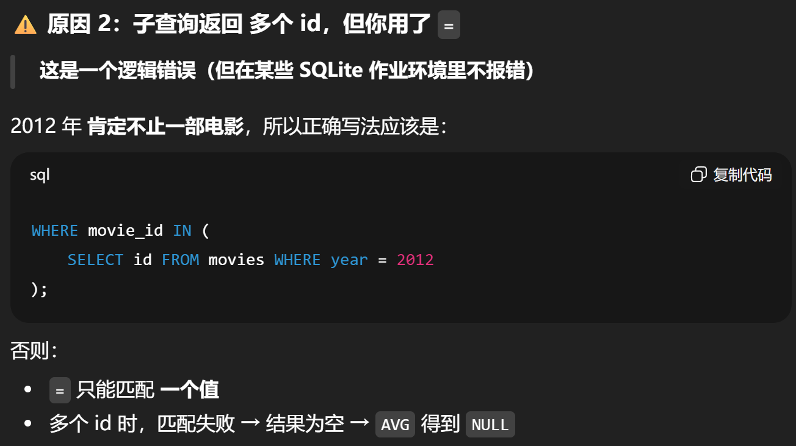
注意，取值的时候 = 只能对应一段值，多段值需要使用 IN
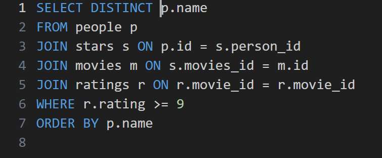
大概就像这样，选取，组织表格，增加条件，选择打印顺序(限制)
注意，上面这种始终成立的条件会造成笛卡尔污染，使得程序卡死

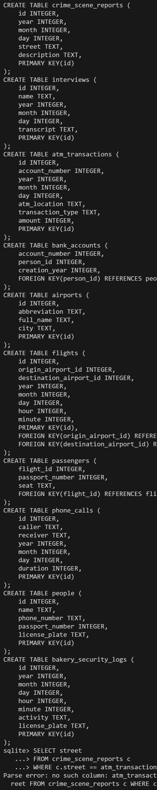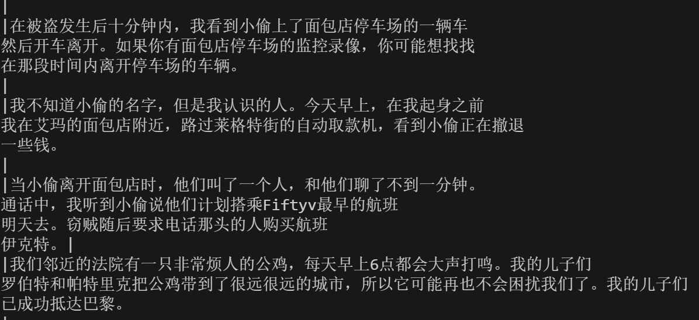
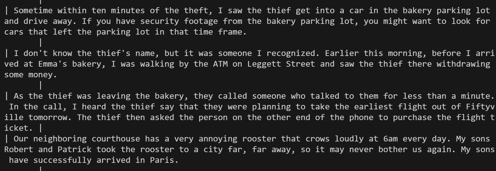
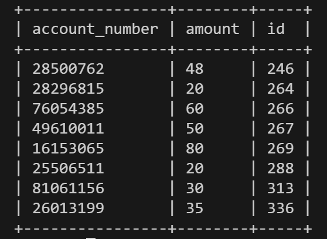
取钱的金额，id 和账户
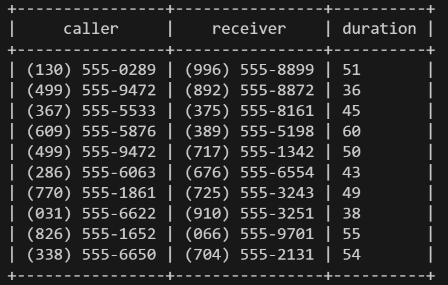
当天打的电话
