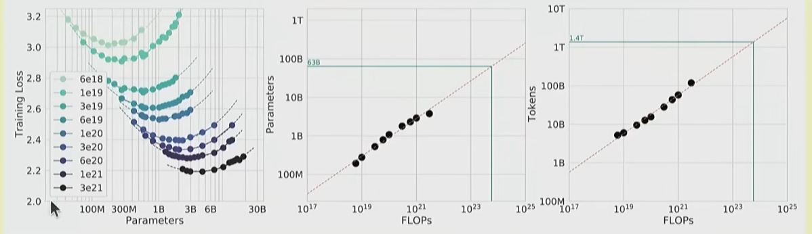
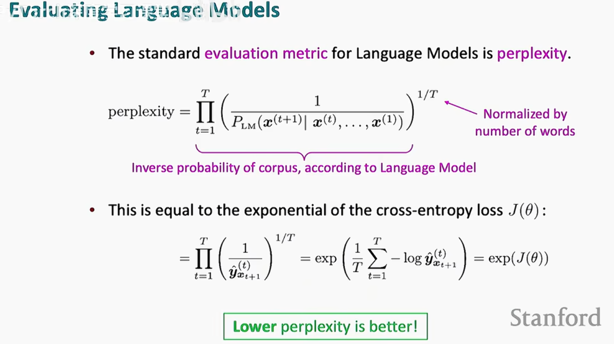

## Overview and tokenization

默认已经掌握transformer架构

## Inferrence（推理）

从输入以后进行encode预填充，然后给出激活值，模型自回归进行推理decode形成输出

这种处理办法天然的带有并行处理的特性
也因此算例成为了最大的瓶颈

关于模型的训练数据选择，越大的模型需要的训练数据越小，所以怎么找到平衡点？
参考OpenAI给出的论文

然后用曲线对应

## Data
训练数据决定了模型的功能

### evaluation

1.Perplexity（困惑度）

语言模型的传统评估指标，衡量模型对文本的预测能力。

2.标准化测试（Standardized Testing）

使用公开数据集（如MMLU、HellaSwag、GSM8K）评估模型在多任务、常识推理、数学等能力上的表现。

3.指令跟随能力评估（Instruction Following）

测试模型是否能够准确理解并执行人类指令，常用基准包括AlpacaEval、IFEval、WildBench。

4.测试时计算扩展（Scaling Test-Time Compute）

探讨如何通过增加推理阶段的计算量（如链式思维、集成方法）来提升模型表现。

5.语言模型作为评判者（LM-as-a-Judge）

使用语言模型自动评估生成任务的质量，替代人工评估。

6.系统级评估（Full System Evaluation）

在完整应用场景中评估模型表现，如检索增强生成（RAG）系统和智能代理（agents）。
