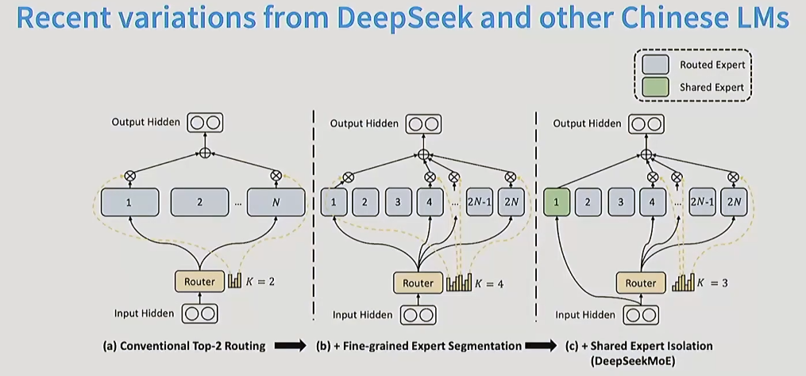

## MOE的创新

## 近年来，一些使用MOE模型的大语言模型在网络上走红(deep seek v3)

创新点
1. 分散的FFN（前馈神经网络）
2. 路由分配机制
   
   路由分配的方式
    1. Top t 专家根据自己的偏好选择相关的Token，最终最相关的top k token进入计算
    2. Top e token根据自己的偏好选择专家，最终返回Top k个专家用于预处理所有token
    3. Global 融合上面两者的办法，但是缺点是太过复杂，反而牺牲了运行时间

或许你想问：为什么token能决定哪个expert最有利

这就涉及到相关的路由构建了
1. softmax路由
2. 强化学习路由
    这是 MoE 早期探索的一种路径（如 Bengio 等人在 2013 年的工作）。
    机理： 路由被看作是一个决策过程。Router（决策者）根据输入的 Token 选择一个专家，如果这个专家处理得好（最终损失 Loss 降低），就给 Router 一个“奖励”；如果处理得不好，就给一个“惩罚”。
3. BASE路由
    这是为了解决**“专家负载不均”**（某些专家被挤爆，某些专家没活干）而设计的更高效方案。
    机理（Solve a matching problem）： 它不把路由看作简单的“选择题”，而是一个**“分配平衡问题”。它将 Token 和专家之间的关系建模为一个线性分配（Linear Assignment）**问题。
    核心动作：
    不仅计算 Token 对专家的“偏好程度”。
    还加入一个全局约束：强制要求每个专家处理相同数量的 Token。
    通过线性分配算法，在满足“大家都别闲着”的前提下，让每个 Token 尽可能去到自己最想去的专家那里。
但是，引用最广的，还是我们上面提到的top-K路由
4. Top-K 路由
   1. 计算偏好得分（$s_{i,t}$）

   $$
   s_{i,t} = \text{Softmax}_i (u_t^{lT} e_i^l)
   $$

   $u_t^l$：当前时刻输入的 Token 向量。$e_i^l$：第 $i$ 个专家的“特征标签”（Router 权重）。
   逻辑： 路由网络让输入的 Token 去和每一个专家的标签做“内积”计算。通过 Softmax，模型得到了这个 Token 对所有 $N$ 个专家的匹配概率分布。
   
   2. 执行 Top-K 筛选（$g_{i,t}$）这是实现**稀疏激活（Sparsity）**的关键一步：

    $$
    g_{i,t} = \begin{cases} s_{i,t}, & s_{i,t} \in \text{Topk}(\{s_{j,t} \mid 1 \le j \le N\}, K) \\ 0, & \text{otherwise} \end{cases}
    $$
    
    逻辑： 模型不会把 Token 发给所有专家。它会按得分排序，只选出得分最高的 $K$ 个专家（通常 $K=2$）。结果： 没被选中的专家，其门控值 $g$ 直接设为 0。这意味着在这一步计算中，剩下的专家完全不被激活，从而节省了巨大的计算量。
   
   3. 加权汇总（$h_t^l$）

   $$
   h_t^l = \sum_{i=1}^N (g_{i,t} \text{FFN}_i (u_t^l)) + u_t^l
   $$

   逻辑： 只有被选中的那 $K$ 个专家会计算输出结果。每个专家的输出会乘以它对应的得分 $g_{i,t}$（作为权重），然后加权求和。残差连接： 最后再加上输入的 $u_t^l$。这保证了即使路由选错了专家，原始信息也能流向下一层，增加了模型的容错率。

上面展示的是最近MOE技术的进展，MOE通过把专家分的越来越细和选取的top-k越来越多来使我们的判别精度越来越细，但是这个过程的总算数量还是不变的
特别是c，加入了共享专家，这也是deep seek的创新

但同时问题也出现了，很多专家可能在开始的时候处理了很多简单的问题，这使得他在选择中的权重很大，这种大权重很有可能导致其他模块的闲置

于是，一种惩罚机制产生了

$$
\text{loss} = \alpha \cdot N \cdot \sum_{i=1}^N f_i \cdot P_i
$$

$f_i$ (实际派单比例)： 真正有多少比例的 Token 进到了这个专家的大门。$P_i$ (预期偏好程度)： 路由网络给这个专家的平均打分。惩罚机理： * 如果一个专家 $f_i$ 很大（很多人选他），且 $P_i$ 很大（路由也很偏爱他），两者的乘积就会变得非常大，从而导致巨大的 Loss 惩罚。为了降低这个 Loss，模型会被迫尝试把 Token 派给那些还没被“重用”的专家。