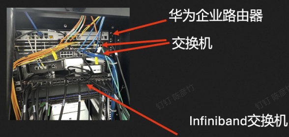
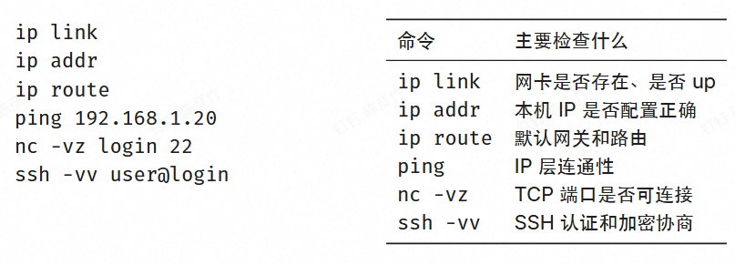
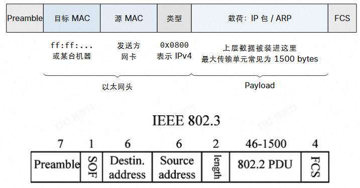
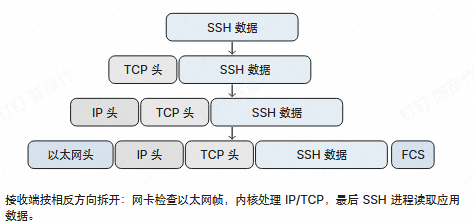
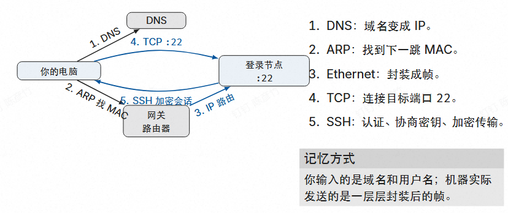
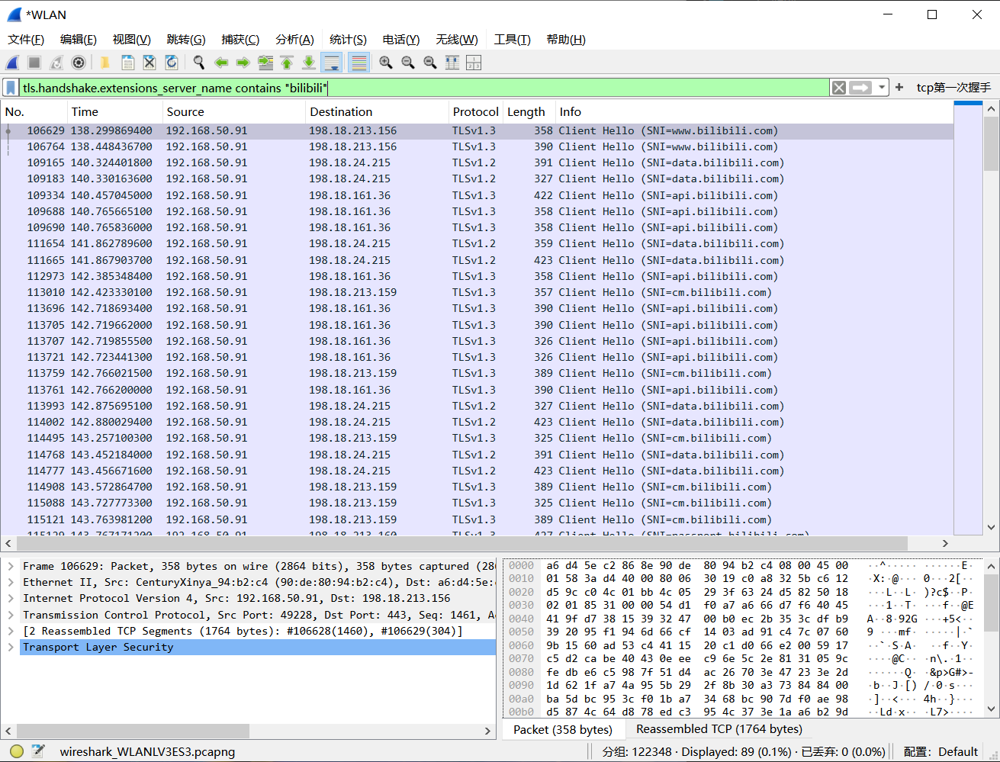
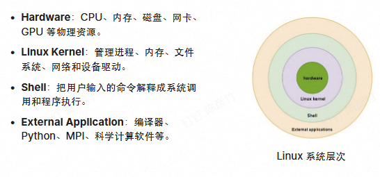
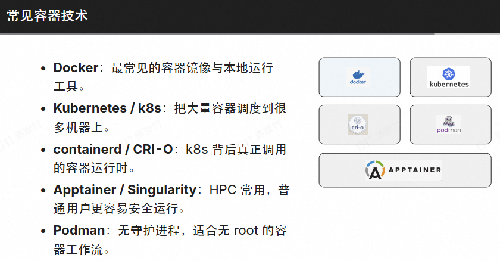

关于服务器架构的部分我在之前服务器搭建与运维的部分其实已经讲过了，所以会从一个比较抽象的角度直接开始讲述，所以如果有遇到不懂的东西请直接去看我们的运维基础，而这个地方我会放更多和超算相关的内容

首先，让我们来看看一个服务器的网络组件架构



华为企业路由器（顶部）

连接不同网络，按 IP 地址转发数据包，负责集群对外互联。

交换机（中部）

在同一局域网内按 MAC 地址转发以太网帧，连接各节点。

InfiniBand 交换机（底部）

HPC 专用高速互联，低延迟、高带宽，用于计算节点间并行通信。

我们会发现HPC对于速率有很强的要求，所以我们选择了一个专用的交换机

其中的两个新概念

协议栈约定“不同层分别负责什么”.



以太网帧展示“数据在链路上实际长什么样”



当然，我们怎么理解我们的以太网帧？



以太网帧其实和我们在算法中的堆栈是一个道理，在不断发展的过程中，我们也会得到相关的协议附加在信息的头/尾

当我们掌握了这些基本的网络知识，现在我们不妨看一下我们的ssh连接中到底发生了什么事



当我们现在要进行ssh的连接

1. 我们的电脑最开始拿到的是ssh的域名，所以要通过DNS映射表变成一套符合协议的IP

2. 得到了IP以后，我们通过路由器泛洪来查找我们的服务器

3. 过程中我们可能经过了TCP三次握手和相关的跳转，我们和对方的机器都拿到了对应的IP地址映射表

4. 最后，我们通过ssh加密的方式是创造了一个正常的连接

<hr style="height: 2px; border: none; background: linear-gradient(to right, #f093fb, #f5576c);">

## wireshark实践

wireshark是一个专门用来检测网络包返回状况的组件

这里我们尝试抓bilibili.com

首先打开现在的抓包流，然后打开我们现在的bilibili

当页面加载完毕的时候，我们断开现在的抓包流，然后加上筛选条款

```
tls.handshake.extensions_server_name contains "bilibili"
```

这个指令限定最后的服务名是含有bilibili的项

所以我们最后的数据就被筛选出来了

再通过筛选按钮来是显示TCP DNS等网络细节的验证




# linux

linux其实是一个很大的课题（这个地方我还没有学完cs61b，所以可能有不对的，请多包涵）

首先我们先看一下linux的系统层次



Hardware：CPU、内存、磁盘、网卡、GPU 等物理资源

Linux Kernel：管理进程、内存、文件系统、网络和设备驱动

Shell：把用户输入的命令解释成系统调用和程序执行

External Application：编译器、Python、MPI、科学计算软件等

linux里面一个很核心的观念——所有东西都是文件

例如

|类型|例子|常见用途|
|---|---|---|
|-|hello.c|普通文件|
|d|/home|目录|
|l|python3|符号链接|
|c/b|/dev/null|设备|
|s|socket|进程通信|

# HPC软件环境

编译器：GCC、Clang、Intel oneAPI、NVIDIA HPC SDK、Bisheng。

编译选项：-Wall、-O2、-g。

数学库：BLAS、LAPACK、FFTW。

并行库：OpenMP、MPI。

GPU 库：CUDA、cuBLAS、cuDNN。

应用软件：不同学科的模拟、建模和数据分析工具。

软件环境管理：Spack。

仓库管理工具：Git。

Agent 工具：Claude Code、Codex、opencode。

高质量库通常比临时手写代码更稳定、更快。（遇到低质量的库一般需要自己尝试手写优化）

其中你可能会很疑惑

Spack是什么？什么叫软件环境管理？

Spack 是面向 HPC 的包管理器。

同名软件可以有多套版本、依赖和硬件优化。

异构集群上，加载软件前要选对版本。
```
spack install <package>
spack load <package>
spack env create <env>
spack env activate <env>
```

# 服务器运维基础

这里我们采用虚拟机来展示我们的集群架构

首先，我们要知道容器靠什么隔离

1. Namespace（命名空间）：容器间隔离。

    • pid：容器里只能看到自己的进程。

    • mnt：容器有自己的根文件系统视图。

    • net：容器有自己的网络栈。

    • uts/ipc/user：主机名、IPC、用户身份也隔离。

2. • Cgroup（控制组）：硬件约束。

    • 防止一个容器把整台机器的资源吃光。

3. • UnionFS（OverlayFS）：镜像一层层叠上去。

    • 只读的底层（基础 OS）大家共享，可写层每人一份。



其中关于k8s

我们要先理解这几个概念

1. node 一台机器

2. pod 容器（们）的最小单位

3. deployment 决定pod生死

4. PVC 给POD挂载永久储存

5. Namespace 分割空间和环境

## BMC

BMC通过网络接口执行多种任务

• 监控服务器温度、风扇速度、电压等硬件参数

• 记录硬件错误日志

• 提供硬件错误日志

• 提供远程 KVM（键盘、视频、鼠标）进行控制

• 通过网络接口远程控制电源

• 在服务器启动过程中修改 BIOS

