## Abstraction

注意，我们这里所说的其实不是摘要，而是 抽象 这一种编程思想

抽象的本质就是下层的内容不会影响到上层，这点我们可以从晶体管到CPU的变化中发现

## 计算机组成

这一部分我会在CS 15213中更新（当然现在在我们的[服务器搭建](../服务器搭建与运维/1.%20服务器硬件搭建.md)中也有相关的内容）

首先先贴一张总结
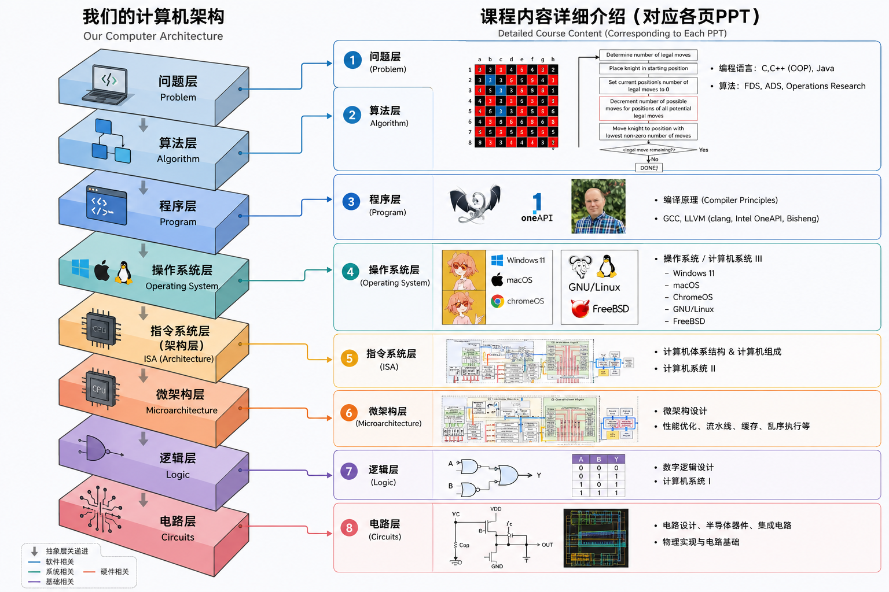

### CPU

CPU的很多参数我在之前都已经提到过了（主频睿频），当然我们学这门课肯定是要以更底层的视角去看待我们的计算机系统

首先，让我们来宏观地看一下一个CPU die
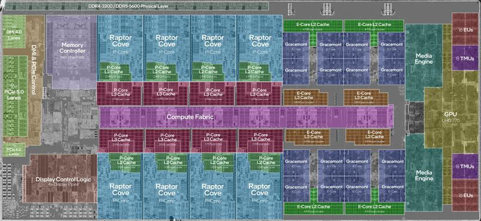

我们可以看见，这个die中具有核心，以及分布在核心周围的缓存

整个内存大概可以分成四个部分

#### ① P-Core（性能核）

图中最大的蓝色区域，而每一个 P-Core 都包括：

```text
P-Core
│
├── 执行单元
├── 分支预测
├── 解码器
├── OoO（乱序执行）
├── Load Store
└── L2 Cache（注意，L2缓存私有，每个核一个）
```
---

#### ② E-Core（能效核）

右边灰蓝色区域

E-Core一般以集群的方式存在，共享一个L2

这种架构使得我们的核心面积能够更小，实现功耗降低和读取速率增加

---

#### ③ L3 Cache

图中的紫色：

Intel 会把 L3 切成很多 Slice，但是注意，L3缓存是共享的，不同核之间都通过L3来交换数据

---

#### ④ Compute Fabric（紫色长条）

一条总线就像一个高铁，连接P-Core，E-Core，L3，GPU，Memory Controller，PCIe（所以PCIE很快啊）

总体上，我们这样来看待一个cpu die

```text
                CPU Die
──────────────────────────────────────
        DDR PHY（连接内存）
──────────────────────────────────────
 Memory Controller + PCIe + DMI
──────────────────────────────────────
        Compute Fabric（互连）
──────────────────────────────────────
 8×P-Core      16×E-Core      GPU
──────────────────────────────────────
       Media Engine / Display
```
### Memory Hierarchy 存储层级
计算机中的存储其实有很多，这个地方我们首先来看看所有储存的层级架构


其中，寄存器就处在我们的核心里面，然后是核心外的L1 L2 L3 然后再到我们外部的内存磁盘，最后是一些云端存储

在win和linux上，我们分别可以用这两种方法来实现我们的Lx大小查找

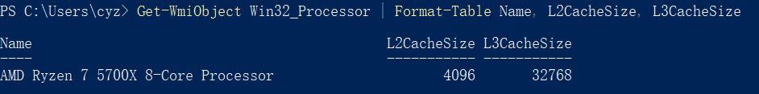

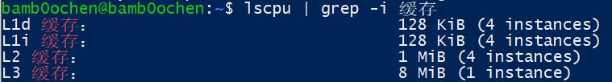

### OS (Operating System)

我们现在有很多的操作系统

win(get) linux(get) debian macOS(get) iOS(get) Ubuntu(get) HarmonyOS Android

这些操作系统在主机的运行中主要起到一个资源分配的作用

例如下面这段代码
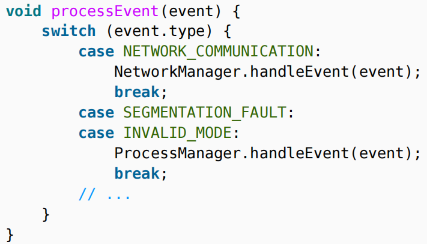

当一个事件输入的时候，我们通过检测事件的类别来为事件分配不同的处理方式，这就是内核（kernel）的最基础思想

#### Trap

Trap简单来说就是CPU停下当前程序，转去处理操作系统的代码

Trap可以分为两种 中断（Interrupt） 和 异常（Expection）

|           | Interrupt | Exception |
| --------- | --------- | --------- |
| 来源        | CPU 外部    | CPU 内部    |
| 是否和当前指令有关 | 无关        | 有关        |
| 是否可以预测    | 不可以       | 可以        |
| 什么时候发生    | 随时        | 执行某条指令时   |

Interrupt是因为外界输入的信息阻断了现在CPU的进程

Interrupts: external asynchronous events（外部的异步事件）

比如你在玩游戏，但是你鼠标动了，这个时候CPU就要停下某条处理游戏的线程去除磷你鼠标的移动反馈

而Exceptions是啥呢 unusual condition occurring at instruction run time

就是说cpu自己检测到了这条指令不对导致的中断（比如除法器中除数为0）

接下来让我们看看下面这张图

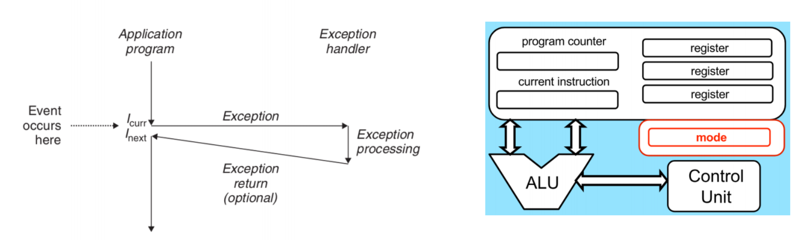

这张图就是我刚刚说的，程序在执行的过程中会因为exception而中断去处理别的事

但是从cpu的角度看，我怎么知道谁是kernel谁是user（现在cpu要处理谁）

所以我们在cpu中引入了一个mode用来存放某状态的快照，通过这个快照的绑定和指引来区分cpu不同的工作态

你可能会问，为什么要区分，cpu本质不就是在处理机器码吗？这还能有不同？

当然，你不希望一个user权限的程序能给你系统删了，这也是所谓普通程序不能控制硬件的原因

而trap就是让用户程序合法进入内核的过程

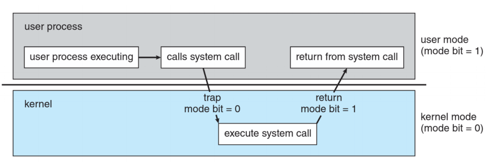

上面这张图就很明显了

### 程序（Program）进程（Process）和线程（Thread）

进程是一个程序执行的结果，在执行的过程中cpu的线程和我们的储存空间都要有一部分分配给他去执行我们的进程

比如我们写了一个c文件

hello.c
```c
#include <stdio.h>

int main() {
    printf("Hello World!\n");
}
```

当我们编译以后

```bash
gcc hello.c -o hello
```

我们会产生一个ELF hello文件

当我们执行hello文件的时候 ./hello 会发生这样一些事

1.我们的Kernel首先会创建一个Process

2.Process要分配内存并且真的非映射到我们的物理内存中

3.开始执行文件

当然，上面有很多细节是我们要进一步讨论的

1.什么是ELF文件

下面这张图列出了一个ELF文件的基本架构

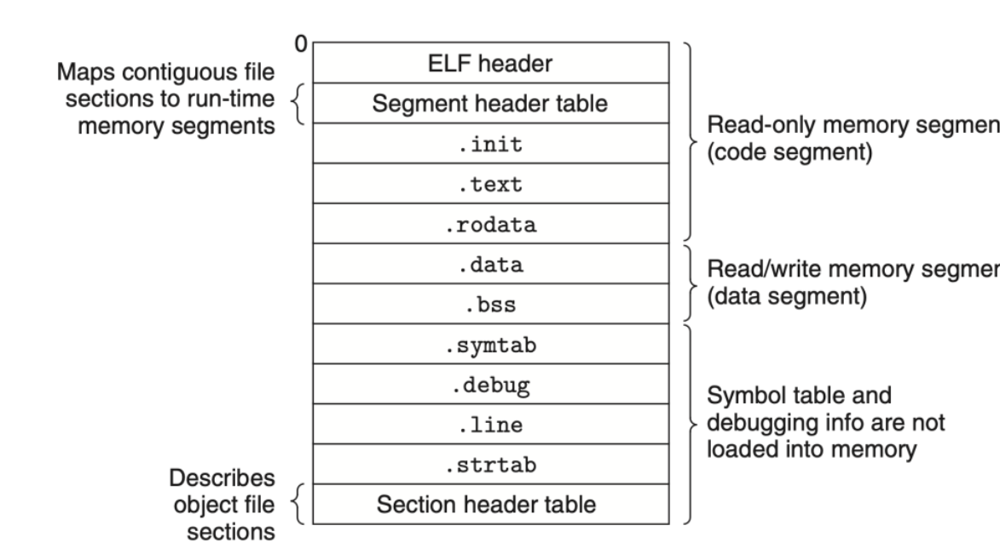

ELF在他的文件头之下还放了很多的导引文件，他们决定了ELF文件中变量的读写权限和相关的内存分配方式

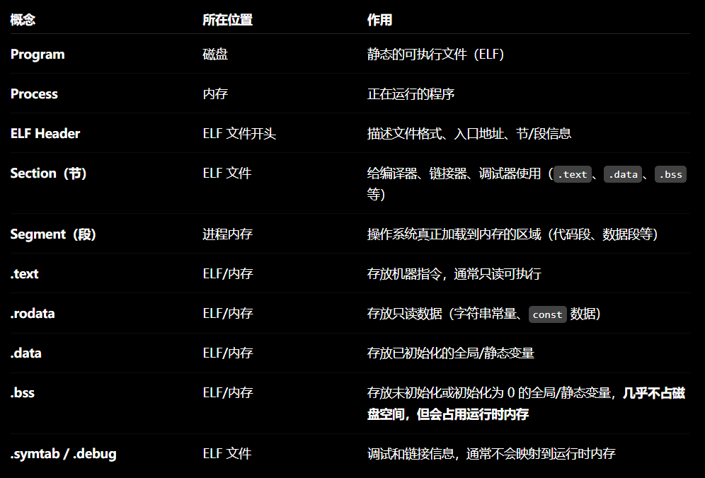

有了ELF文件的指引，我们可以接着来看我们的内存分配方式

2.内存分配方式

这张PPT解释了内存的分配方式

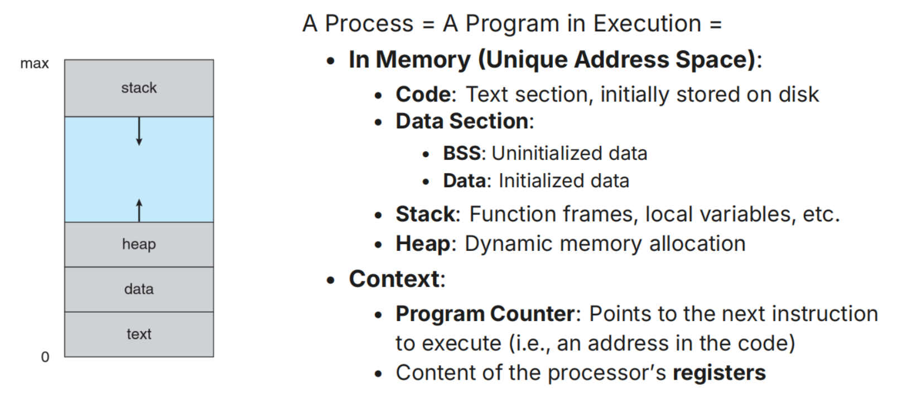

一个内存中首先分为几个层级

代码层(code)：机器码放在这

数据段(data segment)：已初始的局部变量

从上向下的堆(heap)：动态申请的内存（就是为我们说的malloc）

从下向上的栈(stack)：放局部变量，函数参数，返回地址，保存寄存器（这些在cs61a里面讲过）

上下文(context)：PC（程序计数器）SP（栈指针）通用寄存器，状态寄存器（Flags），CPU运行模式（User/Kernel），必要时还包括浮点/SIMD寄存器等

上下文就是我上面说的“快照” 我们的系统要有一个方式来知道我们的运行状况长啥样

这是一段代码的具体对应

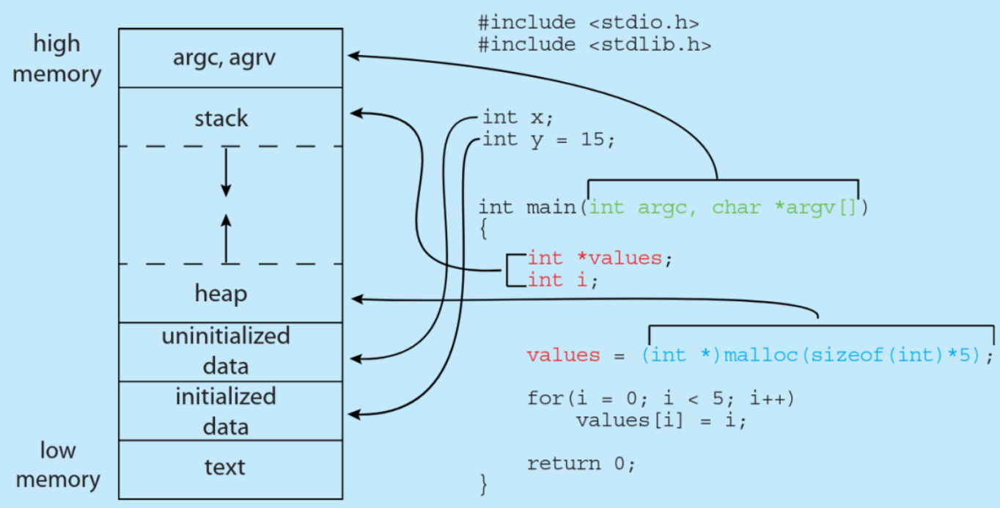

#### Process Schedule

我们现在有两种处理方式来调度我们cpu的资源（毕竟我们的cpu核心是有限的）

1. Non-preemptive 非抢占式调度: 非抢占式调度就是所有的进程只有在完成CPU没有工作的时候才能拿到核心，其他的时候只能等待，这种方式有一个很严重的问题，就是当一个进程卡死的时候整个程序都会卡死，早期的DOS基本都是这种形式

2. Preemptive 抢占式调度: 操作系统有权利中断当前进程，cpu往往会采用时钟中断的方式来实现我么你的进程切换，我们看到很多程序在一起跑，其实是是CPU在高速切换

这个方面做得比较成熟的算法像robe robin：我们给每个进程都分配一个时间片，然后按照顺序轮流执行，当某个进程提前结束的时候就直接推出队列

#### Core Affinity CPU亲和性

我们的程序为什么往往只跑在单核上？因为CPU也会像人脑一样偷懒，当我们尝试去跑一个程序的时候，我们会把相关的信息优先存储在L1 L2缓存中，所以当我们要执行多核任务的时候，L3的共享就不可避免，这就会大大（当然比起内存肯定好多了）增加我们的运行时

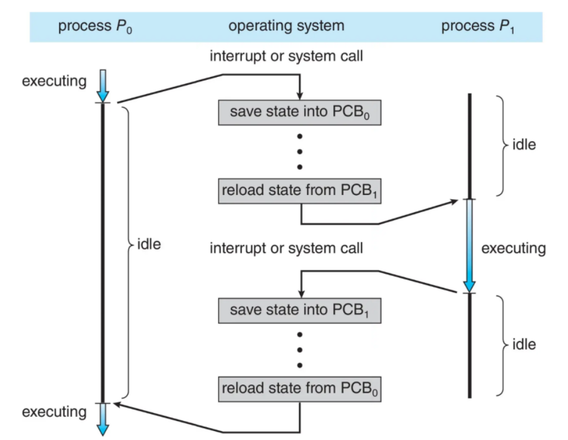

上面这张图就很好地展示了我们的round robin

#### NUMA（Non-Uniform Memory Access，非一致性内存访问）

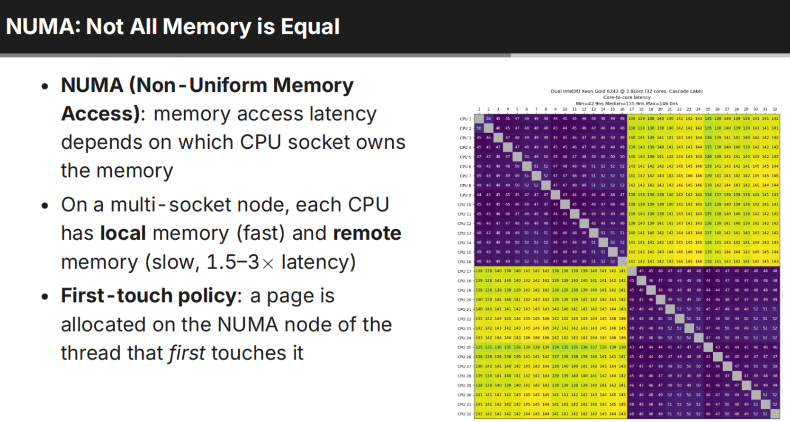

很多人可能会奇怪，cpu到内存明明只有一条路，为什么会出现访存速度不一样呢？

（当然，你一个cpu肯定速度一样啊，想什么呢）

但是当我们遇见一个多U架构的服务器时，我们的情况就就不一样了cpu0访问cpu1内存上的数据很有可能会变成这样的过程

CPU0 - Fabric - CPU1 - Memory Controller - RAM

这样肯定比我们直接跑要慢得多

所以我们就得到了这个core 2 core latency的表格

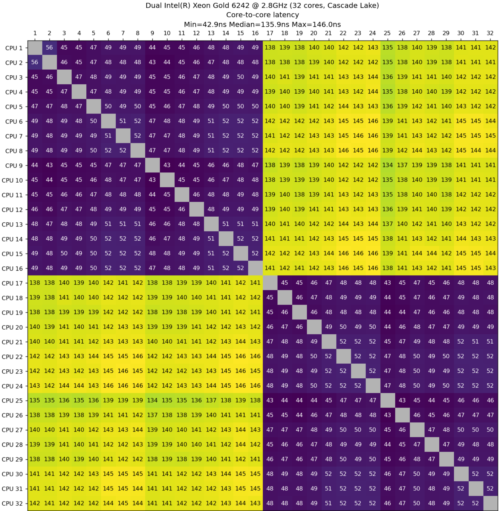

这张图中cpu1-16围成了一个40-50的延迟矩阵，这说明他们很有可能在同一个socket上，而cpu17-32则是在另外一个上

#### Inter-ProcessCommunication(IPC)

上面我们一直都在说线程独立运行的情况，但是现实生活中很多地方都需要线程之间相互运作，所以就有了IPC这样的技术

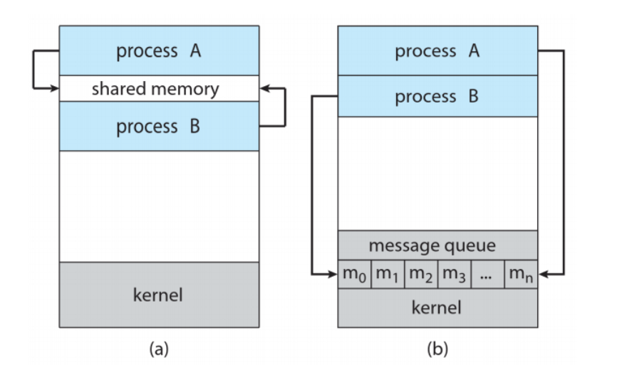

这是IPC的两种具体实现方法

1. 共享内存：操作系统通过分配一个共享内存池来实现AB进程之间数据的统一，但是这也是共享内存的问题，两个进程都能够修改我们的内存，这就会导致此树栖之类的核心组件报错，这种现象也被称为竞争条件（Race Condition）

2. 消息队列：消息队列会在我们的kernel中维护一个消息队列，这个队列具有储存我们信息的能力，通过从消息队列中copy的形式，我们实现了信息的传递，但是问题也很明显——我们必须要复制，而这就会浪费我们的储存空间和我们的运行时，但是由于其出色的稳定性，我们最终还是选择这种方式为主流

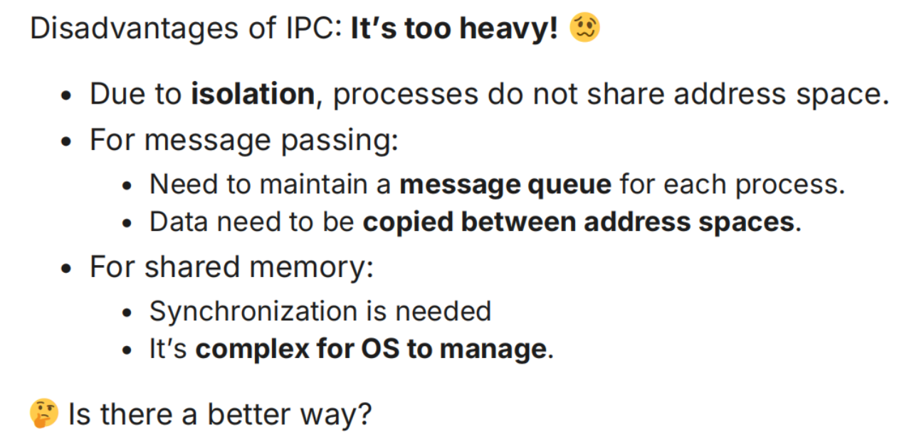

### Thread 线程

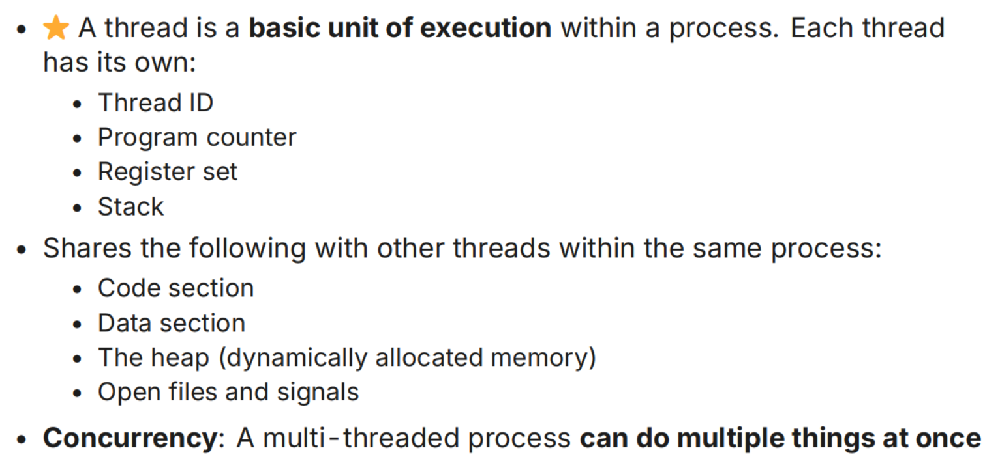

线程的定义如上图所示（讲的比较清楚我就不翻译了）

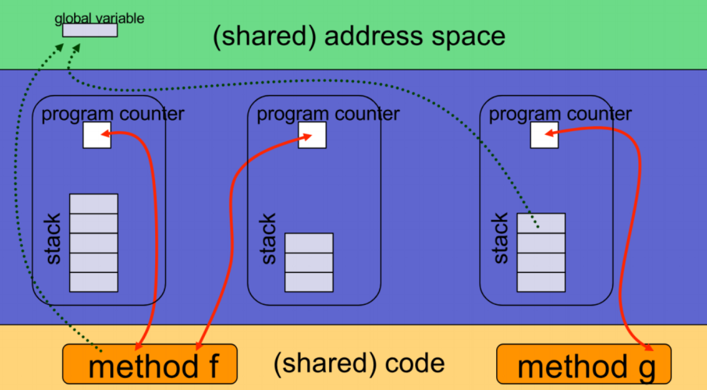

上面这张图展示了线程的工作原理

线程本质上依赖于进程，他和进程共享同一片内存空间，源码和地址

一个进程里的多个线程，共享几乎所有资源，但每个线程都有自己的执行现场（Program Counter + Stack）。同时，我们可以注意到每个线程有自己的method，这是区分不同线程之间的身份认证，防止我们上面说的冲突问题

而图中的红色箭头（PC）通过指定下一条的程序地址，来实现内存的再分配，同时我们会发现每个线程都有自己的stack，这是为了防止线程从底层stack中统一读取数据（也是我们前面说的冲突问题）

#### 线程的创建

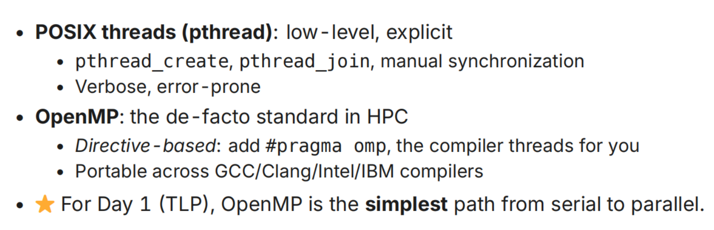

这部分我尽量翻译（刚看到的时候我也看不懂）

首先就是进程的创建是分成两个方式的——POSIX Threads（pthread）和 OpenMP

pthread 是 Linux/Unix 最底层、最经典的线程库。

我们可以这样创建一个线程

```c
#include <pthread.h>

void* worker(void* arg) {
    printf("Hello from thread!\n");
    return NULL;
}

int main() {
    pthread_t t;

    // 创建线程
    pthread_create(&t, NULL, worker, NULL);

    // 等待线程结束
    pthread_join(t, NULL);

    return 0;
}
```
在这个过程中，我们需要自己管理线程的生命周期