## ISA (Instruction Set Architecture) and X86 Instruction

ISA 规定了汇编语言和硬件交互的方式，ISA通过定义硬件接扣和范围的方式来实现输入的标准化

通常包括：

有哪些指令，寄存器，如何编码，数据类型和位宽，如何访问内存，

函数调用和异常处理需要哪些硬件机制；

特权级、Trap、Interrupt 等系统行为。

Instruction 是处理器能够置信的基本操作

比如我们一个C代码

```c
int c = a + b
```

经过编译以后可能信测还给你了这样的RISC-V汇编

```asm
lw   t0, 0(a0)
lw   t1, 0(a1)
add  t2, t0, t1
sw   t2, 0(a2)
```

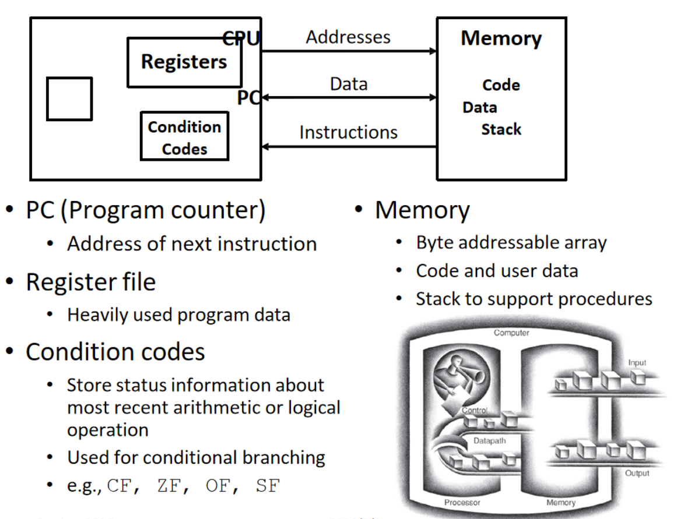

这张图讲解了一个程序被编译了以后产生的相关内容

在这个视角里，复杂的 C/C++ 程序被压缩成几个核心对象：

PC：下一步去哪里取指令；

Registers：当前正在计算的数据；

Condition Codes：刚才的计算产生了什么状态；

Memory：代码、数据和调用栈放在哪里。

CPU 的基本行为可以概括为一个循环：

    根据 PC 取指令 → 译码 → 从寄存器或内存取操作数 → 执行 → 写回结果 → 更新 PC

这个循环称为 Instruction Cycle，即取指、译码、执行循环。

### Register

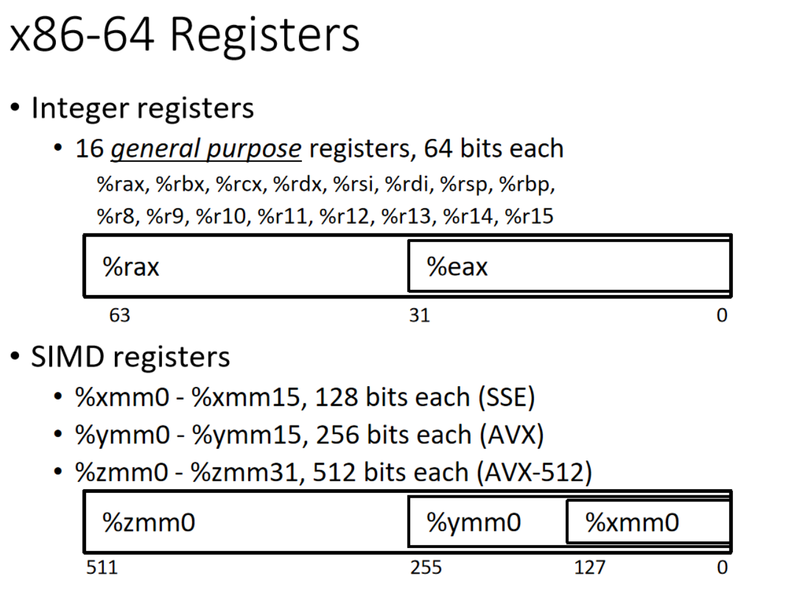

这张图中介绍了两种寄存器

整数寄存器和SIMD寄存器

首先是证书寄存器

x86-64 有 16 个 64 位通用寄存器：

rax, rbx, rcx, rdx, rsi, rdi, rsp, rbp, r8～r15

它们用来临时保存整数、地址、函数参数和计算结果。虽然叫“通用寄存器”，但有些寄存器经常承担约定用途，比如

rsp：栈顶指针

rbp：常用作栈帧基址

rax：常用来保存函数返回值

但是图中我们还能看到一个eax的单元，eax是rax的低32位，而写入eax会自动把rax的搞32位清零（当然为啥要这样做我也不明白）

其次是SIMD寄存器

SIMD 表示 Single Instruction, Multiple Data

图中的寄存器宽度逐渐增加：

xmm0：128 位，SSE；

ymm0：256 位，AVX；

zmm0：512 位，AVX-512。

这些不同的我单元其实是同一个寄存器的不同宽度视图：

zmm0 的低 256 位 = ymm0

ymm0 的低 128 位 = xmm0

假设处理 32 位浮点数：

xmm0 一次可以容纳 4 个；

ymm0 一次可以容纳 8个；

zmm0 一次可以容纳 16 个。

因此 SIMD 能加速数组加法、矩阵运算和深度学习算子。所谓编译器的向量化就是尽量把普通循环转化为使用这些 SIMD 寄存器和指令的计算。

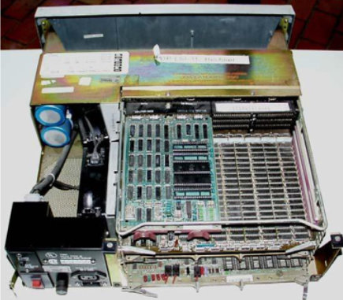

力竭了上面这些，我们就能制造出一台DPD了

当然，这种执行方式非常的低效，我们只有等待上一步完成以后才能继续执行下一步，所以，我们怎么走一台高效的计算机

### 现代计算机

现代的计算机往往不是一台更快的dpd，我们的工程师通过类似多核，多插槽来实现我们进程之间的并行，当然，程序必须使用 pthread、OpenMP 等方式暴露并行性，才能有效利用这些核心

下面展示了其他的一些加速方法

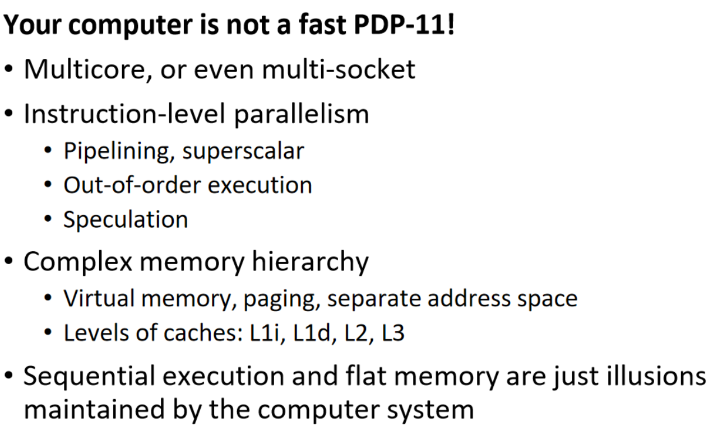

## Process Architecture

这个地方我们引入了一个新的概念——微架构

微架构规定了处理器要怎么实现我们的ISA

比如流水线深度，每周期执行的指令数，是否乱序，内存层级等很底层的东西

因此 Intel 的 Sandy Bridge、Haswell、Skylake，以及 AMD 的 Bulldozer、Zen，都可以实现 x86 ISA。它们能运行大致相同的 x86 程序，但内部设计和性能不同。

同一个程序在不同 x86 CPU 上速度不同，往往不是因为指令含义变了，而是它们的 Cache、流水线、分支预测和执行宽度不同。编译器也可以针对某种微架构使用 -march、-mtune 等选项生成或调整代码。

接下来的内容和那个我发现和I的内容重复了很多，我主要记录一下和超算有关的内容

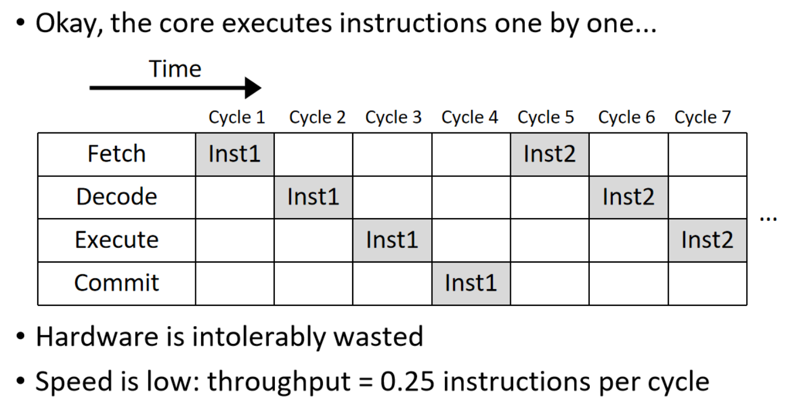

我们可以看到，每一套指令会经过四个阶段

1. **Fetch**：根据 PC 从内存或指令 Cache 取指令；
2. **Decode**：解析指令，判断要做什么、使用哪些寄存器；
3. **Execute**：执行计算或访存；
4. **Commit**：正式更新程序可见的状态，例如寄存器。

图中 `Inst1` 从 Cycle 1 执行到 Cycle 4。只有它完全完成后，`Inst2` 才在 Cycle 5 开始。因此一条指令需要 4 个周期：

$$
\text{Throughput}=\frac{1\text{ 条指令}}{4\text{ 个周期}}
=0.25\text{ instructions/cycle}
$$

问题在于这种方法会导致硬件的严重闲置。例如 Cycle 2 只有 Decode 工作，而 Fetch、Execute、Commit 都空着。虽然 CPU 内部已经有四套不同阶段的硬件，但每个周期只使用其中一套。

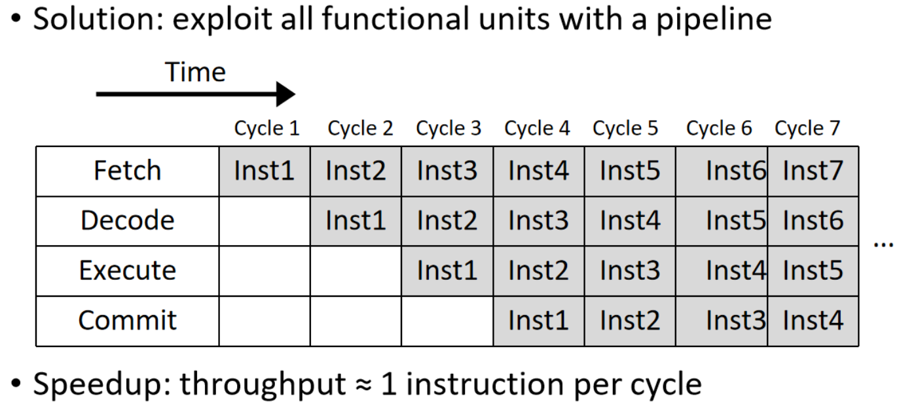

所以我们很容易就会想到用这种非方式来进行优化

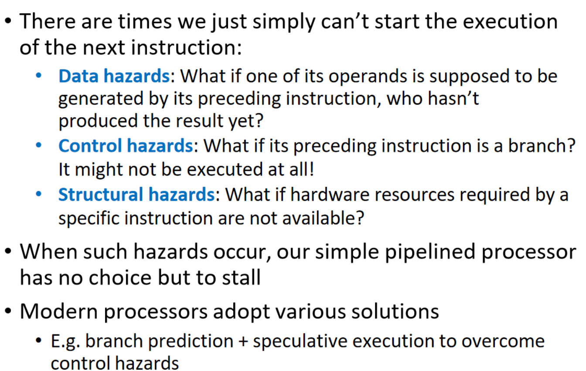

但是你很容易就能发现这不对啊，比如我的线程二依赖于线程一，在这种情况下很明显我不能做输出

上面提出了三种常见的情况

1.数据问题（我的输入必须等你的输出）

2.控制问题（我的地址从哪里读取，寄存冲突）

3.结构冲突（硬件数量不够你多线程）


工程师也实现了一些解决方式

发生无法立即解决的 hazard 时，流水线要 stall（停顿），也就是插入空周期。这样虽
然保证结果正确，但会降低每周期完成的指令数。

因此，现代 CPU 使用 forwarding、多个执行单元、乱序执行、分支预测和推测执行等机制，尽量让流水线不要空下来。

## Memory hierarchy

这一部分也在I中也有提到过了，我就不多说了

我们的RAM分成两种

SRAM (Static)和DRAM (dynamic)

SRAM中存在着大量的晶体管，DRAM则是依靠电容保存bit

所以SRAM不用定期刷新（但是也很贵），通常用在L123中

DRAM则往往出现在我们的内存条中👇

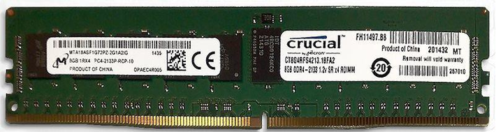

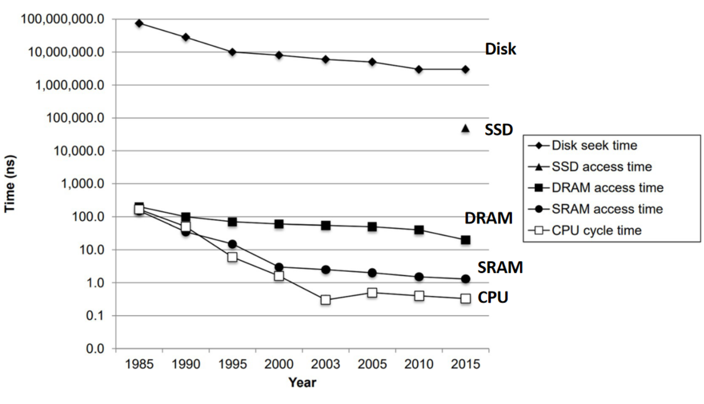

顺便加一个不同储存方案的速度

当然，程序访问内存通常不是完全随机的，而是倾向于重复访问刚用过的数据，或者访问它附近的数据。

### Temporal locality

最近访问过的数据，很可能很快再次被访问。例如：

```c
for (int i = 0; i < n; i++)
    sum += a[i];
```

变量 `sum` 和循环变量 `i` 会被反复使用，因此具有很强的时间局部性。第一次访问后将它们保留在寄存器或 Cache 中，后续访问就会很快。

### Spatial locality

访问某个地址后，很可能很快访问它附近的地址。上面的循环依次访问：

```text
a[0], a[1], a[2], a[3] ...
```

这些元素在内存中连续排列，因此具有空间局部性。

Cache 不会只读取当前需要的几个字节，而是一次从内存加载一整条 **Cache Line**，x86 系统中通常为 64 字节。访问 `a[0]` 时，附近多个数组元素也可能一起进入 Cache，后续访问就能命中。

因此，下面这种连续访问通常很快：

```c
for (int i = 0; i < n; i++)
    use(a[i]);
```

而随机跳跃访问通常较慢：

```c
for (int i = 0; i < n; i++)
    use(a[random_index[i]]);
```

> Cache 用较小的高速空间保存最近使用的数据及其附近数据，利用程序的时间局部性和空间局部性来隐藏 DRAM 的高延迟。这种思想我们在Transformer中的KV$也能看见

### Cache Organization

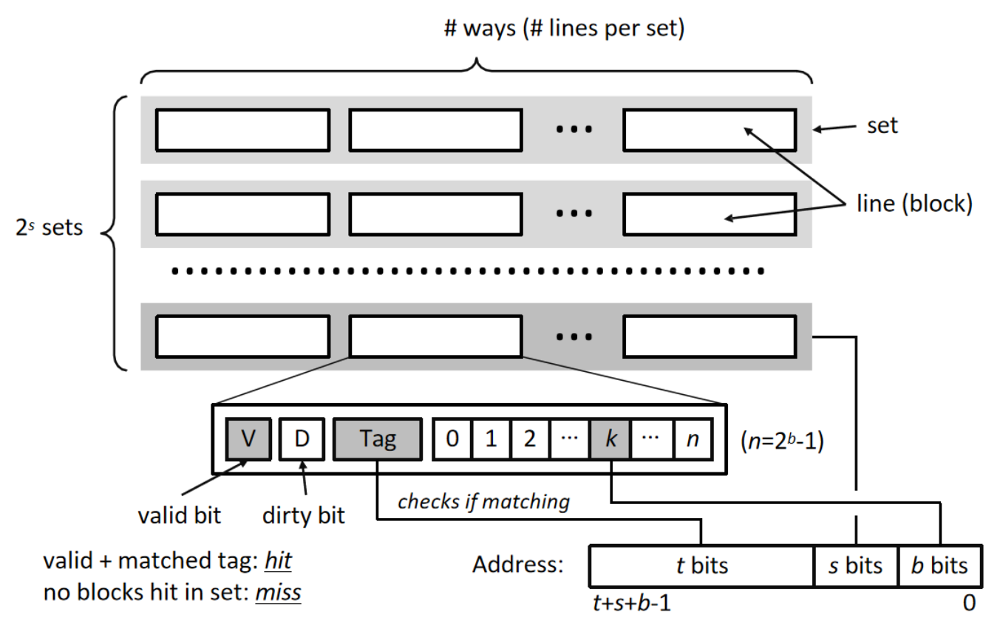

这里面我们可以看到Cache 被分为多个 set（组），每个 set 包含若干条 cache line

可以用一个公式概括：

$$
\text{Cache 容量}=\text{set 数量}\times\text{每组 ways 数量}\times\text{每条 line 的大小}
$$

例如，一个 Cache 有 64 个 set，每组 8 条 line，每条 64 B：

$$
64\times 8\times64\text{ B}=32\text{ KiB}
$$

这里的 **8 ways** 表示每个 set 有 8 个位置可存放数据，也称 **8-way set associative cache（8 路组相联 Cache）**。

当我们的CPU 访问一个内存地址时：

1. 地址中的 **set index** 决定去哪个 set；
2. 在该 set 的所有 ways 中比较 **Tag**；
3. Tag 匹配且 valid bit 为 1，则命中；
4. 否则发生 cache miss。

每条 cache line 除了真正的 Data，还保存一些元数据：

1. **Tag**：记录这条数据来自哪一片内存，用于判断是否是 CPU 想要的数据；
2. **Valid bit**：这条 Cache Line 中的数据是否有效。刚开机或刚失效时为 0；
3. **Dirty bit**：CPU 是否修改过这条数据，但还没有写回主存。

如果 dirty bit 为 1 的 line 被替换，Cache 必须先把它写回下一层存储，否则修改会丢失。

增加 ways 可以降低多个地址争抢同一个位置导致的冲突缺失，但也会增加 Tag 比较的硬件成本和访问复杂度。

当然，我们缓存的使用也有门道，下面我们讲解一下对缓存的多种操作方式

### Read hit

CPU 要读的数据已经在 Cache Line 中，直接读取对应字节即可，不需要访问下一层存储。这个和我们大模型api调用有点像

### Read miss

1. 根据地址找到对应的 set；
2. 在该 set 中选择一条 Cache Line 替换；
3. 从下一层 Cache 或内存载入包含目标数据的整条 Cache Line；
4. 再读取需要的字节。

如果被替换的 line 是 dirty 的，还必须先把它写回下一层。

选择替换哪一条 line，需要 replacement policy，例如：

**Random**：随机选择；
**LRU**：替换最久没有使用的 line

我们往往会从ram中走个几拍把他提升到register中

### Write hit：write-back

1. 修改 Cache Line 内对应的字节；
2. 把 dirty bit 设为 1；
3. 暂时不更新下一层存储。

### Write miss：write-allocate

目标数据不在 Cache 中时，先把对应的整条 Cache Line 从下一层载入 Cache，再修改其中需要的字节。

## Concurrency Basics

并发的第一部分是讲线程和进程的区别，还有我们 拍 的概念（这些不懂的回去看前面）

这里我们看一个实例

我们现在运行两个线程

```C
# thread1

for (int i = 0; i < n: i++){
    count ++;
}

# thread2

for (int i = 0; i < n: i++){
    count ++;
}
```

当我们执行一个n = 10000的运算时，我们期望的结果是20000

但是如果线程之间的并行没有处理好，我们最后执行的结果很有可能就是这样的

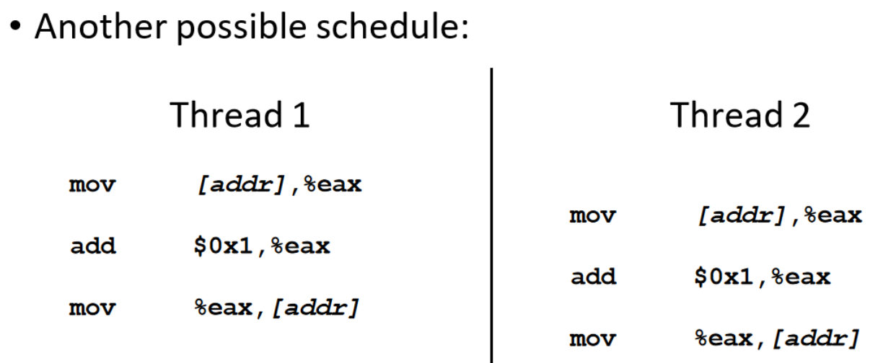

这种情况下我们相当于只执行了一次

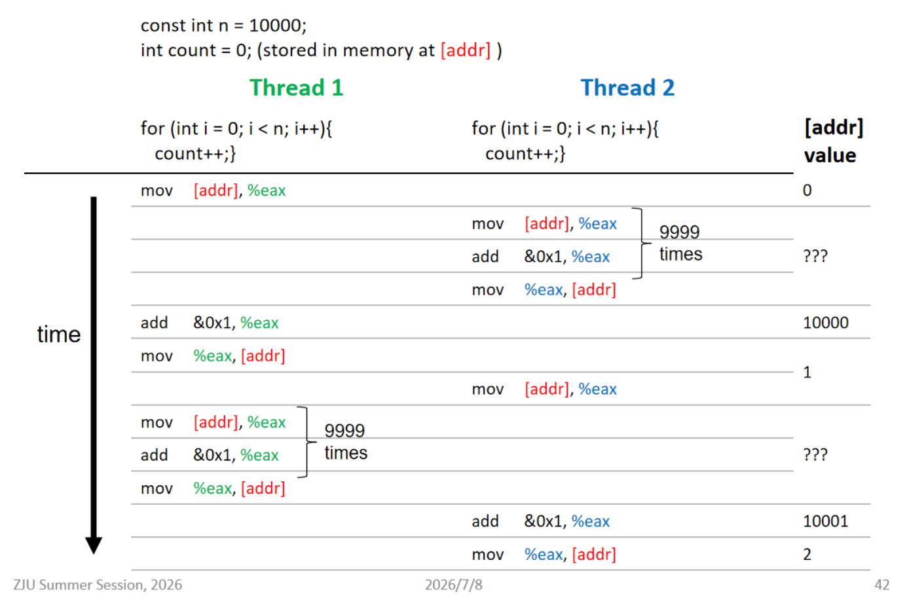

当然，解决方法也很简单，就是给我们的代码加上了临界区（mutual excusion）而常见的方法是 mutex

```c
pthread_mutex_lock(&lock);
count++;                       // critical section
pthread_mutex_unlock(&lock);
```

## x86 Microarchitecture

这部分把前面的四阶段流水线扩展到真实的现代 x86 处理器。真实 CPU 往往有十级以上流水线，并结合乱序执行、多核、硬件多线程和超标量设计，目标是提高 指令级并行 ILP

各阶段作用如下：

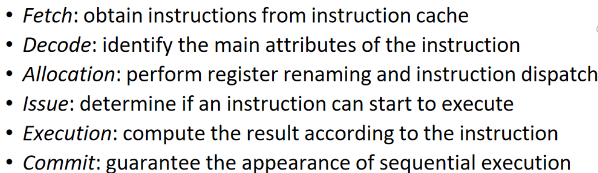

例如，前面一条除法指令还没完成，但后面一条与它无关的加法指令已经准备好，CPU 可以先执行加法。这就是 out-of-order execution。

### Branch Prediction

为了解决我们上面提到的控制问题，现代对的处理器往往使用分支预测的方法

当我们遇到条件分支的时候

```c
if (x > 0)
    A();
else
    B();
```
在条件结果算出来前，CPU 不知道下一条应该来自 A 还是 B。如果暂停流水线等待结果，后面的阶段就会闲置，性能很差。

因此现代 CPU 会预测分支方向，并沿预测路径继续取指和推测执行：

预测错误的代价很大，因为已经做的取指、译码和执行工作全部浪费了。因此流水线越深，通常越需要高准确率的分支预测器。

这里还要区分：

Prefetch（预取）：猜测未来需要哪些数据，提前放入 Cache；

Branch prediction（分支预测）：猜测程序下一步执行哪条指令；

Speculative execution（推测执行）：在预测结果尚未确认前，先执行预测路径上的指令。

### out-of-order execution

这一部分讲解了一种乱序执行的处理方法

