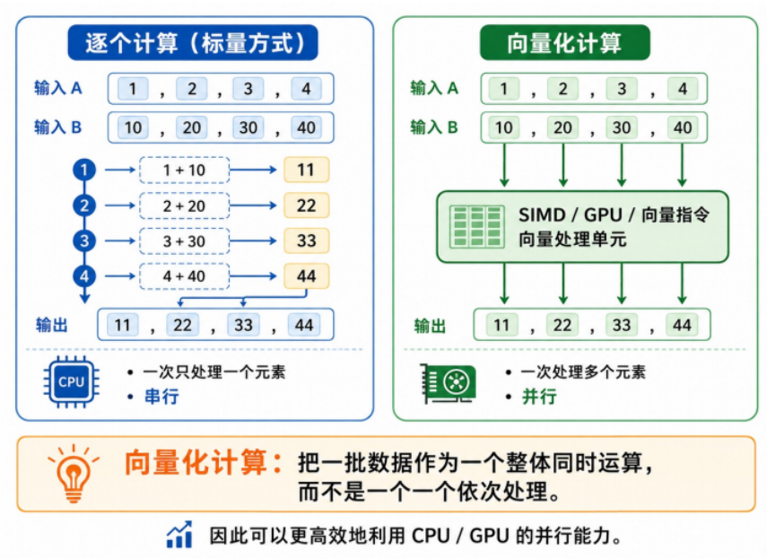
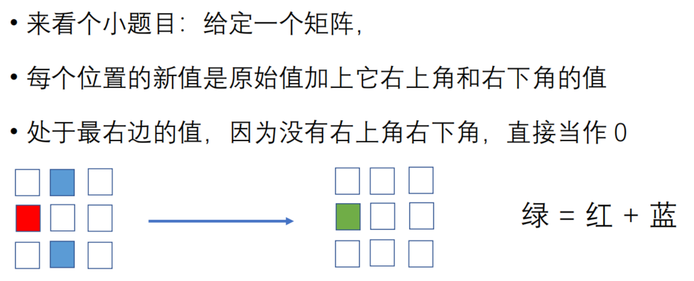
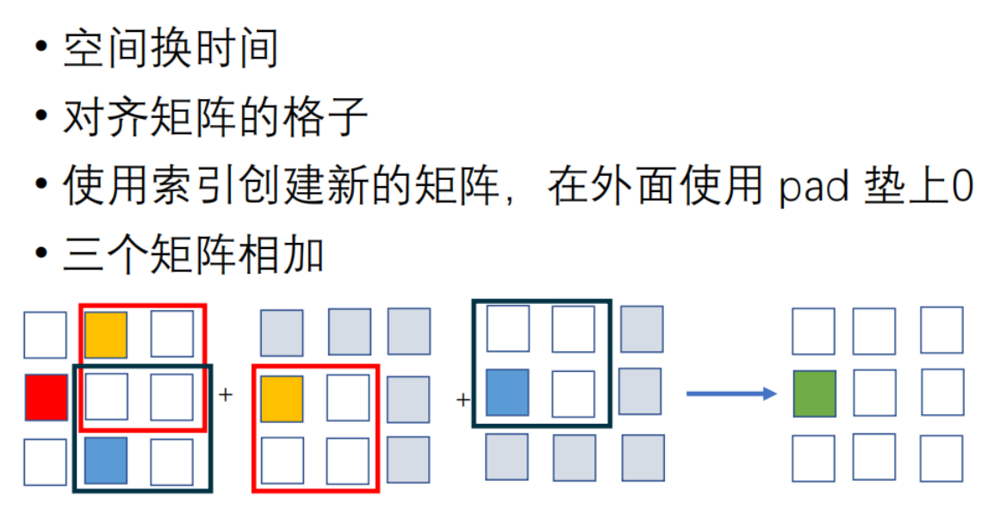
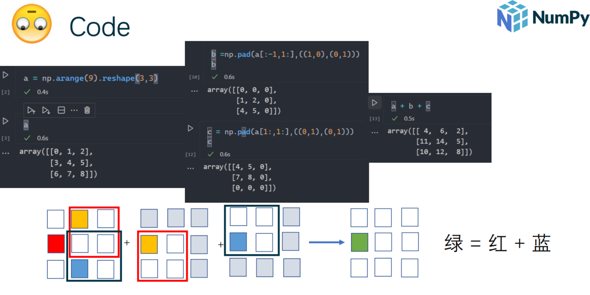
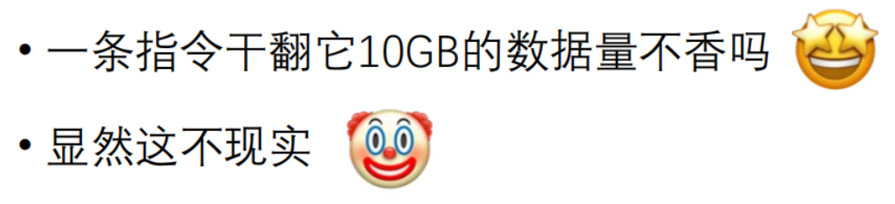
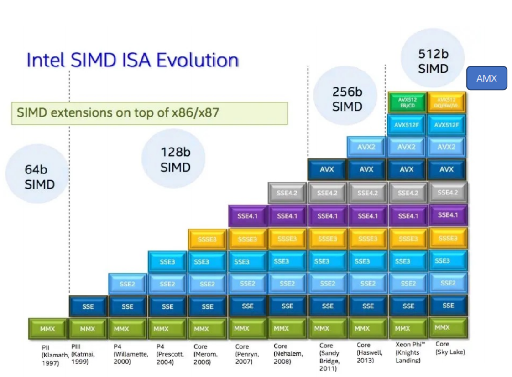
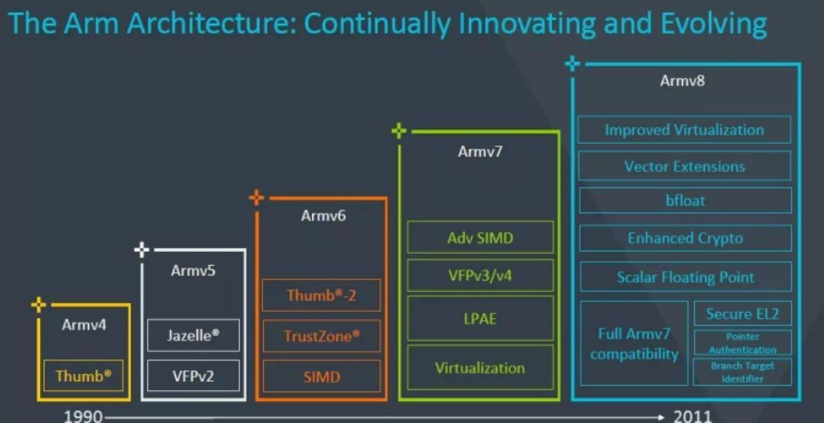
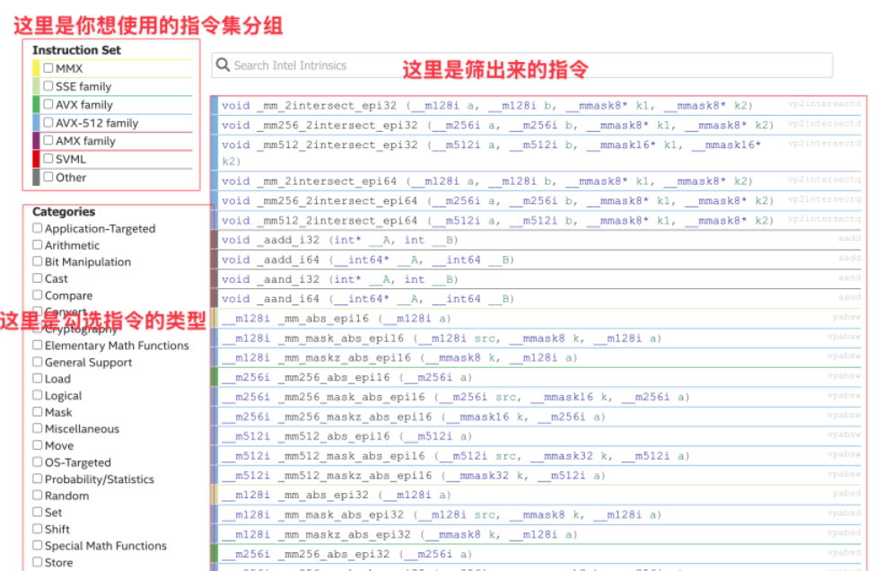
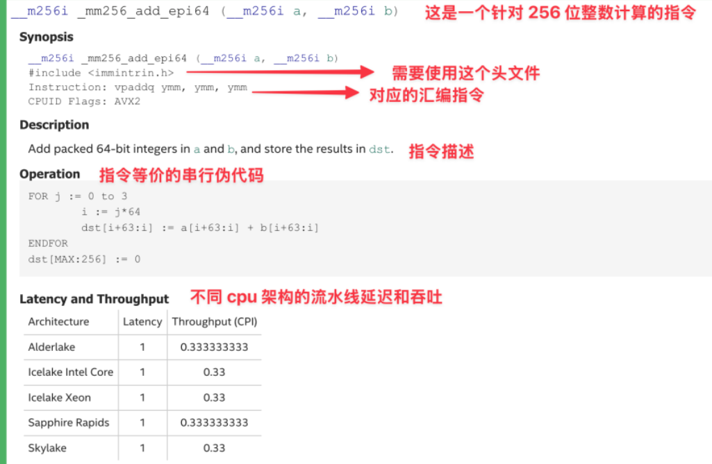
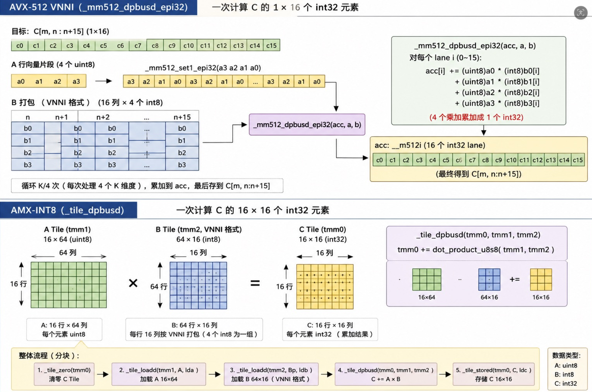

Hola！从这一课开始，欢迎你进入神奇的并行计算编写过程

终于，从这一张过后又回到了中文PPT环境，终于不用翻一层再理解了（也许？）

注意，这一章节的PPT写的非常简单易懂，我也有很多地方是cv的，PPT制作水平还是太高了

## 向量化计算

首先，什么是向量化？

1. 我将用最直⽩、最不绕弯⼦的⽅式告诉你：向量化计算就是把一批数据当作一个整体同时运算，⽽不是一个一个依次处理。

2. 向量化的实践大于理论（会写就行了）

3. 向量化的熟练在于多练

4. 我们做向量化就是找出能向量化的地方然后向量化



这个时候我们就知道，原来我们前面讲了这么多硬件上的，指令上的，内核上的，储存上的并行，就是为了向量化做硬件支持

我们首先来看一段未经向量化的代码

```py
A = [[1,2,3],[4,5,6],[7,8,9]]
B = [[3,2,1],[6,5,4],[9,8,7]]

matrix_sum = [[0,0,0],[0,0,0],[0,0,0]]
fon i in range(3):
    fon j in range(3):
        matrix_sum[i][j]= A[i][j] + B[i][j]
```

第⼀个显著特点是⼤量使⽤ (嵌套) for 循环

本质上是，如果未经优化，⼀次就只执⾏⼀条，造成了极⼤的浪费

对于 3 * 3的矩阵相加来说，答案的每个位置只和原来的两个矩阵相应坐标的值有关，和其他位置都⽆关

也就是说，⼀个位置的运算，和其他位置都没有关系（⽆依赖关系）所以如果我有九个加法单元，那么⼀个单元处理⼀个位置就可以⾼效并⾏完成。

## 实战（没错你向量化就是这么务实）

```py

def function_2(seq: np.ndarray, sub: np.ndarray) -> np.ndarray:
    target = np.dot(sub, sub)
    candidates = np.where(np.correlate(seq, sub, mode='valid') == target
)[0]

check = candidates[:, np.newaxis] + np.arange(len(sub))
mask = np.all(np.take(seq, check) == sub, axis=-1)

return candidates [mask]

```

这段代码实现了一个查找对应数组段的功能，返回全数组中和我们朝朝数组相同的字段，然后返回他的起始位置值

我们想这段代码中有哪些地方是可以实现向量化的

首先，向量化的目标就是为了可以并行，我们现在算法的复杂度是len(seq) * len(sub)($On^2$)

一种可行的方法是把我们的查找组构建成向量，让这个向量和每一位做点积，和为平方的进入候选

然后从候选中选出完全相等的数组（我们可以写 == 但是在算法实现上这个语法的实现方法还是便历）

通过这样的操作，我们的最大复杂度就变成了len(seq) * len(sub) 最小是 len(seq)

其中矩阵乘法就可以通过向量化变成常数维复杂度的计算

```py
def function_1(seq: list[int], sub: list[int]) -> list[int]:
    return [
        i
        for i in range(len(seq) - len(sub) + 1)
        if seq[i:i + len(sub)] == sub
    ]
```
上面也体现出向量化的一种很重要的思想——用空间换时间

如果觉得这种优化微乎其微，不如来看看下面这些问题







## SIMD向量化

之前我们在讲解指令集优化的时候讲过SIMD，这个地方不赘述概念，而是讲一些新的东西

首先我们要澄清一个误区，SIMD的指令个数不等于加速倍数

真实的情况中还需要考虑我们内存带宽的使用，解码消耗的减少，背书只能是一种估计的方法

同时，⼀条AVX2指令能处理256位的数据，⼀条AVX512指令⼀次能处理512位数据，那为什么不再⻓亿点？



指令的功能是需要硬件实现的，⼀条指令处理8个double就意味⾄少需要8个double的运算单元，这意味着更⼤的⾯积，更⾼的成本，更多的发热

AVX512之前被戏称为⼤⽕炉，对CPU负载⾼频率跑⾼容易不稳定

而且这种高负载的硬件架构发热严重，过热导致降频，导致了AVX512表现不如AVX2的奇景



Intel的ISMD发展




ARM的ISMD发展

## 实战

首先，我们从哪里获得我们的素材

https://www.intel.com/content/www/us/en/docs/intrinsics-guide/index.html

这是一篇intel给出的官方加速文档

在阅读文档的时候，我们要注意几个东西

1. 善于搜索



2. 具体实现



下面给出我们的代码实战

使⽤ AVX512 对以下代码进⾏优化。

输⼊：

q: [D]

K: [T, D]

V: [T, D]

计算：

score[t] = q · K[t] / sqrt(D)

prob[t] = softmax(score)[t]

out[j] = Σ_t prob[t] * V[t][j]



