什么是并行

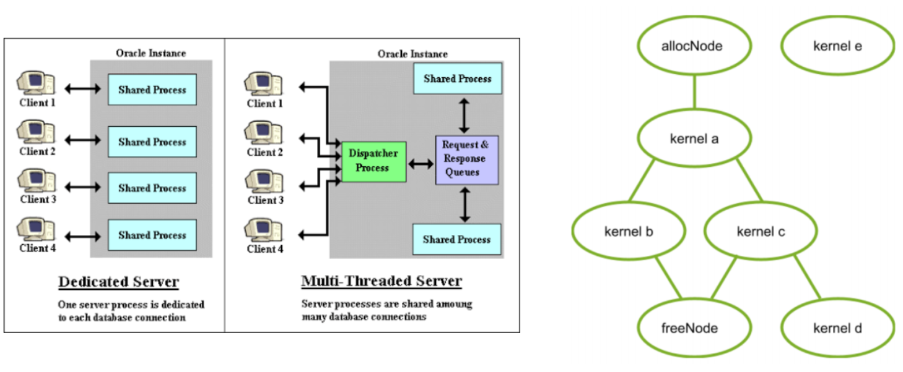

这里我们举两个例子

左边是从网络角度，网络通过一个前台线程来分配资源池中链接的其他资源

右边是cuda计算

我们的bc节点是可以一起算的，这种能一起干的事就是并行

当然，并行的路上当然不是一帆风顺的

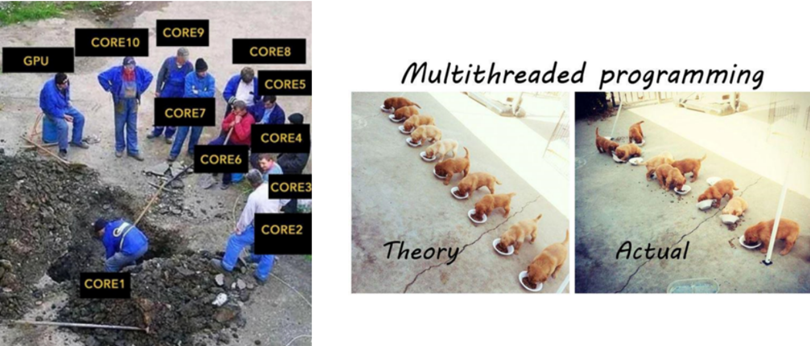

（如图……）我们的核与线程都很难控制

为了实现我们的并行，我们这里讲三种方法

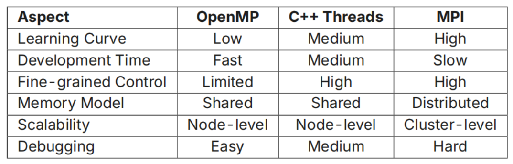

## OpenMP

OpenMP是一个c中的库，我们可以用omp来实现简单的并行

我们来看一个例子

```c
#include <stdio.h>
#include <omp.h> //引入我们的库
int main() {
    printf("Welcome to OpenMP!\n");
    #pragma omp parallel //这个宏定义表示我们要开始了
    {
        int ID = omp_get_thread_num();
        printf("hello(%d)", ID);
        printf("world(%d)\n", ID);  //中间都是并行计算部分
    }
    printf("Bye!");
    return 0;
}
```
对于上面的代码，我么你可能会得到两个输出

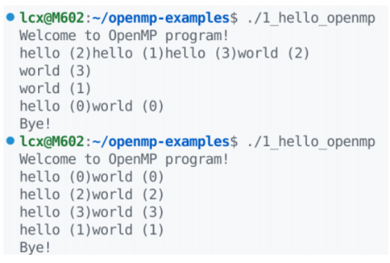

明显，第一个出了大问题

但是为什么呢？

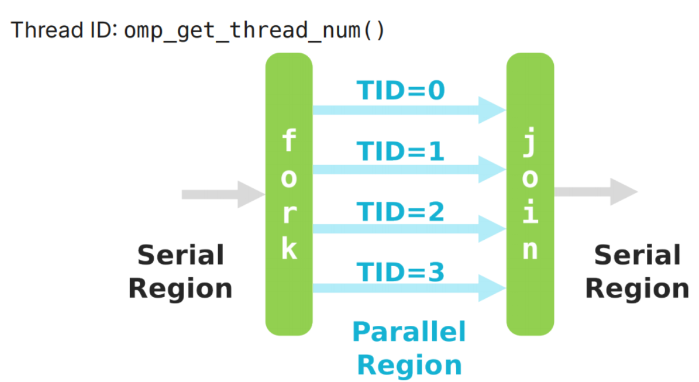

我们的任务在并行的过程中经过了fork和join的过程

而每个进程不知到其他线程的情况

所以最终才会有冲突

也就是我们之前在基础里面讲到的harzard

所以，我们也能够很清楚地知道我们之前在基础里面是怎么解决这个问题的

Critical Section 有些线程发生时对和他同时发生的线程做限制

```c
#pragma omp parallel for
    for (int i = 0; i < 100; i++) {
#pragma omp critical
        { sum += a[i]; }
    }
    printf("Sum = %d\n", sum);
```

Atomic Operations 把不同步骤强制绑定

```c
#pragma omp parallel for
    for (int i = 0; i < 100; i++) {
#pragma omp atomic
        sum += a[i];
    }
    printf("Sum = %d\n", sum);
```

Reduction 在线程内创建私有变量，最后再总和到全局变量

```c
#pragma omp parallel for reduction(+:sum)
    for (int i = 0; i < 100; i++) {
        sum += a[i];
    }
    printf("Sum = %d\n", sum);
```

## C++ thread

前面我们讲了pthread 这个地方的cpp thread本质上就是一种更好写的优化

```cpp
#include <thread>  //import our library
#include <iostream>
using namespace std;
void worker(int id, string& name) {
    cout << "Worker " << id
        << " (" << name <<
        ") running" << endl;
}
int main() {
    thread t(worker, 42, "Alice");
    t.join();  // wait the upper parameter to finish
    return 0;
}
```

同时，我们在这个地方还将引入锁(Mutex)的概念（当然前面我们是提到了我们之前的 生产者-消费者队列，不过这个我们在lecture2 就讲过了，所以这个地方我就直接写了，锁概念的引入也是为了优化我们的 生产者-消费者 队列）

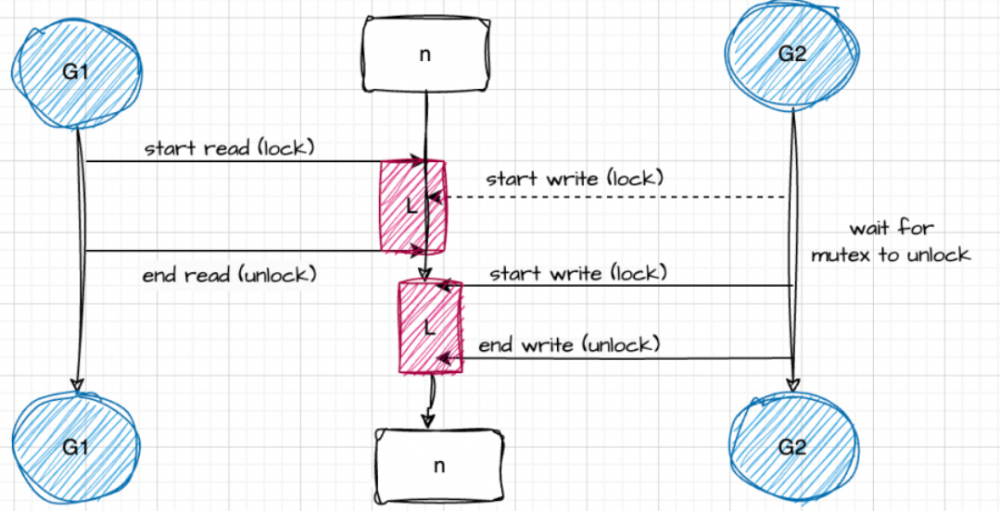

锁的使用能够防止我们data harzard的出现，提高我们代码的鲁棒性

```cpp
std::mutex counter_mutex; // 引用我们的锁
int counter = 0;

void increment_safe(int iterations) {
    for(int i = 0; i < iterations; i++) {
        counter_mutex.lock();  //产生锁
        counter++; // Now thread-safe!
        counter_mutex.unlock();  //释放锁
    }
}
```

当然，我们也有一些优化的技巧

Using std::mutex with RAII (Resource Acquisition Is Initialization):
```cpp
std::mutex counter_mutex;
int counter = 0;
void increment_safe(int iterations) {
    for(int i = 0; i < iterations; i++) {
        std::lock_guard<std::mutex> lock(counter_mutex);
        counter++; // Now thread-safe!
    } // Automatic unlock when lock goes out of scope
}
```

我们通过把锁分配给一个变量的方法，这样就能实现锁的自动释放

当然，我们还会有别的问题，我们也不能让我们的所有线程都跑满（降频等等问题）

所以我们会让我们的线程去等待

```cpp
std::mutex m;
std::condition_variable cv;
bool data_ready = false;
void producer() { /* Prepare data...*/
    {
        std::lock_guard<std::mutex> lock(m);
        data_ready = true;
    }
    cv.notify_one(); // Wake up waiting thread
}
void consumer() {
    std::unique_lock<std::mutex> lock(m);
    cv.wait(lock, []{return data_ready;});
    // Data is ready, process it
}
```

这是他在一个事件模型中的应用

```cpp
std::condition_variable ab_queue_cv;
Obj get_obj_from_a() {
    std::unique_lock<std::mutex> lock(ab_queue_mutex);
    ab_queue_cv.wait(lock, []{ return !ab_queue.empty(); });
    Obj obj = std::move(ab_queue.front());
    ab_queue.pop();
    return obj;
}
void send_obj_to_b(Obj &&obj) {
    {
        std::lock_guard<std::mutex> lock(ab_queue_mutex);
        ab_queue.push(std::move(obj));
    }
    ab_queue_cv.notify_one(); // wake one sleeping consumer
}
```

这样，我们就实现了针对事件的驱动策略，只有有请求的时候我们的核才会运行

btw，我们可以引入线程池的概念

```cpp
std::vector<std::thread> workers;
for (int i = 0; i < 4; i++)
    workers.emplace_back(pipeline_process_b);
```

• notify_one(): wakes exactly one waiting thread — enough, since oneObj can only be processed once.

• notify_all(): wakes all of them; the losers re-check the predicate,find the queue empty, and go back to sleep.

线程池就是全部线程共享一个队列，谁空了谁去拿任务

## MPI

MPI (message passing interface)

就是一组接口（

mpi作为一个比较老的库实现了进程之间的并行，通过显式的通信来实现沟通

```cpp
#include <mpi.h>
#include <stdio.h>
int main(int argc, char** argv) {
    MPI_Init(&argc, &argv);
    int world_size;
    MPI_Comm_size(MPI_COMM_WORLD, &world_size);
    int world_rank;
    MPI_Comm_rank(MPI_COMM_WORLD, &world_rank);
    char processor_name[MPI_MAX_PROCESSOR_NAME];
    int name_len;
    MPI_Get_processor_name(processor_name, &name_len);
    printf("Hello world from processor %s, rank %d out of %d processors\n",
    processor_name, world_rank, world_size);
    MPI_Finalize();
    return 0;
}
```

当然，这种进程间的协议也会有问题

比如死锁，我们的进程之间如果相互等待时就会发生卡死，当然，我们可以通过这种方式解决

```cpp
// n = 2
MPI_Comm_rank(comm, &my_rank);
if (my_rank == 0) {
    MPI_Ssend(sendbuf, count, MPI_INT, 1, tag, comm);
    MPI_Recv(recvbuf, count, MPI_INT, 1, tag, comm, &status);
} else if (my_rank == 1) {
    MPI_Recv(recvbuf, count, MPI_INT, 0, tag, comm, &status);
    MPI_Ssend(sendbuf, count, MPI_INT, 0, tag, comm);
}

// sloution 2

int MPI_Sendrecv(
    const void* buffer_send,
    int count_send,
    MPI_Datatype datatype_send,
    int recipient,
    int tag_send,
    void* buffer_recv,
    int count_recv,
    MPI_Datatype datatype_recv,
    int sender,
    int tag_recv,
    MPI_Comm communicator,
    MPI_Status* status);
```

## 集合通信

上面我们讲到的其实知识限制于两个进程之间的沟通，但当我们扩展到多个进程时候的情景呢？

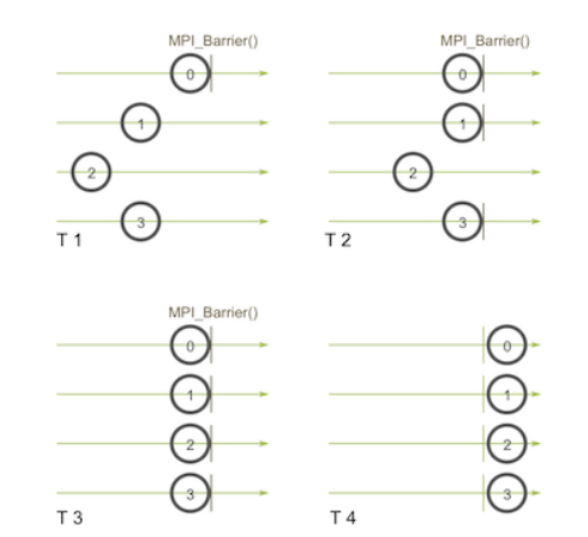

这个地方我们用到的很多方法像barrier boardcast 都是为了控制我们的进程现象

对于数据的收集和分发，我们也能采用一些别的方法像gather和scatter（这些地方方法一个接一个实在整理不动了）

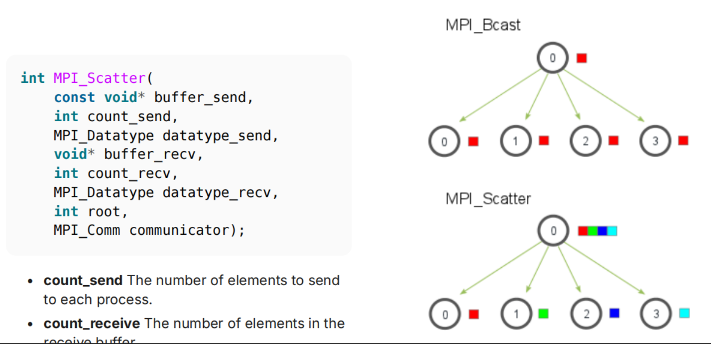

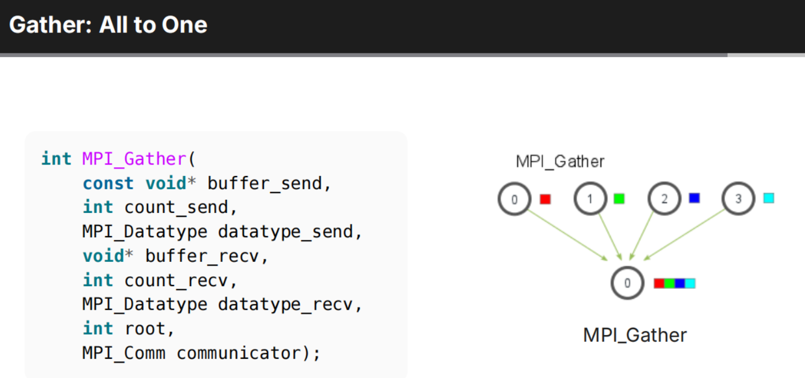

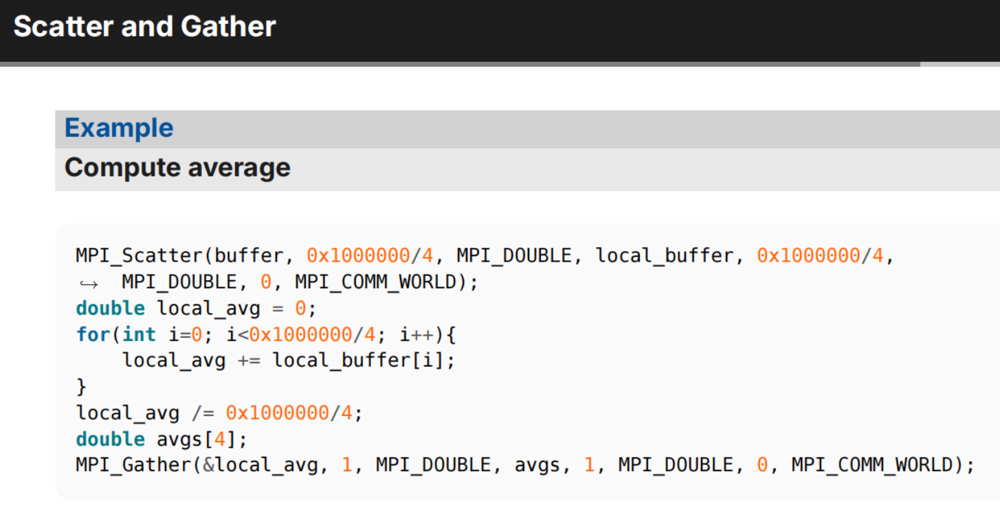

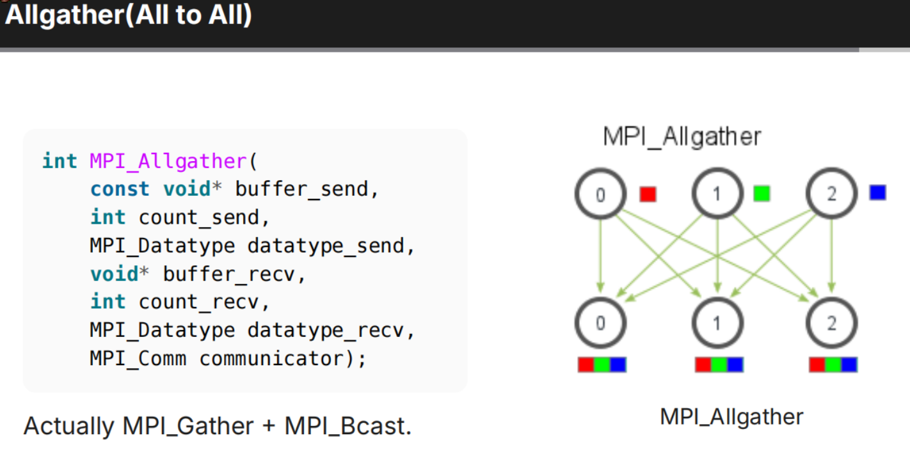

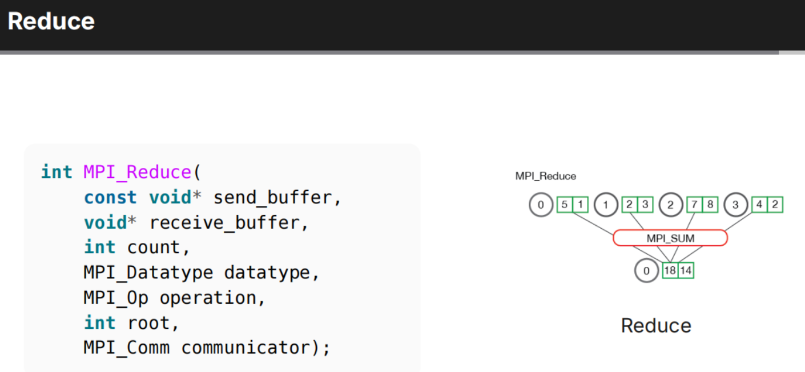

## Critical Path

这个地方主要是判断我们怎么实现一个并行（评估并行的可行性）

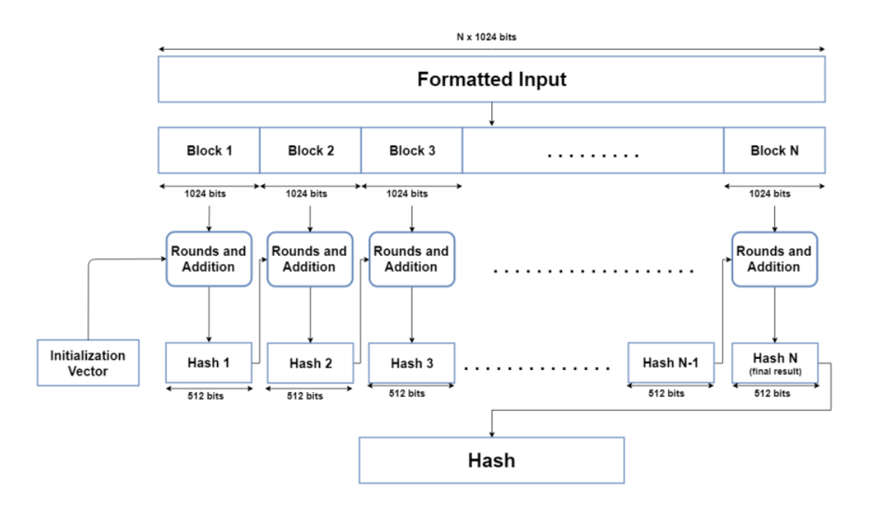

这个地方我们以这个数据处理为例

我们可以看见在这个例子中前后数据的处理是有依赖的，这种方式就不能并行

还有一些别的计算指标，例如关键路径指程序中最长不可并行序列，决定了整体执行时间下限

当我们有了一个改进方案以后，我们就能接着做修改了

这里列出一些并行优化策略

比如我们可以利用算法结合律将文件划分为 EMB 大小块并行处理各块 SHA512。

这样的处理最终串行处理块间依赖关系，大幅缩短关键路径长度。

结合 mmap 优化文件读取，或将 I/O 与计算重叠隐藏延迟。