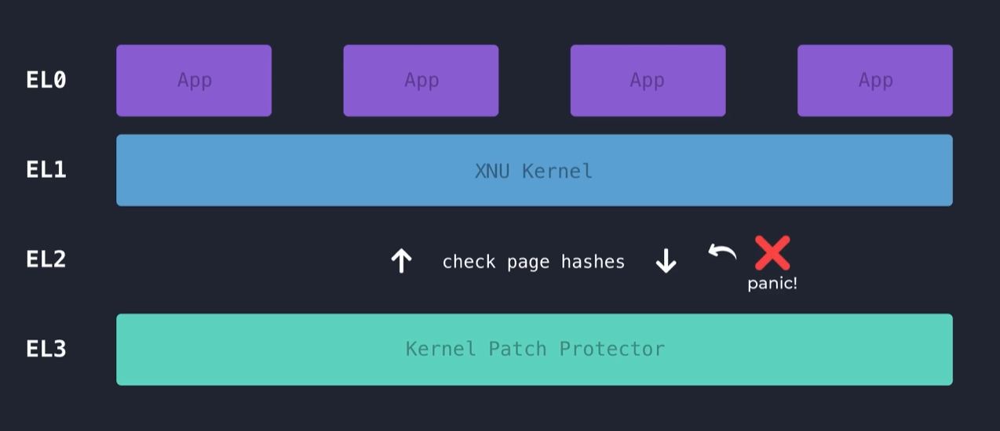
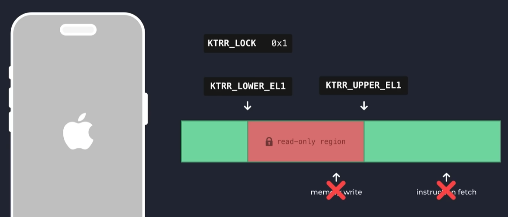
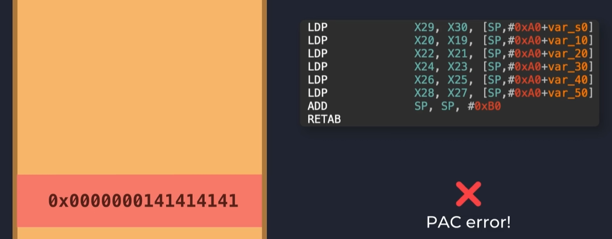
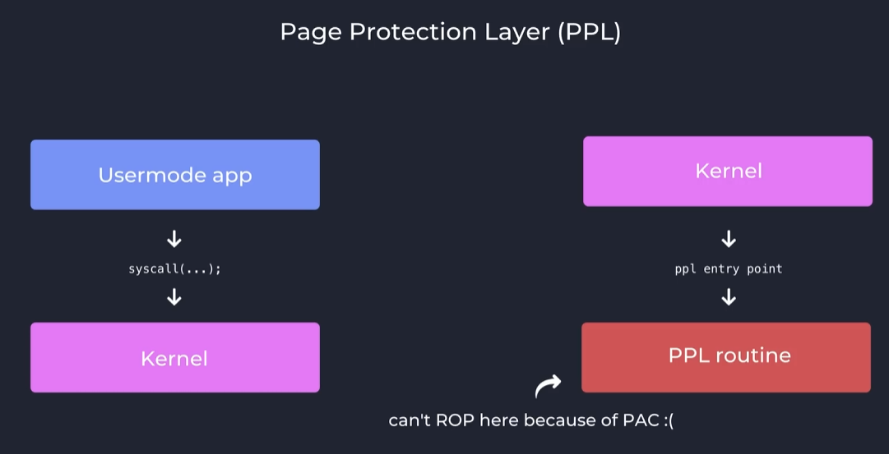
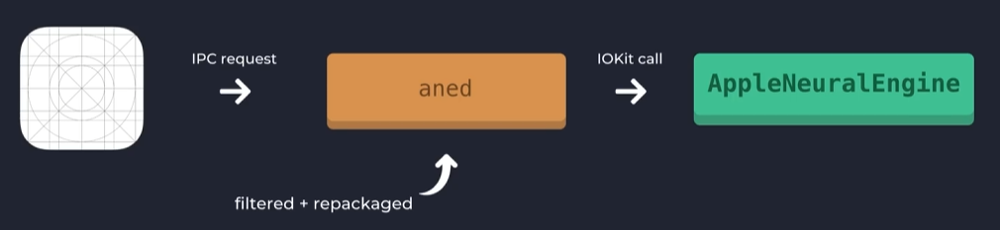

[视频资源](https://www.bilibili.com/video/BV12skTBqEcQ?spm_id_from=333.788.videopod.sections&vd_source=d29a21e1671c0e8f0a10617e8e3990f6)

在一开始，苹果还没有重视我们的系统安全

甚至连win98都实现过的虚拟内存技术直到ios 4才出现在苹果的设计中

(你在我们的macOS简史中会看到一样的话，当然这不是因为我在炒冷饭，只是说明下早期的苹果确实不安全)

所以我们早期的iphone会有一个这样的问题：就是我们的攻击者能够轻易地访问到物理内存

直到ios6 苹果的工程师才映入虚拟内存映射和ASLR(address space layout randomly)技术（内存页面偏移技术）

一个转折点是ios9,ios9引入了内核补丁机制，我们的攻击者在获得内核权限以后往往会对内核做修改，比如代码签名和沙盒，这个版本加入了在内核层上的el3机制，能够检测内核在可执行页面的所有修改

ios10 加入了一个新的修复，我们的内核修改环节被全新的kernel text read-only region来替换，基于苹果新cpu中的专用硬件寄存器，ios10实现了这样一个效果，当手机启动的时候，我们的制度部分内核代码将被完全锁定，我们储存起始的锁定地址和终止的锁定地址，当第三个寄存器被设定之后，这两个寄存器之间的所有内容都会被锁定，所有尝试修改内核的操作会直接导致关机

当然，黑客们也发现了新的方法，当我们通过修改内存调用区的内容时我们的权限也会发生权限提升

那么怎么做具体的修改呢？

在ios12中，工程师们想到了一种新的方法：PAC(Pointer Authtication Codes)

但是我们现在的芯片实现了一种新的优化，很多黑裤会尝试通过修改返回指针来执行侵入性程序，PAC的出现让ROP(导向编程)不再可行，所有的地址都经过加密签名，签名信息储存在指针的高位，当跳转到新的地址的时候ARM64E指令会执行认证逻辑，确保签名在荡秋千环境下仍然有效，替换返回地址将触发PAC异常

至此，苹果基本封锁了所有内核攻击的渠道

当然ios12还引入了一种新的方法PPL(Page Protection Layer)，这种硬件层面的技术为内核提供了一个额外的特权模式，用于处理敏感操作，比如页表，攻击者即使拿到了我们的内核也无法对我们的内存分页进行修改

通过以上几步，ios的内核几乎无坚不摧（当然一榔头那么坚还是能催的）

从13到15代 ios系统也在做一些小而精的优化

应用层面，ios12增加了用户态和中间态等组件部分，防止我们的未授权应用操纵影响我们的内核

内核堆分配器层面，ios系统通过分组，回收虚拟页，随机分页等方式来阻挡了内存信息的泄露

ios18最大的更新是lockdown mode，lockdown mode实现了我们某些功能的完全无法访问（简单说就是苹果的菜鸟保护）

当然，在最近的ios26中，苹果带来了史上最强的防御措施：内存完整性强制保护

这是一种硬件支持的地址检测机制，能够捕捉绝大多数越界释放和释放后使用等问题

这种软硬联合的哲学——从内核到应用锁，是苹果能够直接干趴其他厂商的关键